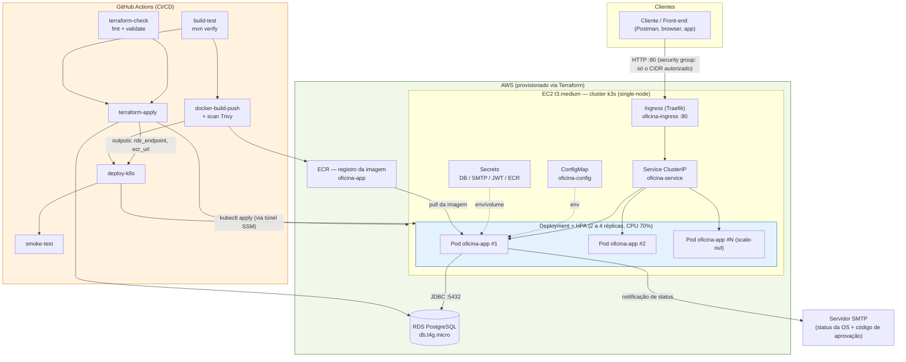

# Tech Challenge — Oficina Mecânica

> **FIAP · Pós-Graduação SOAT (14SOAT) · Fases 1 e 2**
> API de gestão de ordens de serviço para oficina mecânica, em Java 21 + Quarkus, com
> arquitetura hexagonal, infraestrutura como código e pipeline de CI/CD.

|                  |                                                                                              |
|------------------|----------------------------------------------------------------------------------------------|
| **Aplicação**    | Java 21 · Quarkus 3.15 · PostgreSQL 16 · Flyway · JWT RSA-256                                |
| **Arquitetura**  | Hexagonal (Ports & Adapters) — domínio sem dependência de framework                          |
| **Testes**       | 257 testes · cobertura 91,3% · gate JaCoCo de 80% por pacote no `mvn verify`                 |
| **Container**    | Dockerfile multi-stage · docker-compose para desenvolvimento local                           |
| **Orquestração** | Kubernetes (k3s) · Deployment, Service, Ingress, ConfigMap, Secrets, HPA, NetworkPolicy, PDB |
| **IaC**          | Terraform — VPC, EC2 (k3s), RDS PostgreSQL, ECR                                              |
| **CI/CD**        | GitHub Actions — build, testes, imagem + scan, `terraform apply`, deploy, smoke test         |

---

## Índice

- [Sobre a solução](#sobre-a-solução)
- [Estrutura do repositório](#estrutura-do-repositório)
- [Arquitetura proposta](#arquitetura-proposta)
- [Componentes da aplicação](#componentes-da-aplicação)
- [Infraestrutura provisionada](#infraestrutura-provisionada)
- [Fluxo de deploy (CI/CD)](#fluxo-de-deploy-cicd)
- [Como executar](#como-executar)
- [APIs da fase 2](#apis-da-fase-2)
- [Collection das APIs](#collection-das-apis)
- [Vídeo demonstrativo](#vídeo-demonstrativo)
- [Testes e qualidade](#testes-e-qualidade)
- [Alta disponibilidade](#alta-disponibilidade--o-que-esta-entrega-faz-e-o-que-não-faz)
- [Segurança](#segurança)
- [Observabilidade](#observabilidade)
- [Documentação complementar](#documentação-complementar)
- [Débito técnico conhecido](#débito-técnico-conhecido)

---

## Sobre a solução

Sistema de atendimento e execução de serviços para oficina mecânica: abertura e acompanhamento de **Ordens de Serviço (
OS)** com máquina de estados, cadastro de clientes, veículos, peças e serviços, controle de estoque e canal público para
o cliente consultar e aprovar o próprio orçamento.

**Fase 1** entregou o MVP funcional. **Fase 2** evolui essa base para operação real com múltiplas unidades e picos de
demanda, **sem alterar as regras de negócio**:

- **Refatoração arquitetural** — domínio sem nenhuma dependência de framework, ports
  `in`/`out` explícitos e adapters por composição, com testes cobrindo os fluxos críticos.
- **Conteinerização** consistente entre desenvolvimento local e produção (mesmo Dockerfile).
- **Orquestração via Kubernetes** com escalonamento horizontal automático (HPA) por CPU.
- **Infraestrutura como código** (Terraform) provisionando cluster e banco de forma reprodutível.
- **Pipeline de CI/CD** automatizando build, testes, imagem, provisionamento e deploy.

---

## Estrutura do repositório

```
.
├── .github/
│   ├── workflows/ci-cd.yml          # Pipeline completa (6 jobs)
│   ├── workflows/README.md          # Gatilhos e GitHub Secrets necessários
│   └── actions/k3s-kubeconfig/      # Composite action: kubeconfig + túnel SSM
└── oficina/                         # Aplicação (raiz do projeto Maven)
    ├── Dockerfile                   # Build multi-stage
    ├── docker-compose.yml           # Stack local: app + PostgreSQL + Mailpit
    ├── docker-entrypoint.sh
    ├── pom.xml
    ├── k8s/                         # Manifestos Kubernetes
    │   ├── namespace.yaml           #   Namespace oficina
    │   ├── configmap.yaml           #   Configuração não sensível
    │   ├── secret.yaml              #   Template de Secret (placeholders, sem valores reais)
    │   ├── deployment.yaml          #   Deployment + ServiceAccount + PodDisruptionBudget
    │   ├── service.yaml             #   Service ClusterIP
    │   ├── ingress.yaml             #   Ingress Traefik (exposição externa)
    │   ├── hpa.yaml                 #   HorizontalPodAutoscaler
    │   ├── networkpolicy.yaml       #   Segmentação de rede do namespace
    │   └── README.md                #   Passo a passo de deploy e teste de carga
    ├── infra/                       # Terraform (IaC)
    │   ├── vpc.tf, ec2.tf, rds.tf, ecr.tf, security_groups.tf
    │   ├── backend.tf, providers.tf, variables.tf, outputs.tf, data.tf
    │   ├── user_data.sh.tpl         #   Bootstrap do k3s na EC2
    │   └── README.md                #   Recursos, bootstrap do backend, custo, destroy
    ├── postman/                     # Collection completa das APIs
    ├── docs/                        # DDD, specs e guias operacionais
    ├── src/main/java/br/com/oficina/ # domain · application · infrastructure · interfaces
    └── README.md                    # Documentação detalhada da aplicação e das APIs
```

> **Atenção:** a raiz do projeto Maven é `oficina/`. Todos os comandos `mvn`,
> `docker-compose` e `terraform` deste README assumem que você entrou nesse diretório.

---

## Arquitetura proposta



---

## Componentes da aplicação

Container único (`oficina-app`, Quarkus) expondo duas famílias de API:

| Família                   | Prefixo                     | Autenticação                                      |
|---------------------------|-----------------------------|---------------------------------------------------|
| Administrativa            | `/admin/*`                  | JWT RSA-256 (papéis `ADMIN` / `MECHANIC`)         |
| Pública de acompanhamento | `/public/work-orders/*`     | CPF/CNPJ + código de uso único enviado por e-mail |
| Operacional               | `/q/health/*`, `/q/metrics` | Aberta (consumida por probes e scraping)          |

Organização interna, com as dependências apontando para dentro (`interfaces → application → domain` e
`infrastructure → application → domain`):

```
src/main/java/br/com/oficina/
├── domain/            # Zero dependência de framework (verificável por grep)
│   ├── model/         #   Aggregates: WorkOrder, Client, Vehicle, Part, ServiceItem
│   ├── valueobject/   #   CpfCnpj, LicensePlate, ApprovalToken
│   ├── event/         #   WorkOrderStatusChangedEvent
│   └── exception/     #   Exceções de negócio
├── application/
│   ├── ports/in/      # Driver ports (casos de uso)
│   ├── ports/out/     # Driven ports (repositórios, notificação)
│   ├── service/       # Implementação dos casos de uso
│   ├── dto/           # Contratos de entrada/saída
│   └── validation/    # Bean Validation delegando aos Value Objects
├── infrastructure/
│   ├── adapters/out/  # Implementação dos driven ports (persistência, e-mail)
│   ├── persistence/   # *Entity, *Mapper, *PanacheRepository (isolam o JPA)
│   └── security/      # Autenticação JWT, AppUser, seed inicial
└── interfaces/
    ├── rest/          # Recursos JAX-RS
    └── exception/     # Tradução de exceção para HTTP
```

**Duas decisões que sustentam o isolamento:**

1. O pacote `domain` não importa nada além do próprio domínio e do JDK. Confirme com:
   ```bash
   grep -rn "^import" oficina/src/main/java/br/com/oficina/domain/ | grep -v "import java\.\|import br\.com\.oficina"
   ```
   (não retorna nada)
2. Os adapters usam os repositórios Panache **por composição, não por herança**. Herdar
   `PanacheRepository` diretamente no adapter transformaria ~40 métodos de persistência (`deleteAll`, `findAll`,
   `persist`…) em API pública dele, vazando o modelo de persistência para qualquer colaborador que o injetasse.

**Estado 100% externalizado** no PostgreSQL: os pods são *stateless* e substituíveis, o que é pré-requisito para o HPA
escalar horizontalmente sem afetar requisições em andamento. As chaves de assinatura do JWT vêm de um Secret montado
como volume, para que **todas as réplicas assinem com o mesmo par** — do contrário, um token emitido por um pod seria
rejeitado por outro.

---

## Infraestrutura provisionada

Tudo criado por Terraform (`oficina/infra/`) — nada é criado manualmente no console AWS. Detalhamento completo em [
`oficina/infra/README.md`](oficina/infra/README.md).

| Recurso             | Nome                               | Observação                                                                            |
|---------------------|------------------------------------|---------------------------------------------------------------------------------------|
| VPC                 | `oficina-vpc`                      | 1 subnet pública + 2 privadas (2 AZs), **sem NAT Gateway** (item de custo mais caro)  |
| Security Groups     | `oficina-k3s-sg`, `oficina-rds-sg` | SSH e HTTP restritos ao CIDR autorizado; RDS só aceita conexão do SG da EC2           |
| Cluster Kubernetes  | `oficina-k3s`                      | k3s single-node em EC2 `t3.medium`, disco `gp3` criptografado, **IMDSv2 obrigatório** |
| Banco de dados      | `oficina-postgres`                 | RDS PostgreSQL 16, `db.t4g.micro`, `storage_encrypted`, `publicly_accessible = false` |
| Registro de imagem  | `oficina-app`                      | ECR privado                                                                           |
| Estado do Terraform | bucket S3                          | `encrypt = true` + `use_lockfile` (trava nativa do S3, Terraform ≥ 1.10)              |

**Exposição da API:** o Ingress (Traefik, embarcado no k3s) publica a aplicação na porta 80 do node, e o security group
libera essa porta **apenas para o CIDR informado em `allowed_cidr`**. A API do Kubernetes (6443) **nunca é exposta**:
todo acesso administrativo, inclusive o da pipeline, passa por túnel do **SSM Session Manager**. A URL final sai em
`terraform output application_url`.

---

## Fluxo de deploy (CI/CD)

Pipeline em [`.github/workflows/ci-cd.yml`](.github/workflows/ci-cd.yml). Gatilhos e secrets necessários em [
`.github/workflows/README.md`](.github/workflows/README.md).

### Roda em todo push e PR (sem custo, sem credencial AWS)

| # | Job               | O que faz                                                                                                                                                                    |
|---|-------------------|------------------------------------------------------------------------------------------------------------------------------------------------------------------------------|
| 1 | `build-test`      | **Build da aplicação** e **execução dos testes automatizados** (`mvn verify`, incluindo o gate de cobertura JaCoCo). Publica relatórios de teste e cobertura como artefatos. |
| 2 | `terraform-check` | `terraform fmt -check` e `terraform validate`, sem tocar na AWS. Pega erro de sintaxe e restrição de provider antes do `apply`.                                              |

### Roda por push de tag `v*` ou disparo manual (`workflow_dispatch`)

| # | Job                 | O que faz                                                                                                                                                                                                                                                                                                                                                                                          |
|---|---------------------|----------------------------------------------------------------------------------------------------------------------------------------------------------------------------------------------------------------------------------------------------------------------------------------------------------------------------------------------------------------------------------------------------|
| 3 | `docker-build-push` | **Build da imagem Docker** com cache do BuildKit, **scan Trivy** (falha em `CRITICAL` com correção disponível) e só então push para o ECR, com tag pelo SHA do commit + `latest`.                                                                                                                                                                                                                  |
| 4 | `terraform-apply`   | **Deploy do banco de dados** e da infraestrutura: `init/plan/apply` provisionando VPC, EC2 (k3s), RDS e ECR. Exporta `rds_endpoint`, `ecr_repository_url` e `application_url` como **outputs do job**, consumidos diretamente pelo deploy.                                                                                                                                                         |
| 5 | `deploy-k8s`        | **Deploy no cluster Kubernetes**: obtém o kubeconfig via SSM, gera os Secrets (DB, SMTP, chaves JWT, credencial do ECR) a partir de GitHub Secrets e **aplica os manifestos YAML** (`namespace`, `configmap`, `deployment`, `service`, `ingress`, `hpa`, `networkpolicy`). A imagem é fixada com `kubectl set image`. Se o rollout falhar, faz `rollout undo` automático e despeja logs e eventos. |
| 6 | `smoke-test`        | Valida `/q/health/live` e `/q/health/ready` pelo Service e, de dentro do node, o caminho completo pelo Ingress. Em falha, reverte o deploy.                                                                                                                                                                                                                                                        |

> **Por que os estágios de infraestrutura não rodam em todo push na master:** cada `apply`
> recria EC2 e RDS numa conta AWS Academy de crédito limitado. O gatilho por tag
> (`git tag v1.0.0 && git push --tags`) mantém o CD automatizado, com um marco explícito de
> release, sem transformar cada commit em um deploy pago.

**Migrações de schema:** o Flyway roda no start de cada pod (`QUARKUS_FLYWAY_MIGRATE_AT_START=true`) e serializa via
*advisory lock* do PostgreSQL — N réplicas subindo juntas é seguro: a primeira migra, as demais esperam.

---

## Como executar

### 1. Execução local (docker-compose)

Pré-requisitos: Docker 24+ e Docker Compose 2+.

```bash
cd oficina
docker-compose up --build -d
docker-compose logs -f app
```

Sobe três containers:

| Serviço            | Endereço              | Função                                                                         |
|--------------------|-----------------------|--------------------------------------------------------------------------------|
| `oficina_app`      | http://localhost:8080 | Aplicação (Swagger em `/swagger-ui`)                                           |
| `oficina_postgres` | localhost:5432        | Banco de dados                                                                 |
| `oficina_mailpit`  | http://localhost:8025 | Captura os e-mails — **é aqui que aparece o código de aprovação do orçamento** |

Usuários criados automaticamente em ambiente local: `admin` / `admin123` (ADMIN) e
`mecanico` / `mecanico123` (MECHANIC).

```bash
# Login
curl -X POST http://localhost:8080/auth/login \
  -H "Content-Type: application/json" \
  -d '{"username": "admin", "password": "admin123"}'

# Encerrar a stack
docker-compose down
```

Passo a passo completo (incluindo modo dev com hot-reload e execução sem Docker) em
[`oficina/docs/RUN-LOCAL.md`](oficina/docs/RUN-LOCAL.md) e na seção
[Como Executar do README da aplicação](oficina/README.md#como-executar).

---

### 2. Provisionamento da infraestrutura (Terraform)

Pré-requisitos: Terraform ≥ 1.10, AWS CLI configurado, e o **bucket S3 do backend criado uma única vez** (bootstrap
descrito em [`oficina/infra/README.md`](oficina/infra/README.md)).

```bash
cd oficina/infra

export TF_VAR_db_password="<senha com no minimo 16 caracteres>"
export TF_VAR_allowed_cidr="<seu-ip-publico>/32"

terraform init
terraform plan -out=tfplan     # revise o plano antes de aplicar
terraform apply tfplan

terraform output application_url
terraform output rds_endpoint
terraform output ecr_repository_url
```

`allowed_cidr` recusa `0.0.0.0/0` por validação — abrir SSH e a aplicação para a internet inteira falha ainda no `plan`,
não em produção.

```bash
# Obrigatório ao final de CADA sessão (conta AWS Academy, crédito limitado)
terraform destroy
```

Recursos criados, decisões de segurança, custo estimado e o roteiro de destruição estão em
[`oficina/infra/README.md`](oficina/infra/README.md). Rotina de sessão em
[`oficina/docs/SESSION-GUIDE.md`](oficina/docs/SESSION-GUIDE.md).

---

### 3. Deploy em Kubernetes

Pré-requisito: cluster provisionado (passo anterior) e `KUBECONFIG` apontando para ele — o kubeconfig é recuperado via
SSM, sem expor a porta 6443 (comandos em
[`oficina/infra/README.md`](oficina/infra/README.md)).

```bash
cd oficina

# 1. Base
kubectl apply -f k8s/namespace.yaml -f k8s/configmap.yaml

# 2. Secrets — gerados na hora, nunca commitados com valor real.
#    Comandos completos (ECR, chaves JWT, DB/SMTP) em k8s/README.md
kubectl create secret generic oficina-secrets --namespace oficina \
  --from-literal=DB_HOST="<endpoint-do-rds>" \
  --from-literal=DB_USERNAME="<usuario>" \
  --from-literal=DB_PASSWORD="<senha>" \
  --dry-run=client -o yaml | kubectl apply -f -

# 3. Carga de trabalho
kubectl apply -f k8s/deployment.yaml -f k8s/service.yaml -f k8s/ingress.yaml \
              -f k8s/hpa.yaml -f k8s/networkpolicy.yaml

# 4. Validar
kubectl get pods,hpa,svc,ingress -n oficina
kubectl -n oficina rollout status deployment/oficina-app
```

> No `deployment.yaml` a imagem é o placeholder `CHANGE_ME_ECR_REPOSITORY_URL:latest` — a
> pipeline substitui pelo repositório real e fixa a tag pelo SHA do commit com
> `kubectl set image`. No deploy manual, troque pelo valor de
> `terraform output ecr_repository_url`.

**Recursos aplicados:**

| Manifesto            | Recurso                                         | Destaque                                                                                                                                                  |
|----------------------|-------------------------------------------------|-----------------------------------------------------------------------------------------------------------------------------------------------------------|
| `deployment.yaml`    | Deployment, ServiceAccount, PodDisruptionBudget | 2 réplicas, RollingUpdate `maxUnavailable: 0`, probes de startup/readiness/liveness, `runAsNonRoot`, `readOnlyRootFilesystem`, `capabilities: drop [ALL]` |
| `service.yaml`       | Service ClusterIP                               | Exposição externa delegada ao Ingress                                                                                                                     |
| `ingress.yaml`       | Ingress (Traefik)                               | Publica a API na porta 80 do node                                                                                                                         |
| `configmap.yaml`     | ConfigMap                                       | Configuração não sensível (perfil, CORS, Flyway, SMTP não secreto)                                                                                        |
| `secret.yaml`        | Secret (template)                               | **Apenas placeholders** — valores reais entram via `kubectl create secret`                                                                                |
| `hpa.yaml`           | HorizontalPodAutoscaler                         | 2 → 4 réplicas, alvo de **70% de CPU**, `behavior` calibrado                                                                                              |
| `networkpolicy.yaml` | NetworkPolicy                                   | Nega tudo por padrão; libera ingress controller, DNS, PostgreSQL e SMTP                                                                                   |

#### Escalabilidade automática (HPA)

```bash
# Terminal 1 — observar
kubectl get hpa,pods -n oficina -w

# Terminal 2 — gerar carga
hey -z 120s -c 60 http://<ip-publico>/q/health/live
```

O `behavior` é assimétrico de propósito: **scale-up sem janela de estabilização** (dobra a cada 30s, para reagir ao
pico) e **scale-down com 180s de observação, 1 pod por vez** (evita flapping em carga intermitente, que derrubaria pods
no meio de requisições em andamento).

**O HPA escala por CPU apenas — decisão deliberada.** Escalar por memória com a JVM é uma armadilha: o heap cresce até o
limite configurado e o coletor devolve pouca memória ao sistema operacional, então a métrica de memória do container
sobe e não desce. O HPA dispararia scale-out por uso normal de heap e **nunca faria scale-in**, travando o Deployment em
`maxReplicas`. O caminho correto para reagir a pressão de memória é uma métrica de aplicação (`jvm_memory_used_bytes`,
já exposta em `/q/metrics` via Micrometer) através do Prometheus Adapter — não a métrica bruta do container. A
justificativa está versionada no próprio
[`oficina/k8s/hpa.yaml`](oficina/k8s/hpa.yaml).

> O HPA usa o **metrics-server** (embarcado no k3s), independente do `/q/metrics`. Confirme
> com `kubectl top pods -n oficina` antes de demonstrar o autoscaling — se a métrica aparecer
> como `<unknown>`, o HPA não escala.

Passo a passo completo, incluindo a geração de todos os Secrets e o roteiro de teste de carga, em [
`oficina/k8s/README.md`](oficina/k8s/README.md).

---

## APIs da fase 2

Máquina de estados da Ordem de Serviço:

```
RECEIVED → IN_DIAGNOSIS → AWAITING_APPROVAL → IN_EXECUTION → FINISHED → DELIVERED
                                  ↓
                              CANCELLED
```

| Requisito da fase                                | Endpoint                                                                                            | Observação                                                                                                                       |
|--------------------------------------------------|-----------------------------------------------------------------------------------------------------|----------------------------------------------------------------------------------------------------------------------------------|
| **Abertura de OS**                               | `POST /admin/work-orders`                                                                           | Recebe cliente, veículo, serviços e peças; devolve `201` com `Location` e a identificação única (`id` + `orderNumber`)           |
| **Consulta de status da OS**                     | `GET /public/work-orders/{orderNumber}/status`                                                      | Público. Devolve os rótulos do enunciado: Recebida, Diagnóstico, Aguardando Aprovação, Execução, Finalizada, Entregue            |
| **Aprovação de orçamento** (notificação externa) | `POST /public/work-orders/{orderNumber}/approve`<br>`POST /public/work-orders/{orderNumber}/reject` | Recebe a decisão do cliente com CPF/CNPJ + **código de autorização de uso único** enviado por e-mail                             |
| **Listagem de OS**                               | `GET /admin/work-orders`                                                                            | Ordenada por prioridade de status e, dentro do status, mais antigas primeiro; OS finalizadas/entregues **excluídas logicamente** |
| **Atualização de status via e-mail**             | —                                                                                                   | `EmailNotificationAdapter` notifica o cliente nas transições relevantes (orçamento pronto, serviço concluído, veículo entregue)  |

### Listagem — regra de ordenação

`GET /admin/work-orders` (sem filtro) devolve a **fila ativa**:

- ordenada por **Em Execução > Aguardando Aprovação > Diagnóstico > Recebida**;
- dentro do mesmo status, **das mais antigas para as mais recentes** (`createdAt ASC`);
- com **exclusão lógica, nunca física**, dos estados terminais (`FINISHED`, `DELIVERED` e
  `CANCELLED`) — todas continuam consultáveis por `GET /admin/work-orders?status=DELIVERED`;
- com o total de registros, ignorando a paginação, no cabeçalho `X-Total-Count`.

A prioridade é declarada no **enum de domínio** `WorkOrderStatus` (`listingPriority()` /
`isTerminal()`) e a consulta de persistência é **derivada dela** — não existe uma segunda cópia da regra escrita à mão
no adapter, e a regra é testável sem banco.

### Canal público — duas provas independentes

O número da OS é sequencial (`OS-000001`, `OS-000002`…) e portanto enumerável, e o CPF/CNPJ é um dado amplamente
conhecido. Só com esses dois, um terceiro conseguiria aprovar ou cancelar o orçamento de outra pessoa por força bruta.
Por isso `approve` e `reject` exigem também um **código de autorização de 256 bits**, gerado no envio do orçamento,
entregue **exclusivamente no e-mail do cliente** e invalidado no primeiro uso.

- CPF/CNPJ divergente → `404`, com a mesma mensagem de OS inexistente (não confirma quais números de OS existem)
- código ausente → `400`; código inválido → `404`; código já usado → `422`
- reenviar o orçamento gera um código novo e invalida o anterior
- o código **não** aparece em nenhuma resposta da API — nem para o operador autenticado

```bash
curl -X POST http://localhost:8080/public/work-orders/OS-000001/approve \
  -H "Content-Type: application/json" \
  -d '{"clientCpfCnpj": "111.444.777-35", "approvalToken": "<codigo recebido por e-mail>"}'
```

A tabela completa de endpoints (clientes, veículos, peças, serviços, métricas e o canal administrativo de aprovação
presencial) está em
[`oficina/README.md`](oficina/README.md#fluxo-da-ordem-de-serviço).

---

## Collection das APIs

- **Postman** — [
  `oficina/postman/Oficina-Mecanica.postman_collection.json`](oficina/postman/Oficina-Mecanica.postman_collection.json)
  Collection completa e encadeada: login, setup de entidades, fluxo integral da OS (incluindo aprovação pública e
  reutilização do código, que deve retornar `422`), consultas, métricas e 12 cenários de erro. As variáveis são
  preenchidas automaticamente entre as requisições.
- **Swagger UI** — `http://localhost:8080/swagger-ui` · **OpenAPI** — `http://localhost:8080/openapi`
  Gerados pelo Quarkus/SmallRye. Em perfil `prod` ficam **desabilitados por hardening**; use a collection Postman contra
  o ambiente publicado.

---

## Vídeo demonstrativo

<!-- Substituir pelo link do YouTube/Vimeo (público ou não listado, até 15 minutos) -->
**[Link do vídeo](#)** — *a publicar*

Conteúdo demonstrado: arquitetura da solução, deploy da aplicação, execução do CI/CD, consumo das APIs e escalabilidade
automática sob carga.

Roteiro de gravação em [`oficina/docs/ROTEIRO-VIDEO.md`](oficina/docs/ROTEIRO-VIDEO.md).

---

## Testes e qualidade

```bash
cd oficina
mvn verify        # build + testes + gate de cobertura
mvn test          # apenas testes
# Relatório: target/site/jacoco/index.html
```

| Métrica             | Resultado                                                 |
|---------------------|-----------------------------------------------------------|
| Testes              | **257** (unitários + integração)                          |
| Falhas              | 0                                                         |
| Cobertura de linhas | **91,3%**                                                 |
| Gate JaCoCo         | 80% de linhas **por pacote**, verificado na fase `verify` |

Estratégia: JUnit 5 + Mockito para o domínio e os casos de uso; `@QuarkusTest` + REST-Assured para os recursos REST, com
H2 em modo de compatibilidade PostgreSQL.

O gate de cobertura não é um número global — a lista de pacotes obrigatórios é argumentada no
[`oficina/pom.xml`](oficina/pom.xml): domínio, value objects, serviços de aplicação, validação, segurança, adapter de
notificação e mapeamento de exceções. Mappers de getter/setter ficam de fora deliberadamente; forçar cobertura em código
anêmico produz teste de fachada, não proteção contra regressão.

---

## Alta disponibilidade — o que esta entrega faz e o que não faz

| Dimensão                            | Situação                                                            |
|-------------------------------------|---------------------------------------------------------------------|
| Elasticidade sob pico               | ✅ HPA de 2 a 4 réplicas por CPU, com `behavior` calibrado          |
| Rollout sem downtime                | ✅ `maxUnavailable: 0` + `maxSurge: 1`, probes de readiness/startup |
| Sobrevivência à queda de um pod     | ✅ 2 réplicas mínimas + PodDisruptionBudget                         |
| Sobrevivência à queda do **node**   | ❌ cluster **single-node** — o node é ponto único de falha          |
| Sobrevivência à queda de uma **AZ** | ❌ RDS single-AZ, sem réplica de leitura                            |

Isso é uma **decisão consciente de custo**, não um esquecimento: o ambiente roda em conta AWS Academy com crédito único
para o curso inteiro. Um EKS gerenciado custa ~US$0,10/h só de control plane, e multi-AZ no RDS dobra o custo do banco.

**O caminho para HA real, sem reescrever nada:** os manifestos em `oficina/k8s/` são Kubernetes padrão e sobem
inalterados em EKS/AKS/GKE. Bastaria (1) trocar o módulo de EC2+k3s por um cluster gerenciado multi-AZ com pelo menos 2
nodes, (2) `multi_az = true` no RDS com
`backup_retention_period > 0`, e (3) acrescentar `topologySpreadConstraints` ao Deployment para distribuir as réplicas
entre AZs. Análise completa em
[`oficina/docs/spec-terraform-aws.md`](oficina/docs/spec-terraform-aws.md).

---

## Segurança

**Aplicação**

- Senhas com **BCrypt** (custo 12) e comparação em **tempo constante** (evita *timing attacks*)
- JWT assinado com **RSA-256**; chaves vindas de Secret montado como volume, iguais em todas as réplicas
- Autorização por papel: exclusões, métricas e cancelamento de OS restritos a `ADMIN`
- Aprovação pública exige **código de uso único** — CPF/CNPJ sozinho não autoriza
- Validação de CPF/CNPJ (com dígitos verificadores) e de placa (formato antigo e Mercosul)
- CORS por origem explícita, sem `*` em produção
- `correlationId` em respostas `500`; **stack trace nunca é exposto ao cliente**
- Swagger/OpenAPI desabilitados no perfil `prod`

**Container e Kubernetes**

- Imagem roda como **usuário não-root com UID numérico (1001)** — um nome de usuário impediria o kubelet de validar
  `runAsNonRoot` e o pod não iniciaria
- `securityContext`: `runAsNonRoot`, `readOnlyRootFilesystem`, `allowPrivilegeEscalation: false`,
  `capabilities: drop [ALL]`, `seccompProfile: RuntimeDefault`
- `automountServiceAccountToken: false` — a aplicação não fala com a API do Kubernetes
- NetworkPolicy segmentando o namespace (ingress controller, DNS, PostgreSQL, SMTP)
- **Nenhum secret versionado**: `secret.yaml` contém apenas placeholders; os valores reais são gerados na pipeline a
  partir de GitHub Secrets

**Infraestrutura**

- **IMDSv2 obrigatório** com `http_put_response_hop_limit = 1` — um SSRF na aplicação (ou em um pod) não alcança as
  credenciais temporárias do instance profile
- Disco da EC2 criptografado (o etcd do k3s guarda os Secrets do cluster) e RDS com
  `storage_encrypted`
- **Porta 6443 nunca exposta** — acesso ao cluster, inclusive o da pipeline, por túnel SSM
- SSH e HTTP restritos ao CIDR autorizado; `0.0.0.0/0` recusado por validação do Terraform
- Estado do Terraform criptografado no S3, com trava de concorrência
- **Scan Trivy antes do push** da imagem: imagem com vulnerabilidade `CRITICAL` corrigível não chega ao registro
- `permissions: contents: read` no workflow (menor privilégio para o `GITHUB_TOKEN`)

---

## Observabilidade

| Recurso             | Endpoint            | Uso                                                      |
|---------------------|---------------------|----------------------------------------------------------|
| Liveness            | `/q/health/live`    | `livenessProbe` e HEALTHCHECK do Docker                  |
| Readiness           | `/q/health/ready`   | Inclui checagem da conexão com o banco                   |
| Startup             | `/q/health/started` | Cobre a janela de boot (pool + Flyway) no `startupProbe` |
| Métricas Prometheus | `/q/metrics`        | JVM, HTTP server e sistema, via Micrometer               |

Em perfil `prod` o log do console sai em **JSON**: com várias réplicas escrevendo no mesmo stdout, texto livre é
impraticável de correlacionar.

---

## Documentação complementar

| Documento                                                                  | Conteúdo                                                                                                 |
|----------------------------------------------------------------------------|----------------------------------------------------------------------------------------------------------|
| [`oficina/README.md`](oficina/README.md)                                   | Documentação detalhada da aplicação: todos os endpoints, variáveis de ambiente, usuários, banco de dados |
| [`oficina/infra/README.md`](oficina/infra/README.md)                       | Recursos Terraform, bootstrap do backend S3, custo estimado, destruição da sessão                        |
| [`oficina/k8s/README.md`](oficina/k8s/README.md)                           | Deploy passo a passo, geração dos Secrets, teste de carga, endurecimento aplicado                        |
| [`.github/workflows/README.md`](.github/workflows/README.md)               | Gatilhos de cada job e GitHub Secrets necessários                                                        |
| [`oficina/docs/DDD.md`](oficina/docs/DDD.md)                               | Modelagem do domínio, aggregates, linguagem ubíqua                                                       |
| [`oficina/docs/spec-hexagonal.md`](oficina/docs/spec-hexagonal.md)         | Decisões da refatoração arquitetural                                                                     |
| [`oficina/docs/spec-terraform-aws.md`](oficina/docs/spec-terraform-aws.md) | Escolha da topologia AWS e trade-offs de custo                                                           |
| [`oficina/docs/spec-kubernetes.md`](oficina/docs/spec-kubernetes.md)       | Decisões dos manifestos e do autoscaling                                                                 |
| [`oficina/docs/spec-test-unit.md`](oficina/docs/spec-test-unit.md)         | Estratégia de testes e critério do gate de cobertura                                                     |
| [`oficina/docs/RUN-LOCAL.md`](oficina/docs/RUN-LOCAL.md)                   | Execução local detalhada                                                                                 |
| [`oficina/docs/SESSION-GUIDE.md`](oficina/docs/SESSION-GUIDE.md)           | Rotina de sessão AWS Academy (subir, demonstrar, destruir)                                               |

---

## Débito técnico conhecido

Declarado explicitamente porque decisão consciente documentada vale mais que lacuna silenciosa:

- **Sem Testcontainers** nos testes de integração (usam H2 em modo de compatibilidade PostgreSQL). O comportamento
  específico do PostgreSQL só é exercido no ambiente provisionado.
- **Cluster single-node e RDS single-AZ** — ver
  [Alta disponibilidade](#alta-disponibilidade--o-que-esta-entrega-faz-e-o-que-não-faz). É a lacuna arquitetural mais
  relevante desta entrega, e é deliberada.
- **NetworkPolicy inerte no k3s padrão**: o flannel embarcado não implementa NetworkPolicy. O manifesto está versionado
  como estado desejado e passa a valer em qualquer CNI que a implemente (Calico/Cilium).
- **Migrações no start do pod** (`migrate-at-start`): seguro, porque o Flyway serializa por advisory lock do PostgreSQL,
  mas o padrão cloud-native seria um Job/initContainer dedicado.
- **Sem rate limiting** nos endpoints públicos. O código de uso único mitiga a força bruta na aprovação de orçamento,
  mas a consulta de status segue sem limite de requisições.
- **Cobertura desigual nas bordas**: `interfaces.rest` e `infrastructure.adapters.out` ficam em torno de 70%, abaixo do
  restante do projeto.
