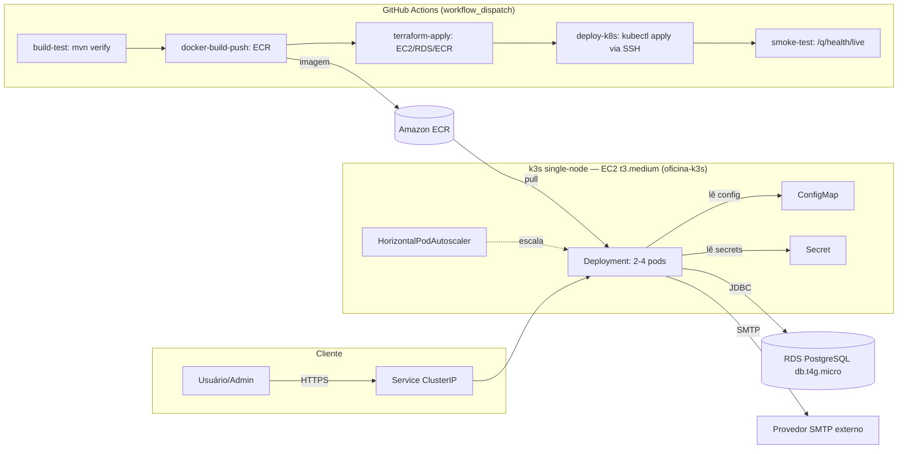

# Fase 2 — Tech Challenge (Oficina Mecânica) Implementation Plan

> **For agentic workers:** REQUIRED SUB-SKILL: Use superpowers:subagent-driven-development (recommended) or superpowers:
> executing-plans to implement this plan task-by-task. Steps use checkbox (`- [ ]`) syntax for tracking.

**Goal:** Fechar os gaps reais entre o que a Fase 2 do Tech Challenge exige (
`oficina/14SOAT - Fase 2 - Tech challenge-1.pdf`) e o que já está implementado no repositório, sem retrabalhar o que já
está correto.

**Architecture:** Quarkus 3 + Arquitetura Hexagonal já formalizada (domínio POJO puro, ports in/out, adapters). O
refactor estrutural e as 5 APIs de negócio já estão implementados e corretos — o gap real está em: (1) testes que a
própria spec do time exige e ainda não existem, (2) toda a cadeia de infraestrutura (K8s, Terraform, CI/CD), e (3)
documentação final. Este plano cobre exclusivamente esse gap, em 5 fases sequenciais (cada uma depende da anterior,
replicando as dependências já declaradas em `oficina/spec-*.md`).

**Tech Stack:** Java 21, Quarkus 3.15, Maven, JUnit 5 + Mockito + AssertJ + RestAssured, H2 (perfil `%test`), Docker,
Kubernetes (k3s self-managed em EC2 única, manifests YAML puros, sem extensão `quarkus-kubernetes`), Terraform (`aws`
provider, conta AWS Academy, região `us-east-1`), GitHub Actions.

## Global Constraints

- Gate JaCoCo: cobertura de linha ≥ 80% em `domain.model`, `application.service`, `infrastructure.security`,
  `infrastructure.validation` (pom.xml:296-311) — não pode regredir.
- `domain/model/**` não pode importar `jakarta.persistence.*` (gate estático já satisfeito — não reabrir).
- Nenhum secret real commitado em nenhum arquivo (`k8s/secret.yaml` só com placeholder; GitHub Secrets com credenciais
  temporárias coladas manualmente por sessão — conta AWS Academy não suporta OIDC, ver `spec-github-actions.md`).
- `terraform apply` contra AWS real **não pode ser executado** sem gate de aprovação de custo explícito do usuário (ver
  Fase 3) — isso é regra do domínio do desafio, não desta ferramenta. Orçamento é único para o curso inteiro (US$50, não
  mensal, não recarrega) — ver `spec-terraform-aws.md`.
- `terraform destroy` é obrigatório ao final de **cada** sessão de trabalho contra a AWS, não só ao final do projeto —
  conta Academy só para EC2 automaticamente; RDS e demais recursos continuam cobrando até serem destruídos
  explicitamente (ver `spec-terraform-aws.md`).
- Toda mudança de produção segue o padrão hexagonal já estabelecido: domínio não conhece framework;
  `application/service` não conhece Panache/Entity.
- Commits frequentes, um por task concluída, sem `--no-verify`.

---

## Fase 1 — Testes pendentes (sem infraestrutura, menor risco)

> **Status revalidado em 2026-07-14** (ver `ready-to-go.md`): o refactor estrutural hexagonal e as APIs de
> negócio referenciadas neste plano (ports `in`, `WorkOrderCreateDto`, `WorkOrderStatusLabel`, ordenação de
> listagem, `NotificationGatewayPort`/`EmailNotificationAdapter`/Mailpit) **já estão implementados** no
> código atual. As Tasks 1-6 abaixo, porém, continuam pendentes tal como escritas — nenhum arquivo
> `notifySafely`, `*MapperTest` ou `WorkOrderRepositoryAdapterTest` foi encontrado nesta revisão. Este plano
> permanece válido como está para fechar esse débito de teste; não precisa de ajuste de conteúdo (é trabalho
> Java puro, sem dependência de cloud).

### Task 1: Corrigir resiliência da notificação no `WorkOrderService`

**Contexto:** `spec-api.md` 2.5 exige que falha no envio de notificação nunca quebre a transição de status. Hoje o
try/catch só existe dentro de `EmailNotificationAdapter` (infraestrutura). `WorkOrderService` (aplicação) chama
`notificationGateway.notifyStatusChange(...)` sem proteção nenhuma — se um mock de teste (ou uma implementação futura do
port) lançar exceção, ela propaga e reverte a transação `@Transactional`. Isso viola o contrato do port em si, não
apenas a implementação atual. É preciso mover a garantia de resiliência para o ponto de consumo do port na camada de
aplicação.

**Files:**

- Modify: `oficina/src/main/java/br/com/oficina/application/service/WorkOrderService.java:157-202`
- Test: `oficina/src/test/java/br/com/oficina/application/service/WorkOrderServiceTest.java`

**Interfaces:**

- Consumes: `NotificationGatewayPort.notifyStatusChange(WorkOrderStatusChangedEvent)` (já existe,
  `oficina/src/main/java/br/com/oficina/domain/ports/out/NotificationGatewayPort.java`)
- Produces: método privado `notifySafely(WorkOrder saved)` em `WorkOrderService`, usado pelos 3 pontos de transição (
  `sendForApproval`, `complete`, `deliver`)

- [ ] **Step 1: Escrever os testes que hoje falhariam (falha de notificação não deve propagar)**

Adicionar ao final de `oficina/src/test/java/br/com/oficina/application/service/WorkOrderServiceTest.java` (antes do
fechamento da classe):

```java

@Test
void sendForApproval_shouldNotifyStatusChange() {
    DomainTestFixtures.setField(workOrder, "status", WorkOrderStatus.IN_DIAGNOSIS);
    when(workOrderRepository.fetchById(1L)).thenReturn(Optional.of(workOrder));

    workOrderService.sendForApproval(1L);

    verify(notificationGateway, times(1)).notifyStatusChange(any(WorkOrderStatusChangedEvent.class));
}

@Test
void complete_shouldNotifyStatusChange() {
    DomainTestFixtures.setField(workOrder, "status", WorkOrderStatus.IN_EXECUTION);
    when(workOrderRepository.fetchById(1L)).thenReturn(Optional.of(workOrder));

    workOrderService.complete(1L);

    verify(notificationGateway, times(1)).notifyStatusChange(any(WorkOrderStatusChangedEvent.class));
}

@Test
void deliver_shouldNotifyStatusChange() {
    DomainTestFixtures.setField(workOrder, "status", WorkOrderStatus.FINISHED);
    when(workOrderRepository.fetchById(1L)).thenReturn(Optional.of(workOrder));

    workOrderService.deliver(1L);

    verify(notificationGateway, times(1)).notifyStatusChange(any(WorkOrderStatusChangedEvent.class));
}

@Test
void deliver_whenNotificationFails_shouldStillPersistStatusChange() {
    DomainTestFixtures.setField(workOrder, "status", WorkOrderStatus.FINISHED);
    when(workOrderRepository.fetchById(1L)).thenReturn(Optional.of(workOrder));
    doThrow(new RuntimeException("SMTP indisponível"))
            .when(notificationGateway).notifyStatusChange(any(WorkOrderStatusChangedEvent.class));

    WorkOrderResponseDto result = workOrderService.deliver(1L);

    assertThat(result.status()).isEqualTo(WorkOrderStatus.DELIVERED);
    verify(workOrderRepository, times(1)).save(any(WorkOrder.class));
}
```

- [ ] **Step 2: Rodar os testes e confirmar que o último falha hoje**

Run: `cd oficina && mvn -q -Dtest=WorkOrderServiceTest test`
Expected: os 3 primeiros testes passam (notify já é chamado);
`deliver_whenNotificationFails_shouldStillPersistStatusChange` FALHA com a `RuntimeException` propagando do teste (
confirma o gap descrito no contexto).

- [ ] **Step 3: Implementar `notifySafely` e trocar as 3 chamadas diretas**

Em `oficina/src/main/java/br/com/oficina/application/service/WorkOrderService.java`, adicionar import de
`org.jboss.logging.Logger` e o campo/método:

```java
import org.jboss.logging.Logger;
```

```java
    private static final Logger LOG = Logger.getLogger(WorkOrderService.class);
```

Substituir as 3 ocorrências de:

```java
        notificationGateway.notifyStatusChange(WorkOrderStatusChangedEvent.of(saved));
```

por:

```java
        notifySafely(saved);
```

E adicionar o método privado (perto de `restoreStockOfAllParts`):

```java
    /**
 * Notificação é efeito colateral, não invariante de domínio: falha aqui nunca
 * pode reverter uma transição de status já persistida. A garantia vive no
 * ponto de consumo do port, não apenas na implementação concreta do adapter.
 */
private void notifySafely(WorkOrder saved) {
    try {
        notificationGateway.notifyStatusChange(WorkOrderStatusChangedEvent.of(saved));
    } catch (Exception e) {
        LOG.errorf(e, "Falha ao notificar mudança de status da OS %s", saved.getOrderNumber());
    }
}
```

- [ ] **Step 4: Rodar os testes e confirmar que todos passam**

Run: `cd oficina && mvn -q -Dtest=WorkOrderServiceTest test`
Expected: PASS (todos, incluindo o de falha).

- [ ] **Step 5: Commit**

```bash
git add oficina/src/main/java/br/com/oficina/application/service/WorkOrderService.java oficina/src/test/java/br/com/oficina/application/service/WorkOrderServiceTest.java
git commit -m "fix: garante que falha de notificação não reverte transição de status da OS"
```

---

### Task 2: Teste de round-trip do `ClientMapper`

**Contexto:** `spec-hexagonal.md` exige teste de mapper ida-e-volta (`toDomain`/`toEntity`) para as 4 entidades
migradas. Nenhum existe hoje. `ClientEntity.id`/`createdAt`/`updatedAt` só são populados via ciclo de vida JPA real (
`@PrePersist`), então o teste precisa ser `@QuarkusTest` com persistência real contra o perfil `%test` (H2), não um
teste unitário puro com mocks.

**Files:**

- Create: `oficina/src/test/java/br/com/oficina/infrastructure/persistence/ClientMapperTest.java`

**Interfaces:**

- Consumes: `ClientMapper.toDomain(ClientEntity)`, `ClientMapper.toNewEntity(Client)`,
  `ClientMapper.applyState(ClientEntity, Client)` (
  `oficina/src/main/java/br/com/oficina/infrastructure/persistence/ClientMapper.java`); `Client` constructor
  `(name, cpfCnpj, clientType, email, phone)` e getters (
  `oficina/src/main/java/br/com/oficina/domain/model/Client.java`)
- Produces: nenhuma (teste terminal, sem consumidores)

- [ ] **Step 1: Escrever o teste de round-trip**

```java
package br.com.oficina.infrastructure.persistence;

import br.com.oficina.domain.model.Client;
import br.com.oficina.domain.model.ClientType;
import io.quarkus.test.junit.QuarkusTest;
import jakarta.inject.Inject;
import jakarta.persistence.EntityManager;
import jakarta.transaction.Transactional;
import org.junit.jupiter.api.Test;

import static org.assertj.core.api.Assertions.assertThat;

@QuarkusTest
class ClientMapperTest {

    @Inject
    ClientMapper mapper;

    @Inject
    EntityManager em;

    @Test
    @Transactional
    void toEntityThenToDomain_shouldPreserveAllFields() {
        Client original = new Client("Maria Teste", "52998224725", ClientType.PF,
                "maria@teste.com", "11999998888");

        ClientEntity entity = mapper.toNewEntity(original);
        em.persist(entity);
        em.flush();
        em.clear();

        ClientEntity reloaded = em.find(ClientEntity.class, entity.getId());
        Client rehydrated = mapper.toDomain(reloaded);

        assertThat(rehydrated.getId()).isEqualTo(entity.getId());
        assertThat(rehydrated.getName()).isEqualTo("Maria Teste");
        assertThat(rehydrated.getCpfCnpj()).isEqualTo("52998224725");
        assertThat(rehydrated.getClientType()).isEqualTo(ClientType.PF);
        assertThat(rehydrated.getEmail()).isEqualTo("maria@teste.com");
        assertThat(rehydrated.getPhone()).isEqualTo("11999998888");
        assertThat(rehydrated.getCreatedAt()).isNotNull();
        assertThat(rehydrated.getUpdatedAt()).isNotNull();
    }

    @Test
    @Transactional
    void applyState_shouldSyncDomainChangesIntoManagedEntity() {
        Client original = new Client("Cliente A", "11144477735", ClientType.PF, null, null);
        ClientEntity entity = mapper.toNewEntity(original);
        em.persist(entity);
        em.flush();

        Client changed = new Client("Cliente A Atualizado", "11144477735", ClientType.PF,
                "novo@teste.com", "11888887777");
        mapper.applyState(entity, changed);
        em.flush();
        em.clear();

        ClientEntity reloaded = em.find(ClientEntity.class, entity.getId());
        assertThat(reloaded.getName()).isEqualTo("Cliente A Atualizado");
        assertThat(reloaded.getEmail()).isEqualTo("novo@teste.com");
        assertThat(reloaded.getPhone()).isEqualTo("11888887777");
    }
}
```

- [ ] **Step 2: Rodar e confirmar que passa**

Run: `cd oficina && mvn -q -Dtest=ClientMapperTest test`
Expected: PASS (2 testes).

- [ ] **Step 3: Commit**

```bash
git add oficina/src/test/java/br/com/oficina/infrastructure/persistence/ClientMapperTest.java
git commit -m "test: cobre round-trip do ClientMapper (toDomain/toEntity)"
```

---

### Task 3: Teste de round-trip do `VehicleMapper`

**Contexto:** Igual à Task 2, mas `VehicleMapper.applyState` usa `em.getReference(ClientEntity.class, ...)` para
resolver a FK — precisa de um `ClientEntity` persistido antes.

**Files:**

- Create: `oficina/src/test/java/br/com/oficina/infrastructure/persistence/VehicleMapperTest.java`

**Interfaces:**

- Consumes: `VehicleMapper.toDomain/toNewEntity/applyState` (
  `oficina/src/main/java/br/com/oficina/infrastructure/persistence/VehicleMapper.java`); `Vehicle` (
  `oficina/src/main/java/br/com/oficina/domain/model/Vehicle.java`); `ClientMapper.toNewEntity` (Task 2)

- [ ] **Step 1: Escrever o teste**

```java
package br.com.oficina.infrastructure.persistence;

import br.com.oficina.domain.model.Client;
import br.com.oficina.domain.model.ClientType;
import br.com.oficina.domain.model.Vehicle;
import io.quarkus.test.junit.QuarkusTest;
import jakarta.inject.Inject;
import jakarta.persistence.EntityManager;
import jakarta.transaction.Transactional;
import org.junit.jupiter.api.Test;

import static org.assertj.core.api.Assertions.assertThat;

@QuarkusTest
class VehicleMapperTest {

    @Inject
    VehicleMapper mapper;

    @Inject
    ClientMapper clientMapper;

    @Inject
    EntityManager em;

    private ClientEntity persistClient() {
        Client client = new Client("Dono do Veículo", "11144477735", ClientType.PF, null, null);
        ClientEntity entity = clientMapper.toNewEntity(client);
        em.persist(entity);
        em.flush();
        return entity;
    }

    @Test
    @Transactional
    void toEntityThenToDomain_shouldPreserveAllFields() {
        ClientEntity clientEntity = persistClient();
        Vehicle original = new Vehicle("ABC1234", "Toyota", "Corolla", 2020, clientEntity.getId());

        VehicleEntity entity = mapper.toNewEntity(original);
        em.persist(entity);
        em.flush();
        em.clear();

        VehicleEntity reloaded = em.find(VehicleEntity.class, entity.getId());
        Vehicle rehydrated = mapper.toDomain(reloaded);

        assertThat(rehydrated.getId()).isEqualTo(entity.getId());
        assertThat(rehydrated.getLicensePlate()).isEqualTo("ABC1234");
        assertThat(rehydrated.getBrand()).isEqualTo("Toyota");
        assertThat(rehydrated.getModel()).isEqualTo("Corolla");
        assertThat(rehydrated.getProductionYear()).isEqualTo(2020);
        assertThat(rehydrated.getClientId()).isEqualTo(clientEntity.getId());
        assertThat(rehydrated.getClientName()).isEqualTo("Dono do Veículo");
        assertThat(rehydrated.getCreatedAt()).isNotNull();
        assertThat(rehydrated.getUpdatedAt()).isNotNull();
    }

    @Test
    @Transactional
    void applyState_shouldSyncDomainChangesIntoManagedEntity() {
        ClientEntity clientEntity = persistClient();
        Vehicle original = new Vehicle("XYZ9876", "Honda", "Civic", 2018, clientEntity.getId());
        VehicleEntity entity = mapper.toNewEntity(original);
        em.persist(entity);
        em.flush();

        Vehicle changed = new Vehicle("XYZ9876", "Honda", "Civic EXL", 2019, clientEntity.getId());
        mapper.applyState(entity, changed);
        em.flush();
        em.clear();

        VehicleEntity reloaded = em.find(VehicleEntity.class, entity.getId());
        assertThat(reloaded.getModel()).isEqualTo("Civic EXL");
        assertThat(reloaded.getProductionYear()).isEqualTo(2019);
    }
}
```

- [ ] **Step 2: Rodar e confirmar que passa**

Run: `cd oficina && mvn -q -Dtest=VehicleMapperTest test`
Expected: PASS (2 testes).

- [ ] **Step 3: Commit**

```bash
git add oficina/src/test/java/br/com/oficina/infrastructure/persistence/VehicleMapperTest.java
git commit -m "test: cobre round-trip do VehicleMapper (toDomain/toEntity)"
```

---

### Task 4: Teste de round-trip do `PartMapper`

**Files:**

- Create: `oficina/src/test/java/br/com/oficina/infrastructure/persistence/PartMapperTest.java`

**Interfaces:**

- Consumes: `PartMapper.toDomain/toNewEntity/applyState` (
  `oficina/src/main/java/br/com/oficina/infrastructure/persistence/PartMapper.java`); `Part` (
  `oficina/src/main/java/br/com/oficina/domain/model/Part.java`)

- [ ] **Step 1: Escrever o teste**

```java
package br.com.oficina.infrastructure.persistence;

import br.com.oficina.domain.model.Part;
import br.com.oficina.domain.model.PartType;
import io.quarkus.test.junit.QuarkusTest;
import jakarta.inject.Inject;
import jakarta.persistence.EntityManager;
import jakarta.transaction.Transactional;
import org.junit.jupiter.api.Test;

import java.math.BigDecimal;

import static org.assertj.core.api.Assertions.assertThat;

@QuarkusTest
class PartMapperTest {

    @Inject
    PartMapper mapper;

    @Inject
    EntityManager em;

    @Test
    @Transactional
    void toEntityThenToDomain_shouldPreserveAllFields() {
        Part original = new Part("Óleo Motor 5W30", "Sintético", new BigDecimal("45.90"), 10, "L",
                2, PartType.PECA);

        PartEntity entity = mapper.toNewEntity(original);
        em.persist(entity);
        em.flush();
        em.clear();

        PartEntity reloaded = em.find(PartEntity.class, entity.getId());
        Part rehydrated = mapper.toDomain(reloaded);

        assertThat(rehydrated.getId()).isEqualTo(entity.getId());
        assertThat(rehydrated.getName()).isEqualTo("Óleo Motor 5W30");
        assertThat(rehydrated.getDescription()).isEqualTo("Sintético");
        assertThat(rehydrated.getUnitPrice()).isEqualByComparingTo("45.90");
        assertThat(rehydrated.getStockQuantity()).isEqualTo(10);
        assertThat(rehydrated.getUnit()).isEqualTo("L");
        assertThat(rehydrated.getMinimumStock()).isEqualTo(2);
        assertThat(rehydrated.getPartType()).isEqualTo(PartType.PECA);
        assertThat(rehydrated.getActive()).isTrue();
        assertThat(rehydrated.getVersion()).isNotNull();
        assertThat(rehydrated.getCreatedAt()).isNotNull();
        assertThat(rehydrated.getUpdatedAt()).isNotNull();
    }

    @Test
    @Transactional
    void applyState_shouldSyncDomainChangesIntoManagedEntity() {
        Part original = new Part("Filtro de Ar", null, new BigDecimal("30.00"), 5, "un");
        PartEntity entity = mapper.toNewEntity(original);
        em.persist(entity);
        em.flush();

        Part changed = new Part("Filtro de Ar Premium", "Importado", new BigDecimal("55.00"), 3, "un",
                1, PartType.PECA);
        mapper.applyState(entity, changed);
        em.flush();
        em.clear();

        PartEntity reloaded = em.find(PartEntity.class, entity.getId());
        assertThat(reloaded.getName()).isEqualTo("Filtro de Ar Premium");
        assertThat(reloaded.getUnitPrice()).isEqualByComparingTo("55.00");
        assertThat(reloaded.getStockQuantity()).isEqualTo(3);
    }
}
```

- [ ] **Step 2: Rodar e confirmar que passa**

Run: `cd oficina && mvn -q -Dtest=PartMapperTest test`
Expected: PASS (2 testes).

- [ ] **Step 3: Commit**

```bash
git add oficina/src/test/java/br/com/oficina/infrastructure/persistence/PartMapperTest.java
git commit -m "test: cobre round-trip do PartMapper (toDomain/toEntity)"
```

---

### Task 5: Teste de round-trip do `ServiceItemMapper`

**Files:**

- Create: `oficina/src/test/java/br/com/oficina/infrastructure/persistence/ServiceItemMapperTest.java`

**Interfaces:**

- Consumes: `ServiceItemMapper.toDomain/toNewEntity/applyState` (
  `oficina/src/main/java/br/com/oficina/infrastructure/persistence/ServiceItemMapper.java`); `ServiceItem` (
  `oficina/src/main/java/br/com/oficina/domain/model/ServiceItem.java`)

- [ ] **Step 1: Escrever o teste**

```java
package br.com.oficina.infrastructure.persistence;

import br.com.oficina.domain.model.ServiceItem;
import io.quarkus.test.junit.QuarkusTest;
import jakarta.inject.Inject;
import jakarta.persistence.EntityManager;
import jakarta.transaction.Transactional;
import org.junit.jupiter.api.Test;

import java.math.BigDecimal;

import static org.assertj.core.api.Assertions.assertThat;

@QuarkusTest
class ServiceItemMapperTest {

    @Inject
    ServiceItemMapper mapper;

    @Inject
    EntityManager em;

    @Test
    @Transactional
    void toEntityThenToDomain_shouldPreserveAllFields() {
        ServiceItem original = new ServiceItem("Troca de Óleo", "Inclui filtro", new BigDecimal("120.00"), 30);

        ServiceItemEntity entity = mapper.toNewEntity(original);
        em.persist(entity);
        em.flush();
        em.clear();

        ServiceItemEntity reloaded = em.find(ServiceItemEntity.class, entity.getId());
        ServiceItem rehydrated = mapper.toDomain(reloaded);

        assertThat(rehydrated.getId()).isEqualTo(entity.getId());
        assertThat(rehydrated.getName()).isEqualTo("Troca de Óleo");
        assertThat(rehydrated.getDescription()).isEqualTo("Inclui filtro");
        assertThat(rehydrated.getBasePrice()).isEqualByComparingTo("120.00");
        assertThat(rehydrated.getEstimatedDurationMinutes()).isEqualTo(30);
        assertThat(rehydrated.getActive()).isTrue();
        assertThat(rehydrated.getCreatedAt()).isNotNull();
        assertThat(rehydrated.getUpdatedAt()).isNotNull();
    }

    @Test
    @Transactional
    void applyState_shouldSyncDomainChangesIntoManagedEntity() {
        ServiceItem original = new ServiceItem("Alinhamento", null, new BigDecimal("80.00"), 40);
        ServiceItemEntity entity = mapper.toNewEntity(original);
        em.persist(entity);
        em.flush();

        ServiceItem changed = new ServiceItem("Alinhamento e Balanceamento", "Combo", new BigDecimal("140.00"), 60);
        mapper.applyState(entity, changed);
        em.flush();
        em.clear();

        ServiceItemEntity reloaded = em.find(ServiceItemEntity.class, entity.getId());
        assertThat(reloaded.getName()).isEqualTo("Alinhamento e Balanceamento");
        assertThat(reloaded.getBasePrice()).isEqualByComparingTo("140.00");
        assertThat(reloaded.getEstimatedDurationMinutes()).isEqualTo(60);
    }
}
```

- [ ] **Step 2: Rodar e confirmar que passa**

Run: `cd oficina && mvn -q -Dtest=ServiceItemMapperTest test`
Expected: PASS (2 testes).

- [ ] **Step 3: Commit**

```bash
git add oficina/src/test/java/br/com/oficina/infrastructure/persistence/ServiceItemMapperTest.java
git commit -m "test: cobre round-trip do ServiceItemMapper (toDomain/toEntity)"
```

---

### Task 6: Teste de adapter para ordenação priorizada (`WorkOrderRepositoryAdapter.findActive`)

**Contexto:** `spec-api.md` 2.4 e `spec-test-unit.md` exigem teste de adapter com dados seedados em 4 status diferentes,
mais um par no mesmo status com `createdAt` distintos, confirmando ordem de prioridade + antiguidade, e confirmando
exclusão de `FINISHED`/`DELIVERED`. `createdAt` em `WorkOrderEntity` é `updatable = false` e setado só via
`@PrePersist` — para controlar timestamps distintos de forma determinística no teste, usamos `UPDATE` nativo via
`EntityManager` após o persist (não altera produção, é técnica de teste).

**Files:**

- Create: `oficina/src/test/java/br/com/oficina/infrastructure/adapters/out/WorkOrderRepositoryAdapterTest.java`

**Interfaces:**

- Consumes: `WorkOrderRepositoryAdapter.findActive(int, int)` (
  `oficina/src/main/java/br/com/oficina/infrastructure/adapters/out/WorkOrderRepositoryAdapter.java:76-84`); `WorkOrder`
  constructor/`assignOrderNumber`/status transitions (
  `oficina/src/main/java/br/com/oficina/domain/model/WorkOrder.java`)

- [ ] **Step 1: Escrever o teste**

```java
package br.com.oficina.infrastructure.adapters.out;

import br.com.oficina.domain.model.CustomerSnapshot;
import br.com.oficina.domain.model.VehicleSnapshot;
import br.com.oficina.domain.model.WorkOrder;
import io.quarkus.test.junit.QuarkusTest;
import jakarta.inject.Inject;
import jakarta.persistence.EntityManager;
import jakarta.transaction.Transactional;
import org.junit.jupiter.api.Test;

import java.time.LocalDateTime;
import java.util.List;

import static org.assertj.core.api.Assertions.assertThat;

@QuarkusTest
class WorkOrderRepositoryAdapterTest {

    @Inject
    WorkOrderRepositoryAdapter adapter;

    @Inject
    EntityManager em;

    private WorkOrder persistWithCreatedAt(String orderNumber, LocalDateTime createdAt, Runnable transition) {
        WorkOrder wo = new WorkOrder(
                new CustomerSnapshot(1L, "Cliente", "11144477735", "cliente@teste.com"),
                new VehicleSnapshot(1L, "ABC1234", "Toyota", "Corolla", 2020),
                null);
        WorkOrder saved = adapter.save(wo);
        saved.assignOrderNumber(orderNumber);
        transition.run();
        WorkOrder finalState = adapter.save(saved);

        em.createNativeQuery("UPDATE work_orders SET created_at = ?1 WHERE id = ?2")
                .setParameter(1, createdAt)
                .setParameter(2, finalState.getId())
                .executeUpdate();
        em.clear();
        return finalState;
    }

    @Test
    @Transactional
    void findActive_shouldOrderByStatusPriorityThenByAge_andExcludeClosedOrders() {
        LocalDateTime base = LocalDateTime.now().minusDays(10);

        WorkOrder received = persistWithCreatedAt("OS-RECEIVED", base.plusDays(1), () -> {
        });
        WorkOrder diagnosisOld = persistWithCreatedAt("OS-DIAG-OLD", base, WorkOrder::startDiagnosis);
        WorkOrder diagnosisNew = persistWithCreatedAt("OS-DIAG-NEW", base.plusDays(2), WorkOrder::startDiagnosis);
        WorkOrder awaitingApproval = persistWithCreatedAt("OS-AWAITING", base.plusDays(1), () -> {
            diagnosisOld.startDiagnosis();
        });
        WorkOrder inExecution = persistWithCreatedAt("OS-EXEC", base.plusDays(1), () -> {
        });
        persistWithCreatedAt("OS-FINISHED", base, () -> {
        });
        persistWithCreatedAt("OS-DELIVERED", base, () -> {
        });

        List<WorkOrder> active = adapter.findActive(0, 50);
        List<String> orderNumbers = active.stream().map(WorkOrder::getOrderNumber).toList();

        assertThat(orderNumbers)
                .doesNotContain("OS-FINISHED", "OS-DELIVERED");

        int diagOldIdx = orderNumbers.indexOf("OS-DIAG-OLD");
        int diagNewIdx = orderNumbers.indexOf("OS-DIAG-NEW");
        assertThat(diagOldIdx).isLessThan(diagNewIdx);
    }
}
```

> Nota de implementação: os cenários de `IN_EXECUTION`/`AWAITING_APPROVAL` acima usam transições reais da máquina de
> estados (`startDiagnosis`, `sendForApproval`, `approve`) — ajustar o `Runnable transition` de cada chamada para a
> sequência de métodos necessária a partir de `RECEIVED` (ex.: para chegar em `AWAITING_APPROVAL`, chamar
`startDiagnosis()` seguido de `sendForApproval()`; para `IN_EXECUTION`, adicionar `approve()`). Rodar o teste após
> escrever e ajustar as sequências de transição conforme o `WorkOrderStatus` de cada fixture, validando com as assertions
> de prioridade (`IN_EXECUTION > AWAITING_APPROVAL > IN_DIAGNOSIS > RECEIVED`).

- [ ] **Step 2: Rodar e confirmar que passa**

Run: `cd oficina && mvn -q -Dtest=WorkOrderRepositoryAdapterTest test`
Expected: PASS.

- [ ] **Step 3: Commit**

```bash
git add oficina/src/test/java/br/com/oficina/infrastructure/adapters/out/WorkOrderRepositoryAdapterTest.java
git commit -m "test: cobre ordenacao priorizada e exclusao logica em WorkOrderRepositoryAdapter.findActive"
```

---

### Task 7: Rodar `mvn verify` completo e confirmar gate JaCoCo

- [ ] **Step 1: Rodar build completo**

Run: `cd oficina && mvn verify`
Expected: `BUILD SUCCESS`, relatório JaCoCo em `target/site/jacoco-merged/index.html` com os 4 pacotes gateados ≥ 80%.

- [ ] **Step 2: Commit (se `pom.xml` precisar de ajuste de include, só então)**

Sem alteração esperada — task apenas de verificação. Se o gate falhar, investigar o pacote específico antes de
prosseguir para a Fase 2.

---

## Fase 2 — Kubernetes (`/k8s`)

> Depende da Fase 3 (Terraform) apenas para *aplicar* contra um cluster real. Os manifestos podem ser escritos e
> revisados (`kubectl apply --dry-run=client`) antes disso.

### Task 8: Manifestos base (`namespace`, `configmap`, `secret`)

**Files:**

- Create: `oficina/k8s/namespace.yaml`
- Create: `oficina/k8s/configmap.yaml`
- Create: `oficina/k8s/secret.yaml`

- [ ] **Step 1: `namespace.yaml`**

```yaml
apiVersion: v1
kind: Namespace
metadata:
  name: oficina
```

- [ ] **Step 2: `configmap.yaml`**

```yaml
apiVersion: v1
kind: ConfigMap
metadata:
  name: oficina-config
  namespace: oficina
data:
  QUARKUS_PROFILE: "prod"
  DB_NAME: "oficina_db"
  JWT_ISSUER: "oficina-api"
  JWT_EXPIRATION_HOURS: "8"
  CORS_ALLOWED_ORIGINS: "https://oficina.example.com"
  MAILER_FROM: "nao-responda@oficina.com"
  MAILER_PORT: "587"
  MAILER_START_TLS: "REQUIRED"
  APP_SEED_ENABLED: "false"
```

> `APP_SEED_ENABLED=false` em produção — o seed de usuário admin/mecânico (`DataSeeder`) é recurso de dev/demo; manter
> ativo em produção real recriaria credenciais padrão a cada rollout. Se a demonstração do desafio exigir login pronto,
> trocar para `"true"` e definir as senhas via `Secret` (não aqui, que é `ConfigMap` não-sensível).

- [ ] **Step 3: `secret.yaml` (placeholders — nenhum valor real)**

```yaml
apiVersion: v1
kind: Secret
metadata:
  name: oficina-secrets
  namespace: oficina
type: Opaque
stringData:
  DB_HOST: "CHANGE_ME_RDS_ENDPOINT"
  DB_USERNAME: "CHANGE_ME"
  DB_PASSWORD: "CHANGE_ME"
  MAILER_HOST: "CHANGE_ME_SMTP_HOST"
  MAILER_USERNAME: "CHANGE_ME"
  MAILER_PASSWORD: "CHANGE_ME"
  APP_SEED_ADMIN_PASSWORD: "CHANGE_ME"
  APP_SEED_MECHANIC_PASSWORD: "CHANGE_ME"
  JWT_PUBLIC_KEY_LOCATION: "keys/publicKey.pem"
  JWT_PRIVATE_KEY_LOCATION: "keys/privateKey.pem"
```

> Em runtime real (CI/CD, Fase 4), este arquivo não é aplicado diretamente — é gerado via
`kubectl create secret --dry-run=client -o yaml | kubectl apply -f -` a partir de GitHub Secrets, exatamente para nunca
> ter valor real versionado (ver Task 14).

- [ ] **Step 4: Validar sintaticamente (sem cluster)**

Run:
`kubectl apply --dry-run=client -f oficina/k8s/namespace.yaml -f oficina/k8s/configmap.yaml -f oficina/k8s/secret.yaml`
Expected: `... created (dry run)` para os 3 recursos, sem erro de parsing.

- [ ] **Step 5: Commit**

```bash
git add oficina/k8s/namespace.yaml oficina/k8s/configmap.yaml oficina/k8s/secret.yaml
git commit -m "feat: adiciona manifestos k8s base (namespace, configmap, secret)"
```

---

### Task 9: `deployment.yaml` com probes e requests/limits

**Contexto:** HPA (Task 10) precisa de `requests.cpu` definido para ter base de cálculo. Health checks já existem via
`quarkus-smallrye-health` (`/q/health/live`, `/q/health/ready`).

**Files:**

- Create: `oficina/k8s/deployment.yaml`

**Interfaces:**

- Consumes: variáveis de `oficina-config` (Task 8) e `oficina-secrets` (Task 8); imagem publicada no ECR (repositório
  definido em `oficina/infra/ecr.tf`, Task 12); `ecr-registry-secret` (`spec-kubernetes.md`) para `imagePullSecrets`

- [ ] **Step 1: Escrever `deployment.yaml`**

```yaml
apiVersion: apps/v1
kind: Deployment
metadata:
  name: oficina-app
  namespace: oficina
  labels:
    app: oficina-app
spec:
  replicas: 2
  selector:
    matchLabels:
      app: oficina-app
  template:
    metadata:
      labels:
        app: oficina-app
    spec:
      imagePullSecrets:
        - name: ecr-registry-secret
      containers:
        - name: oficina-app
          image: CHANGE_ME_ECR_REPOSITORY_URL:latest
          ports:
            - containerPort: 8080
          envFrom:
            - configMapRef:
                name: oficina-config
            - secretRef:
                name: oficina-secrets
          resources:
            requests:
              cpu: "250m"
              memory: "512Mi"
            limits:
              cpu: "1000m"
              memory: "768Mi"
          readinessProbe:
            httpGet:
              path: /q/health/ready
              port: 8080
            initialDelaySeconds: 20
            periodSeconds: 10
            failureThreshold: 3
          livenessProbe:
            httpGet:
              path: /q/health/live
              port: 8080
            initialDelaySeconds: 30
            periodSeconds: 15
            failureThreshold: 3
```

> `image: CHANGE_ME_ECR_REPOSITORY_URL:latest` é placeholder resolvido pelo job `deploy-k8s` do CI/CD (Task 14), via
`sed`/`envsubst` no momento do `kubectl apply`, usando o output `ecr_repository_url` do Terraform (Task 12) — a URL do
> repositório já inclui o nome (`<conta>.dkr.ecr.us-east-1.amazonaws.com/oficina-app`), não concatenar `/oficina-app` de
> novo. `ecr-registry-secret` precisa ser recriado se o token de 12h expirar (ver `spec-kubernetes.md`). `requests`/
`limits` acima cabem com folga na EC2 `t3.medium` (4GB) mesmo em `maxReplicas: 4` (Task 10) — validar com
`kubectl top nodes` após o primeiro deploy antes de confiar nisso para o vídeo.

- [ ] **Step 2: Validar sintaticamente**

Run: `kubectl apply --dry-run=client -f oficina/k8s/deployment.yaml`
Expected: sem erro de parsing (referência a Secret/ConfigMap inexistentes ainda não é validada em dry-run client-side,
então isso já é suficiente nesta etapa).

- [ ] **Step 3: Commit**

```bash
git add oficina/k8s/deployment.yaml
git commit -m "feat: adiciona deployment k8s com probes e requests/limits"
```

---

### Task 10: `service.yaml` e `hpa.yaml`

**Files:**

- Create: `oficina/k8s/service.yaml`
- Create: `oficina/k8s/hpa.yaml`

- [ ] **Step 1: `service.yaml`**

```yaml
apiVersion: v1
kind: Service
metadata:
  name: oficina-service
  namespace: oficina
spec:
  type: ClusterIP
  selector:
    app: oficina-app
  ports:
    - port: 80
      targetPort: 8080
```

- [ ] **Step 2: `hpa.yaml`**

```yaml
apiVersion: autoscaling/v2
kind: HorizontalPodAutoscaler
metadata:
  name: oficina-hpa
  namespace: oficina
spec:
  scaleTargetRef:
    apiVersion: apps/v1
    kind: Deployment
    name: oficina-app
  minReplicas: 2
  maxReplicas: 4
  metrics:
    - type: Resource
      resource:
        name: cpu
        target:
          type: Utilization
          averageUtilization: 70
```

- [ ] **Step 3: Validar sintaticamente**

Run: `kubectl apply --dry-run=client -f oficina/k8s/service.yaml -f oficina/k8s/hpa.yaml`
Expected: sem erro de parsing.

- [ ] **Step 4: Commit**

```bash
git add oficina/k8s/service.yaml oficina/k8s/hpa.yaml
git commit -m "feat: adiciona service e hpa k8s (min 2 / max 4 réplicas, 70% CPU)"
```

---

## Fase 3 — Terraform (`/infra`, AWS — conta AWS Academy)

> **GATE NÃO-NEGOCIÁVEL (já definido em `oficina/spec-terraform-aws.md`):** nenhum `terraform apply` real contra AWS
> pode ser executado nesta fase sem que, antes:
> 1. seja apresentada estimativa de custo por recurso (EC2 `t3.medium`, RDS `db.t4g.micro`, ECR, S3 state) com base em
     preços vigentes;
> 2. o total seja comparado contra o orçamento único de US$50 disponível (não mensal, não recarrega);
> 3. alternativas mais baratas sejam apresentadas se necessário (ex.: `t3.small`);
> 4. aprovação explícita seja dada — separada da aprovação do código `.tf` em si.
>
> As tasks abaixo cobrem escrever e revisar (`terraform plan`) o código. **Não executar `terraform apply` como parte
deste plano** sem retornar ao usuário para o gate acima. Se um `apply` real já tiver sido executado numa sessão
> anterior, **`terraform destroy` é obrigatório ao final de cada sessão** (comando em `spec-terraform-aws.md`) — a conta
> Academy só para EC2 automaticamente, não RDS.

### Task 11: Bootstrap do backend S3 + `providers.tf`, `backend.tf`, `variables.tf`, `data.tf`

**Contexto:** a conta AWS Academy bloqueia criação de IAM role/policy — este e o próximo task referenciam `LabRole`/
`LabInstanceProfile` via `data source`, nunca `resource "aws_iam_role"`. O bucket S3 de state é bootstrapado uma única
vez, fora do ciclo `apply`/`destroy` regular (ver `spec-terraform-aws.md`) — sem ele, um `apply` disparado pela pipeline
de CI/CD (runner efêmero, sem disco persistente) não veria o que já foi criado localmente.

**Files:**

- Create: `oficina/infra/providers.tf`
- Create: `oficina/infra/backend.tf`
- Create: `oficina/infra/variables.tf`
- Create: `oficina/infra/data.tf`

- [ ] **Step 1: Bootstrap do bucket de state (execução única, fora do Terraform)**

Run:

```bash
aws s3 mb s3://oficina-tfstate-<sufixo-unico> --region us-east-1
aws s3api put-bucket-versioning --bucket oficina-tfstate-<sufixo-unico> --versioning-configuration Status=Enabled
```

Expected: bucket criado. Anotar o nome escolhido — usado no Step 2 e não muda entre sessões (a conta Academy é
persistente, não é recriada a cada "Start Lab").

- [ ] **Step 2: `providers.tf` e `backend.tf`**

```hcl
# providers.tf
terraform {
  required_version = ">= 1.7"

  required_providers {
    aws = {
      source  = "hashicorp/aws"
      version = "~> 5.60"
    }
    tls = {
      source  = "hashicorp/tls"
      version = "~> 4.0"
    }
  }
}

provider "aws" {
  region = "us-east-1"
}
```

```hcl
# backend.tf
terraform {
  backend "s3" {
    bucket = "oficina-tfstate-<sufixo-unico>"
    key    = "oficina/terraform.tfstate"
    region = "us-east-1"
  }
}
```

- [ ] **Step 3: `variables.tf`**

```hcl
variable "project_name" {
  description = "Prefixo usado no nome dos recursos"
  type        = string
  default     = "oficina"
}

variable "allowed_cidr" {
  description = "CIDR (IP do aluno, formato x.x.x.x/32) autorizado a acessar SSH (22) e a API do k3s (6443)"
  type        = string
}

variable "db_password" {
  description = "Senha do RDS — fornecer via TF_VAR_db_password, nunca hardcoded"
  type        = string
  sensitive   = true
}
```

- [ ] **Step 4: `data.tf`**

```hcl
data "aws_iam_role" "lab_role" {
  name = "LabRole"
}

data "aws_iam_instance_profile" "lab_instance_profile" {
  name = "LabInstanceProfile"
}

data "aws_ssm_parameter" "al2023_ami" {
  name = "/aws/service/ami-amazon-linux-latest/al2023-ami-kernel-default-x86_64"
}

data "aws_availability_zones" "available" {
  state = "available"
}
```

> Nenhum `resource "aws_iam_role"` ou `resource "aws_iam_policy"` existe neste módulo — a conta Academy bloqueia
`iam:CreateRole`/`CreatePolicy`. `LabRole`/`LabInstanceProfile` já vêm com as permissões necessárias (EC2, RDS, ECR)
> pré-anexadas pelo Academy.

- [ ] **Step 5: `terraform init` (usa o backend S3 do Step 1)**

Run: `cd oficina/infra && terraform init`
Expected: `Terraform has been successfully initialized!`, backend S3 confirmado.

- [ ] **Step 6: Commit**

```bash
git add oficina/infra/providers.tf oficina/infra/backend.tf oficina/infra/variables.tf oficina/infra/data.tf
git commit -m "feat: adiciona base terraform AWS (providers, backend S3, variables, data sources LabRole)"
```

---

### Task 12: `vpc.tf`, `security_groups.tf`, `ec2.tf`, `rds.tf`, `ecr.tf`, `outputs.tf`

**Contexto:** decisões de recurso já fechadas em `oficina/spec-terraform-aws.md`: k3s single-node em EC2 `t3.medium` (
não EKS — control plane gerenciado não para com "End Lab" do Academy), VPC sem NAT Gateway, RDS `db.t4g.micro` single-AZ
em subnet privada, ECR privado.

**Files:**

- Create: `oficina/infra/vpc.tf`
- Create: `oficina/infra/security_groups.tf`
- Create: `oficina/infra/ec2.tf`
- Create: `oficina/infra/user_data.sh.tpl`
- Create: `oficina/infra/rds.tf`
- Create: `oficina/infra/ecr.tf`
- Create: `oficina/infra/outputs.tf`

- [ ] **Step 1: `vpc.tf`**

```hcl
resource "aws_vpc" "main" {
  cidr_block           = "10.0.0.0/16"
  enable_dns_support   = true
  enable_dns_hostnames = true
  tags = { Name = "${var.project_name}-vpc", Project = var.project_name }
}

resource "aws_internet_gateway" "main" {
  vpc_id = aws_vpc.main.id
  tags = { Name = "${var.project_name}-igw" }
}

resource "aws_subnet" "public" {
  vpc_id                  = aws_vpc.main.id
  cidr_block              = "10.0.1.0/24"
  availability_zone       = data.aws_availability_zones.available.names[0]
  map_public_ip_on_launch = true
  tags = { Name = "${var.project_name}-public" }
}

resource "aws_subnet" "private_a" {
  vpc_id            = aws_vpc.main.id
  cidr_block        = "10.0.11.0/24"
  availability_zone = data.aws_availability_zones.available.names[0]
  tags = { Name = "${var.project_name}-private-a" }
}

resource "aws_subnet" "private_b" {
  vpc_id            = aws_vpc.main.id
  cidr_block        = "10.0.12.0/24"
  availability_zone = data.aws_availability_zones.available.names[1]
  tags = { Name = "${var.project_name}-private-b" }
}

resource "aws_route_table" "public" {
  vpc_id = aws_vpc.main.id
  route {
    cidr_block = "0.0.0.0/0"
    gateway_id = aws_internet_gateway.main.id
  }
  tags = { Name = "${var.project_name}-public-rt" }
}

resource "aws_route_table_association" "public" {
  subnet_id      = aws_subnet.public.id
  route_table_id = aws_route_table.public.id
}
```

> Sem NAT Gateway: as subnets privadas não têm rota de saída à internet, de propósito — o RDS não precisa,
> conecta só com a EC2 via rede interna da VPC. `private_a`/`private_b` existem só para satisfazer a exigência
> de 2 AZs do `aws_db_subnet_group` (Step 4); não hospedam nada além do RDS.

- [ ] **Step 2: `security_groups.tf`**

```hcl
resource "aws_security_group" "k3s" {
  name_prefix = "${var.project_name}-k3s-"
  vpc_id      = aws_vpc.main.id

  ingress {
    description = "SSH"
    from_port   = 22
    to_port     = 22
    protocol    = "tcp"
    cidr_blocks = [var.allowed_cidr]
  }

  ingress {
    description = "k3s API"
    from_port   = 6443
    to_port     = 6443
    protocol    = "tcp"
    cidr_blocks = [var.allowed_cidr]
  }

  egress {
    from_port = 0
    to_port   = 0
    protocol  = "-1"
    cidr_blocks = ["0.0.0.0/0"]
  }

  tags = { Name = "${var.project_name}-k3s-sg" }
}

resource "aws_security_group" "rds" {
  name_prefix = "${var.project_name}-rds-"
  vpc_id      = aws_vpc.main.id

  ingress {
    description = "PostgreSQL apenas da EC2 do k3s"
    from_port   = 5432
    to_port     = 5432
    protocol    = "tcp"
    security_groups = [aws_security_group.k3s.id]
  }

  egress {
    from_port = 0
    to_port   = 0
    protocol  = "-1"
    cidr_blocks = ["0.0.0.0/0"]
  }

  tags = { Name = "${var.project_name}-rds-sg" }
}
```

- [ ] **Step 3: `user_data.sh.tpl` e `ec2.tf`**

```bash
#!/bin/bash
set -euxo pipefail

dnf install -y aws-cli

# --tls-san: sem isso, o certificado autoassinado do k3s só cobre os IPs conhecidos no momento da
# instalação (IP privado, 127.0.0.1) — o Elastic IP é associado por recurso Terraform separado, então
# fica de fora do certificado e todo acesso externo via kubectl falha com erro de TLS.
curl -sfL https://get.k3s.io | sh -s - --write-kubeconfig-mode 644 --tls-san ${k3s_public_ip}

mkdir -p /home/ec2-user/.kube
cp /etc/rancher/k3s/k3s.yaml /home/ec2-user/.kube/config
sed -i "s/127.0.0.1/${k3s_public_ip}/" /home/ec2-user/.kube/config
chown -R ec2-user:ec2-user /home/ec2-user/.kube
```

```hcl
resource "tls_private_key" "k3s" {
  algorithm = "RSA"
  rsa_bits  = 4096
}

resource "aws_key_pair" "k3s" {
  key_name   = "${var.project_name}-k3s-key"
  public_key = tls_private_key.k3s.public_key_openssh
}

resource "aws_eip" "k3s" {
  domain = "vpc"
  tags = { Name = "${var.project_name}-k3s-eip" }
}

resource "aws_instance" "k3s" {
  ami                  = data.aws_ssm_parameter.al2023_ami.value
  instance_type        = "t3.medium"
  subnet_id            = aws_subnet.public.id
  vpc_security_group_ids = [aws_security_group.k3s.id]
  iam_instance_profile = data.aws_iam_instance_profile.lab_instance_profile.name
  key_name             = aws_key_pair.k3s.key_name

  root_block_device {
    volume_type = "gp3"
    volume_size = 20
  }

  user_data = templatefile("${path.module}/user_data.sh.tpl", {
    k3s_public_ip = aws_eip.k3s.public_ip
  })

  tags = { Name = "${var.project_name}-k3s", Project = var.project_name }
}

resource "aws_eip_association" "k3s" {
  instance_id   = aws_instance.k3s.id
  allocation_id = aws_eip.k3s.id
}
```

> `aws_eip.k3s` é alocado independente da instância — não há dependência circular: o IP já existe antes do
> `aws_instance.k3s` ser criado, então `user_data` pode referenciá-lo diretamente via `templatefile()`. O par
> de chaves SSH é gerado pelo próprio Terraform (`tls_private_key`), não importado — evita a precondição de o
> aluno já ter uma chave configurada localmente a cada sessão nova; a chave privada sai como `output`
> sensível (Step 6) e é consumida pelo job `deploy-k8s` da pipeline para buscar o kubeconfig via `scp`
> (`spec-github-actions.md`). Requer adicionar `hashicorp/tls` a `required_providers` em `providers.tf`
> (Task 11).

- [ ] **Step 4: `rds.tf`**

```hcl
resource "aws_db_subnet_group" "main" {
  name = "${var.project_name}-db-subnet-group"
  subnet_ids = [aws_subnet.private_a.id, aws_subnet.private_b.id]
  tags = { Name = "${var.project_name}-db-subnet-group" }
}

resource "aws_db_instance" "main" {
  identifier           = "${var.project_name}-postgres"
  engine               = "postgres"
  engine_version       = "16"
  instance_class       = "db.t4g.micro"
  allocated_storage    = 20
  storage_type         = "gp3"
  db_name              = "oficina_db"
  username             = "oficina_admin"
  password             = var.db_password
  db_subnet_group_name = aws_db_subnet_group.main.name
  vpc_security_group_ids = [aws_security_group.rds.id]
  multi_az             = false
  publicly_accessible  = false
  skip_final_snapshot  = true
  tags = { Name = "${var.project_name}-postgres", Project = var.project_name }
}
```

- [ ] **Step 5: `ecr.tf`**

```hcl
resource "aws_ecr_repository" "main" {
  name                 = "${var.project_name}-app"
  image_tag_mutability = "MUTABLE"
  force_delete         = true

  tags = { Name = "${var.project_name}-ecr", Project = var.project_name }
}
```

> `force_delete = true`: sem isso, `terraform destroy` falha se houver imagem dentro do repositório, exigindo
> remoção manual antes — risco real de virar recurso órfão numa sessão apressada de 4h.

- [ ] **Step 6: `outputs.tf`**

```hcl
output "k3s_public_ip" {
  value = aws_eip.k3s.public_ip
}

output "rds_endpoint" {
  value = aws_db_instance.main.address
}

output "ecr_repository_url" {
  value = aws_ecr_repository.main.repository_url
}

output "ssh_private_key" {
  value     = tls_private_key.k3s.private_key_pem
  sensitive = true
}
```

> Recuperar a chave privada quando necessário: `terraform output -raw ssh_private_key > k3s-key.pem && chmod
> 600 k3s-key.pem`.

- [ ] **Step 7: `terraform validate` e `terraform plan` (revisão manual, sem custo)**

Run:
`cd oficina/infra && terraform validate && terraform plan -var="allowed_cidr=<seu-ip>/32" -var="db_password=<senha-temporaria-local>"`
Expected: plano mostra VPC + subnets + security groups + EC2 + EIP + RDS + ECR a criar, **zero** recursos `aws_iam_*`. *
*Revisar manualmente antes de qualquer apply.**

- [ ] **Step 8: Commit**

```bash
git add oficina/infra/vpc.tf oficina/infra/security_groups.tf oficina/infra/ec2.tf oficina/infra/user_data.sh.tpl oficina/infra/rds.tf oficina/infra/ecr.tf oficina/infra/outputs.tf
git commit -m "feat: adiciona recursos terraform AWS (VPC sem NAT, EC2 k3s, RDS, ECR)"
```

- [ ] **Step 9: PARAR — apresentar estimativa de custo e obter aprovação do gate antes de qualquer `terraform apply`
  real**

Não executar. Retornar ao usuário com estimativa de custo (EC2 `t3.medium`, RDS `db.t4g.micro`, ECR, S3 state) baseada
em preços vigentes de `us-east-1`, comparada contra o orçamento único de US$50 (não mensal), e aguardar aprovação
explícita separada da aprovação do código. Tabela completa em `spec-terraform-aws.md`.

---

### Task 13: `oficina/infra/README.md` (documentação de aplicação/destruição)

**Files:**

- Create: `oficina/infra/README.md`

- [ ] **Step 1: Escrever o README de infra**

```markdown
# Infraestrutura (Terraform) — Oficina Mecânica (AWS Academy)

## Recursos provisionados

| Recurso | Nome | Tipo |
|---|---|---|
| VPC | `oficina-vpc` | 1 subnet pública + 2 privadas, sem NAT Gateway |
| Cluster K8s | `oficina-k3s` | k3s single-node, EC2 `t3.medium` |
| Banco de dados | `oficina-postgres` | RDS PostgreSQL `db.t4g.micro`, single-AZ |
| Registro de imagem | `oficina-app` | ECR privado |

## Pré-requisitos

- Terraform >= 1.7
- AWS CLI configurado com as credenciais temporárias da sessão AWS Academy ("AWS Details" > copiar para
  `~/.aws/credentials` ou variáveis de ambiente `AWS_ACCESS_KEY_ID`/`AWS_SECRET_ACCESS_KEY`/`AWS_SESSION_TOKEN`)
- Variável `TF_VAR_db_password` definida (nunca commitar em `.tfvars`)
- Variável `TF_VAR_allowed_cidr` definida com o IP do aluno no formato `x.x.x.x/32`
- Bucket S3 de state já bootstrapado (uma única vez, ver `spec-terraform-aws.md`)

## Como aplicar

```bash
cd infra
terraform init
terraform plan -out=tfplan
# Revisar o plano manualmente antes de prosseguir — gate de custo cumprido antes deste passo
terraform apply tfplan
```

## Como destruir — obrigatório ao final de CADA sessão, não só ao final do projeto

```bash
cd infra
terraform destroy -auto-approve
```

Depois, confirmar ausência de recursos órfãos (comandos `aws cli` completos em `spec-terraform-aws.md`) — a
conta AWS Academy só para automaticamente instâncias EC2 ao encerrar a sessão; RDS continua cobrando até ser
destruído explicitamente.

## Custo estimado

Ver tabela completa e atualizada em `oficina/spec-terraform-aws.md`. Resumo: ≈ US\$0,061/hora combinado
(EC2 + RDS + storage); orçamento é único para o curso inteiro (US\$50, não mensal) — revalidar preços via
skill `aws-cost-operations` se muito tempo tiver passado desde a última estimativa.

```

- [ ] **Step 2: Commit**

```bash
git add oficina/infra/README.md
git commit -m "docs: documenta recursos terraform AWS e passos de apply/destroy"
```

---

## Fase 4 — CI/CD (GitHub Actions)

> Depende das Fases 2 e 3 existirem (manifests e outputs do Terraform). **Apenas `build-test` roda
> automaticamente** em push/PR. Os demais jobs só rodam via `workflow_dispatch` — a conta AWS Academy não
> sustenta automação perene (credenciais temporárias, sem OIDC; ver `spec-github-actions.md`, seção
> "Contexto"). Isso não é uma lacuna do pipeline, é um limite estrutural da conta. `terraform-apply` assume
> que o gate de custo da Fase 3 já foi cumprido manualmente antes da primeira execução.

### Task 14: `.github/workflows/ci-cd.yml`

**Files:**

- Create: `.github/workflows/ci-cd.yml`

**Interfaces:**

- Consumes: `oficina/pom.xml` (`mvn verify`), `oficina/Dockerfile`, `oficina/infra/*.tf` (Task 11-12),
  `oficina/k8s/*.yaml` (Task 8-10)

- [ ] **Step 1: Escrever o workflow**

```yaml
name: CI/CD

on:
  push:
    branches: [ main ]
  pull_request:
    branches: [ main ]
  workflow_dispatch: { }

env:
  AWS_REGION: us-east-1
  ECR_REPOSITORY: oficina-app

jobs:
  build-test:
    runs-on: ubuntu-latest
    steps:
      - uses: actions/checkout@v4
      - uses: actions/setup-java@v4
        with:
          distribution: temurin
          java-version: "21"
          cache: maven
      - name: mvn verify
        working-directory: oficina
        run: mvn verify

  docker-build-push:
    needs: build-test
    if: github.event_name == 'workflow_dispatch'
    runs-on: ubuntu-latest
    steps:
      - uses: actions/checkout@v4
      - name: Configure AWS credentials (temporárias da sessão AWS Academy — colar antes de disparar)
        uses: aws-actions/configure-aws-credentials@v4
        with:
          aws-access-key-id: ${{ secrets.AWS_ACCESS_KEY_ID }}
          aws-secret-access-key: ${{ secrets.AWS_SECRET_ACCESS_KEY }}
          aws-session-token: ${{ secrets.AWS_SESSION_TOKEN }}
          aws-region: ${{ env.AWS_REGION }}
      - name: ECR login
        id: ecr-login
        uses: aws-actions/amazon-ecr-login@v2
      - name: Build and push image
        working-directory: oficina
        env:
          ECR_REGISTRY: ${{ steps.ecr-login.outputs.registry }}
        run: |
          docker build -t $ECR_REGISTRY/${{ env.ECR_REPOSITORY }}:${{ github.sha }} .
          docker tag $ECR_REGISTRY/${{ env.ECR_REPOSITORY }}:${{ github.sha }} $ECR_REGISTRY/${{ env.ECR_REPOSITORY }}:latest
          docker push $ECR_REGISTRY/${{ env.ECR_REPOSITORY }}:${{ github.sha }}
          docker push $ECR_REGISTRY/${{ env.ECR_REPOSITORY }}:latest

  terraform-apply:
    needs: build-test
    if: github.event_name == 'workflow_dispatch'
    runs-on: ubuntu-latest
    steps:
      - uses: actions/checkout@v4
      - name: Configure AWS credentials (temporárias da sessão AWS Academy — colar antes de disparar)
        uses: aws-actions/configure-aws-credentials@v4
        with:
          aws-access-key-id: ${{ secrets.AWS_ACCESS_KEY_ID }}
          aws-secret-access-key: ${{ secrets.AWS_SECRET_ACCESS_KEY }}
          aws-session-token: ${{ secrets.AWS_SESSION_TOKEN }}
          aws-region: ${{ env.AWS_REGION }}
      - uses: hashicorp/setup-terraform@v3
      - name: terraform init/plan/apply
        working-directory: oficina/infra
        env:
          TF_VAR_db_password: ${{ secrets.DB_PASSWORD }}
          TF_VAR_allowed_cidr: ${{ secrets.ALLOWED_CIDR }}
        run: |
          terraform init
          terraform plan -out=tfplan
          terraform apply -auto-approve tfplan

  deploy-k8s:
    needs: [ docker-build-push, terraform-apply ]
    runs-on: ubuntu-latest
    steps:
      - uses: actions/checkout@v4
      - name: Configure AWS credentials (temporárias da sessão AWS Academy — colar antes de disparar)
        uses: aws-actions/configure-aws-credentials@v4
        with:
          aws-access-key-id: ${{ secrets.AWS_ACCESS_KEY_ID }}
          aws-secret-access-key: ${{ secrets.AWS_SECRET_ACCESS_KEY }}
          aws-session-token: ${{ secrets.AWS_SESSION_TOKEN }}
          aws-region: ${{ env.AWS_REGION }}
      - name: Buscar kubeconfig da EC2 via SSH (sem equivalente a "az aks get-credentials" — k3s não é gerenciado)
        env:
          K3S_HOST: ${{ secrets.K3S_PUBLIC_IP }}
          SSH_KEY: ${{ secrets.K3S_SSH_PRIVATE_KEY }}
        run: |
          echo "$SSH_KEY" > /tmp/k3s-key.pem
          chmod 600 /tmp/k3s-key.pem
          scp -o StrictHostKeyChecking=no -i /tmp/k3s-key.pem ec2-user@$K3S_HOST:/home/ec2-user/.kube/config /tmp/kubeconfig
          echo "KUBECONFIG=/tmp/kubeconfig" >> $GITHUB_ENV
      - name: Apply base manifests
        run: kubectl apply -f oficina/k8s/namespace.yaml -f oficina/k8s/configmap.yaml
      - name: Gerar e aplicar secret do ECR (token de 12h — spec-kubernetes.md)
        run: |
          kubectl create secret docker-registry ecr-registry-secret \
            --namespace oficina \
            --docker-server="${{ secrets.ECR_REPOSITORY_URL }}" \
            --docker-username=AWS \
            --docker-password="$(aws ecr get-login-password --region ${{ env.AWS_REGION }})" \
            --dry-run=client -o yaml | kubectl apply -f -
      - name: Generate and apply secret (nunca commitado com valor real)
        run: |
          kubectl create secret generic oficina-secrets \
            --namespace oficina \
            --from-literal=DB_HOST="${{ secrets.DB_HOST }}" \
            --from-literal=DB_USERNAME="${{ secrets.DB_USERNAME }}" \
            --from-literal=DB_PASSWORD="${{ secrets.DB_PASSWORD }}" \
            --from-literal=MAILER_HOST="${{ secrets.MAILER_HOST }}" \
            --from-literal=MAILER_USERNAME="${{ secrets.MAILER_USERNAME }}" \
            --from-literal=MAILER_PASSWORD="${{ secrets.MAILER_PASSWORD }}" \
            --from-literal=APP_SEED_ADMIN_PASSWORD="${{ secrets.APP_SEED_ADMIN_PASSWORD }}" \
            --from-literal=APP_SEED_MECHANIC_PASSWORD="${{ secrets.APP_SEED_MECHANIC_PASSWORD }}" \
            --dry-run=client -o yaml | kubectl apply -f -
      - name: Apply deployment/service/hpa
        run: |
          sed "s#CHANGE_ME_ECR_REPOSITORY_URL#${{ secrets.ECR_REPOSITORY_URL }}#" oficina/k8s/deployment.yaml \
            | sed "s#:latest#:${{ github.sha }}#" \
            | kubectl apply -f -
          kubectl apply -f oficina/k8s/service.yaml -f oficina/k8s/hpa.yaml

  smoke-test:
    needs: deploy-k8s
    runs-on: ubuntu-latest
    steps:
      - uses: actions/checkout@v4
      - name: Buscar kubeconfig da EC2 via SSH
        env:
          K3S_HOST: ${{ secrets.K3S_PUBLIC_IP }}
          SSH_KEY: ${{ secrets.K3S_SSH_PRIVATE_KEY }}
        run: |
          echo "$SSH_KEY" > /tmp/k3s-key.pem
          chmod 600 /tmp/k3s-key.pem
          scp -o StrictHostKeyChecking=no -i /tmp/k3s-key.pem ec2-user@$K3S_HOST:/home/ec2-user/.kube/config /tmp/kubeconfig
          echo "KUBECONFIG=/tmp/kubeconfig" >> $GITHUB_ENV
      - name: Port-forward and check health endpoint
        run: |
          kubectl -n oficina rollout status deployment/oficina-app --timeout=180s
          kubectl -n oficina port-forward svc/oficina-service 8080:80 &
          sleep 5
          curl -sf http://localhost:8080/q/health/live
```

> **Pré-requisito de rede, só para `deploy-k8s`/`smoke-test`:** o security group da EC2 (`spec-terraform-aws.md`)
> restringe a porta 6443 a `var.allowed_cidr` (IP do aluno) — runners hospedados do GitHub têm IP dinâmico e
> não alcançam a API do k3s por padrão. Antes de disparar esses dois jobs, ampliar temporariamente a regra
> (`terraform apply -var="allowed_cidr=0.0.0.0/0"`) e reverter depois. Documentar esse passo manual no README
> do workflow (Step 3), não escondê-lo.

- [ ] **Step 2: Validar sintaxe YAML localmente**

Run: `python3 -c "import yaml,sys; yaml.safe_load(open('.github/workflows/ci-cd.yml'))"`
Expected: sem exceção (YAML sintaticamente válido). Se `python3`/`pyyaml` indisponível, revisar visualmente indentação e
usar `actionlint` se disponível.

- [ ] **Step 3: Documentar secrets e passos manuais no README (ver Task 15)**

Lista de GitHub Secrets a criar manualmente no repositório (não faz parte deste workflow, é pré-requisito
operacional): `AWS_ACCESS_KEY_ID`, `AWS_SECRET_ACCESS_KEY`, `AWS_SESSION_TOKEN` (as três, coladas do painel
"AWS Details" do Academy — **expiram com a sessão, atualizar antes de cada `workflow_dispatch`**),
`DB_PASSWORD`, `ALLOWED_CIDR`, `K3S_PUBLIC_IP`, `K3S_SSH_PRIVATE_KEY`, `ECR_REPOSITORY_URL` (os quatro últimos
vêm dos outputs do `terraform apply` — Task 12 — e mudam a cada sessão em que a EC2 é recriada), `DB_HOST`,
`DB_USERNAME`, `MAILER_HOST`, `MAILER_USERNAME`, `MAILER_PASSWORD`, `APP_SEED_ADMIN_PASSWORD`,
`APP_SEED_MECHANIC_PASSWORD`. Documentar também o passo manual de abertura temporária do security group
citado no Step 1.

- [ ] **Step 4: Commit**

```bash
git add .github/workflows/ci-cd.yml
git commit -m "feat: adiciona pipeline CI/CD AWS (build, testes, imagem ECR, terraform, deploy k3s, smoke test)"
```

---

## Fase 5 — Documentação final

### Task 15: Atualizar `oficina/README.md` com seção Fase 2

**Contexto:** só fechar esta task depois que as Fases 2-4 estiverem escritas (o diagrama depende dos componentes reais).
Pode ser rascunhada em paralelo, mas revisão final é o último passo do plano.

**Files:**

- Modify: `oficina/README.md` (adicionar seção ao final, sem remover conteúdo da Fase 1)
- Modify: `oficina/docs/DDD.md` (atualizar referência aos ports formalizados na Fase 1 deste plano)

- [ ] **Step 1: Adicionar seção "Fase 2" ao final de `oficina/README.md`**

```markdown
## Fase 2 — Evolução para Produção (Hexagonal + AWS + CI/CD)

### Objetivos desta fase

- Formalização da Arquitetura Hexagonal: domínio (`Client`, `Vehicle`, `Part`, `ServiceItem`, `WorkOrder`) livre de
  dependência de framework de persistência.
- Evolução das APIs de negócio: criação unificada de OS, status em português, listagem priorizada com exclusão lógica,
  notificação por e-mail em transições de status.
- Infraestrutura como código completa: Docker → Kubernetes (k3s) → Terraform (AWS) → CI/CD.

### Arquitetura



### Execução local (Docker Compose)

```bash
cd oficina
docker compose up --build -d
docker compose logs -f app
```

Serviços disponíveis: app em `http://localhost:8080`, Mailpit (captura de e-mail) em `http://localhost:8025`.

### Deploy em Kubernetes

Pré-requisitos: EC2 com k3s provisionada (ver seção Terraform abaixo). Sem equivalente a `az aks
get-credentials` — k3s não é gerenciado, o kubeconfig é buscado via SSH:

```bash
terraform -chdir=infra output -raw ssh_private_key > k3s-key.pem && chmod 600 k3s-key.pem
scp -i k3s-key.pem ec2-user@$(terraform -chdir=infra output -raw k3s_public_ip):/home/ec2-user/.kube/config ./kubeconfig
export KUBECONFIG=./kubeconfig
```

```bash
kubectl apply -f k8s/namespace.yaml -f k8s/configmap.yaml
kubectl create secret docker-registry ecr-registry-secret \
  --namespace oficina --docker-server=$(terraform -chdir=infra output -raw ecr_repository_url) \
  --docker-username=AWS --docker-password="$(aws ecr get-login-password --region us-east-1)"
kubectl create secret generic oficina-secrets -n oficina \
  --from-literal=DB_HOST=$(terraform -chdir=infra output -raw rds_endpoint) \
  --from-literal=DB_USERNAME=<usuario> \
  --from-literal=DB_PASSWORD=<senha> \
  --from-literal=MAILER_HOST=<smtp-host> \
  --from-literal=MAILER_USERNAME=<smtp-user> \
  --from-literal=MAILER_PASSWORD=<smtp-pass>
kubectl apply -f k8s/deployment.yaml -f k8s/service.yaml -f k8s/hpa.yaml
kubectl get pods,hpa,svc -n oficina
```

### Provisionamento de infraestrutura (Terraform)

```bash
cd infra
terraform init
terraform plan -out=tfplan   # revisar antes de aplicar — gate de custo cumprido antes deste passo
terraform apply tfplan
```

Detalhes de recursos, custo e destroy: [`infra/README.md`](infra/README.md).

### Como destruir os recursos AWS — obrigatório ao final de CADA sessão, não só ao final do projeto

Conta AWS Academy Learner Lab: o orçamento de US$50 é único para o curso inteiro (não recarrega), e a sessão
só para instâncias EC2 automaticamente — RDS e demais recursos continuam cobrando até serem destruídos
explicitamente. Rodar sempre antes de encerrar a sessão ("End Lab"):

```bash
cd infra
terraform destroy -auto-approve
```

E confirmar ausência de recursos órfãos:

```bash
aws ec2 describe-instances --filters "Name=tag:Project,Values=oficina" "Name=instance-state-name,Values=pending,running,stopping,stopped" --query 'Reservations[].Instances[].[InstanceId,State.Name]' --output table
aws rds describe-db-instances --query 'DBInstances[?contains(DBInstanceIdentifier,`oficina`)].[DBInstanceIdentifier,DBInstanceStatus]' --output table
aws ec2 describe-addresses --query 'Addresses[?AssociationId==`null`].[PublicIp,AllocationId]' --output table
```

Se qualquer comando retornar linhas, o `destroy` não terminou — investigar antes de sair. Detalhes completos
em [`spec-terraform-aws.md`](spec-terraform-aws.md).

### Documentação e demonstração

- Coleção de API: [`postman/Oficina-Mecanica.postman_collection.json`](postman/Oficina-Mecanica.postman_collection.json)
- OpenAPI/Swagger: exportar de `/openapi` (perfil `dev`/`docker`) e anexar/linkar aqui.
- Vídeo demonstrativo (≤15min, YouTube/Vimeo): `<link a preencher>`

### Checklist de entrega (ações manuais, fora do escopo de código)

- [ ] Vídeo gravado e publicado (deploy da aplicação, execução do CI/CD, consumo das APIs, escalabilidade automática sob
  carga).
- [ ] Repositório compartilhado com o usuário `soat-architecture`.
- [ ] PDF de entrega no portal do aluno com link do repositório, desenho de arquitetura e link do vídeo.
- [ ] `terraform destroy` executado e órfãos verificados antes de encerrar a sessão AWS Academy.

```

- [ ] **Step 2: Renderizar o Mermaid mentalmente / validar sintaxe**

Run: colar o bloco Mermaid acima em https://mermaid.live (ou preview do GitHub após commit) e confirmar que renderiza sem erro de sintaxe antes de commitar definitivamente.

- [ ] **Step 3: Atualizar `oficina/docs/DDD.md` com os ports formalizados**

Abrir `oficina/docs/DDD.md`, localizar a seção que descreve os agregados `Client`/`Vehicle`/`Part`/`ServiceItem` e confirmar/ajustar para citar `ClientRepositoryPort`, `VehicleRepositoryPort`, `PartRepositoryPort`, `ServiceItemRepositoryPort`, `NotificationGatewayPort` (todos já existentes em `oficina/src/main/java/br/com/oficina/domain/ports/out/`) como os ports `out` formalizados desta fase — sem reescrever o documento, só atualizar o que diverge do código atual.

- [ ] **Step 4: Commit**

```bash
git add oficina/README.md oficina/docs/DDD.md
git commit -m "docs: adiciona secao Fase 2 ao README (arquitetura, deploy, checklist de entrega)"
```

---

## Self-Review (cobertura do PDF)

| Requisito do PDF                                         | Task(s)                                                  |
|----------------------------------------------------------|----------------------------------------------------------|
| Clean Code / Hexagonal / testes cobrindo fluxos críticos | Já feito (Fase 1 do refactor) + Tasks 1-7                |
| Criação unificada de OS                                  | Já implementado (`WorkOrderCreateDto`) — sem task nova   |
| Consulta de status                                       | Já implementado (`WorkOrderStatusLabel`) — sem task nova |
| Aprovação de orçamento (endpoint externo)                | Já implementado e documentado — sem task nova            |
| Listagem priorizada + exclusão lógica                    | Já implementado; teste na Task 6                         |
| Notificação por e-mail                                   | Já implementado; resiliência corrigida na Task 1         |
| Dockerfile/compose                                       | Já correto — sem task nova                               |
| Kubernetes (Deployment/Service/ConfigMap/Secret/HPA)     | Tasks 8-10                                               |
| Terraform (cluster + banco)                              | Tasks 11-13 (gate de custo antes do apply)               |
| CI/CD                                                    | Task 14                                                  |
| README (arquitetura, deploy, instruções, links)          | Task 15                                                  |

Nenhum requisito do PDF ficou sem task correspondente.
