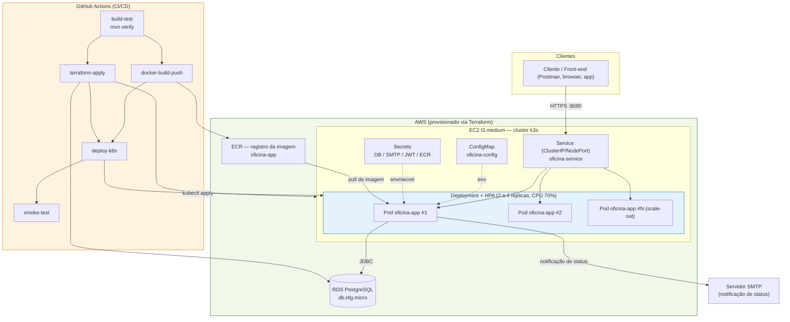

# Oficina Mecânica - Sistema Integrado MVP

> Tech Challenge Fase 1 — FIAP Pós-Graduação SOAT  
> Back-end em Java 21 + Quarkus 3.15 + PostgreSQL

## Sobre o Sistema

Sistema integrado de atendimento e execução de serviços para oficina mecânica, com foco em:

- Gestão de Ordens de Serviço (OS) com máquina de estados
- CRUD de clientes, veículos, peças e serviços
- Acompanhamento público de OS pelo cliente
- Controle de estoque de peças e insumos
- Autenticação JWT para APIs administrativas

## Requisitos

| Ferramenta     | Versão mínima |
|----------------|---------------|
| Java           | 21+           |
| Maven          | 3.9+          |
| Docker         | 24+           |
| Docker Compose | 2.0+          |

## Como Executar

### Opção 1 — Docker Compose (Recomendado)

```bash
# Clone o repositório
git clone <url-repositorio>
cd oficina

# Sobe toda a stack (PostgreSQL + App) em background
docker-compose up --build -d

# Acompanha os logs
docker-compose logs -f app

# Para a stack
docker-compose down
```

A aplicação estará disponível em `http://localhost:8080`

> **Nota:** Na primeira execução, o container gera automaticamente o par de chaves RSA para JWT. O volume
`oficina_jwt_keys` persiste as chaves entre reinicializações.

### Opção 2 — Desenvolvimento Local

```bash
# 1. Gere as chaves JWT (necessário apenas na primeira vez)
chmod +x generate-keys.sh
./generate-keys.sh

# 2. Suba o PostgreSQL via Docker
# Usuário/senha alinhados aos defaults da aplicação (DB_USERNAME/DB_PASSWORD=postgres),
# permitindo rodar 'mvn quarkus:dev' sem definir variáveis de ambiente.
docker run -d \
  --name oficina-postgres \
  -e POSTGRES_DB=oficina_db \
  -e POSTGRES_USER=postgres \
  -e POSTGRES_PASSWORD=postgres \
  -p 5432:5432 \
  postgres:16-alpine

# 3. Execute em modo dev (hot-reload)
mvn quarkus:dev
```

### Opção 3 — Build e execução manual

```bash
# Build sem testes
mvn package -DskipTests

# Executa o JAR
java -jar target/quarkus-app/quarkus-run.jar
```

## Documentação da API (Swagger)

Após subir a aplicação, acesse:

- **Swagger UI:** http://localhost:8080/swagger-ui
- **OpenAPI JSON:** http://localhost:8080/openapi

## Usuários Padrão (apenas dev/MVP)

Em **dev** (via `docker-compose.yml`) os seguintes usuários são criados na primeira execução:

| Usuário   | Senha (dev)  | Papel     | Permissões                                                                                                                       |
|-----------|--------------|-----------|----------------------------------------------------------------------------------------------------------------------------------|
| admin     | admin123     | ADMIN     | Dono — acesso total                                                                                                              |
| atendente | atendente123 | ATTENDANT | Cadastros (criar/editar) e operação de OS; **sem** exclusão, métricas, ajuste de estoque/cancelamento diretos (usa solicitações) |

> O perfil **MECHANIC** foi descontinuado (o mecânico não acessa o sistema). A migração
> `V5__remove_legacy_mechanic_users.sql` remove usuários legados com esse papel.

> ⚠️ **Em produção, defina obrigatoriamente** as variáveis `APP_SEED_ADMIN_PASSWORD` e
> `APP_SEED_ATTENDANT_PASSWORD`. Se não forem definidas, o sistema **gera senhas aleatórias**
> e as registra no log apenas uma vez. Após criar os usuários, defina `APP_SEED_ENABLED=false`.

## Autenticação

```bash
# 1. Faça login para obter o token JWT
curl -X POST http://localhost:8080/auth/login \
  -H "Content-Type: application/json" \
  -d '{"username": "admin", "password": "admin123"}'

# Resposta:
# {
#   "token": "eyJhbGc...",
#   "username": "admin",
#   "role": "ADMIN",
#   "expiresIn": 28800
# }

# 2. Use o token nas chamadas administrativas
curl http://localhost:8080/admin/clients \
  -H "Authorization: Bearer eyJhbGc..."
```

## Fluxo da Ordem de Serviço

```
RECEIVED → IN_DIAGNOSIS → AWAITING_APPROVAL → IN_EXECUTION → FINISHED → DELIVERED
                                     ↓
                                 CANCELLED
```

| Ação                           | Endpoint                                          | Papel           |
|--------------------------------|---------------------------------------------------|-----------------|
| Criar OS                       | `POST /admin/work-orders`                         | ADMIN/ATTENDANT |
| Iniciar diagnóstico            | `PATCH /admin/work-orders/{id}/start-diagnosis`   | ADMIN/ATTENDANT |
| Enviar orçamento               | `PATCH /admin/work-orders/{id}/send-for-approval` | ADMIN/ATTENDANT |
| Cliente aprova (remoto)        | `POST /public/work-orders/{orderNumber}/approve`  | Público (¹)     |
| Cliente rejeita (remoto)       | `POST /public/work-orders/{orderNumber}/reject`   | Público (¹)     |
| Aprovar (registro presencial)  | `PATCH /admin/work-orders/{id}/approve`           | ADMIN/ATTENDANT |
| Rejeitar (registro presencial) | `PATCH /admin/work-orders/{id}/reject`            | ADMIN/ATTENDANT |
| Concluir execução              | `PATCH /admin/work-orders/{id}/complete`          | ADMIN/ATTENDANT |
| Registrar entrega              | `PATCH /admin/work-orders/{id}/deliver`           | ADMIN/ATTENDANT |
| Cancelar                       | `PATCH /admin/work-orders/{id}/cancel`            | ADMIN           |

> (¹) **Approve/Reject — dois canais distintos**
> - **Canal público** (`/public/work-orders/{orderNumber}/approve|reject`): destinado ao
    > próprio cliente aprovar/rejeitar remotamente seu orçamento. Exige o número da OS e
    > prova de identidade (CPF/CNPJ) no corpo da requisição.
> - **Canal administrativo** (`/admin/work-orders/{id}/approve|reject`): destinado ao
    > atendente registrar uma aprovação/rejeição feita **presencialmente ou por telefone**
    > pelo cliente. Mantém auditoria via JWT do operador (ADMIN/ATTENDANT).

## Solicitações (fluxo de aprovação — maker-checker)

Operações sensíveis têm execução direta restrita ao **dono** (ADMIN). A **atendente**
(ATTENDANT) não as executa: abre uma **solicitação** com justificativa obrigatória, que
o dono aprova (executando a operação) ou rejeita. Tudo auditado (solicitante, motivo,
quem decidiu).

| Ação                                   | Endpoint                                | Papel           |
|----------------------------------------|-----------------------------------------|-----------------|
| Solicitar ajuste de estoque            | `POST /admin/requests/stock-adjustment` | ADMIN/ATTENDANT |
| Solicitar cancelamento de OS           | `POST /admin/requests/cancellation`     | ADMIN/ATTENDANT |
| Listar solicitações (filtro `?status`) | `GET /admin/requests`                   | ADMIN           |
| Contagem de pendentes                  | `GET /admin/requests/pending-count`     | ADMIN           |
| Aprovar (executa a operação)           | `POST /admin/requests/{id}/approve`     | ADMIN           |
| Rejeitar                               | `POST /admin/requests/{id}/reject`      | ADMIN           |
| Ajustar estoque **direto**             | `PATCH /admin/parts/{id}/stock`         | ADMIN           |
| Cancelar OS **direto**                 | `PATCH /admin/work-orders/{id}/cancel`  | ADMIN           |

> Na aprovação, a operação real roda na mesma transação; se falhar (estoque
> insuficiente, OS já cancelada), há rollback e a solicitação permanece `PENDING`.

## Endpoints Públicos (sem autenticação)

| Método | Endpoint                                    | Descrição                           |
|--------|---------------------------------------------|-------------------------------------|
| GET    | `/public/work-orders/{orderNumber}/status`  | Consultar status da OS              |
| POST   | `/public/work-orders/{orderNumber}/approve` | Aprovar orçamento (exige CPF/CNPJ)  |
| POST   | `/public/work-orders/{orderNumber}/reject`  | Rejeitar orçamento (exige CPF/CNPJ) |

> **Aprovação/rejeição pública — exigência de identidade**
> Os endpoints `approve`/`reject` exigem o CPF/CNPJ do cliente no corpo da requisição.
> O sistema valida que esse documento bate com o cliente associado à OS — caso contrário
> retorna `404` (mesma resposta de OS inexistente, para não distinguir cenários).
>
> Exemplo:
> ```bash
> curl -X POST http://localhost:8080/public/work-orders/OS-000001/approve \
>   -H "Content-Type: application/json" \
>   -d '{"clientCpfCnpj": "111.444.777-35"}'
> ```

## Executando os Testes

```bash
# Roda todos os testes com relatório de cobertura JaCoCo
mvn verify

# Apenas testes unitários
mvn test

# Relatório de cobertura em: target/site/jacoco/index.html
```

## Estrutura do Projeto

```
src/main/java/br/com/oficina/
├── domain/
│   ├── model/          # Domínio. WorkOrder (aggregate root) é POJO puro + VOs
│   │                   #   (CustomerSnapshot/VehicleSnapshot). Supporting domains
│   │                   #   (Client, Vehicle, Part, ServiceItem) são entidades JPA.
│   └── exception/      # Exceções de domínio
├── application/
│   ├── dto/            # Data Transfer Objects (request/response)
│   └── service/        # Serviços de aplicação (casos de uso)
├── infrastructure/
│   ├── persistence/    # WorkOrderEntity (+linhas) e WorkOrderMapper (isola JPA do core)
│   ├── repository/     # Repositórios Panache + adapter de persistência da OS
│   ├── security/       # Autenticação JWT, AppUser
│   └── validation/     # Validadores de CPF/CNPJ e placa
└── interfaces/
    ├── rest/           # Recursos JAX-RS (endpoints REST)
    └── exception/      # Mapeamento de exceções para HTTP
```

## Banco de Dados

**PostgreSQL** foi escolhido pelos seguintes motivos:

- Suporte nativo a tipos avançados (JSONB, arrays)
- ACID compliance robusto para operações transacionais
- Excelente performance em queries complexas com JOIN
- Suporte a índices parciais e expressões
- Comunidade ativa e ampla adoção enterprise

As migrations são gerenciadas pelo **Flyway** (`src/main/resources/db/migration/`).

## Variáveis de Ambiente

| Variável                    | Padrão              | Descrição                                      |
|-----------------------------|---------------------|------------------------------------------------|
| DB_HOST                     | localhost           | Host do PostgreSQL                             |
| DB_PORT                     | 5432                | Porta do PostgreSQL                            |
| DB_NAME                     | oficina_db          | Nome do banco                                  |
| DB_USERNAME                 | postgres            | Usuário do banco                               |
| DB_PASSWORD                 | postgres            | Senha do banco                                 |
| JWT_ISSUER                  | oficina-api         | Issuer do JWT                                  |
| JWT_EXPIRATION_HOURS        | 8                   | Validade do token JWT (horas)                  |
| JWT_PRIVATE_KEY_LOCATION    | keys/privateKey.pem | Caminho da chave privada RSA                   |
| JWT_PUBLIC_KEY_LOCATION     | keys/publicKey.pem  | Caminho da chave pública RSA                   |
| CORS_ALLOWED_ORIGINS        | localhost:3000,8080 | Lista de origens permitidas (CSV)              |
| APP_SEED_ENABLED            | true                | Se cria usuários iniciais (desabilite após)    |
| APP_SEED_ADMIN_PASSWORD     | _gerada_            | Senha do admin (dono); vazia → senha aleatória |
| APP_SEED_ATTENDANT_PASSWORD | _gerada_            | Senha da atendente; vazia → senha aleatória    |

## Health Check

```bash
# Liveness
curl http://localhost:8080/q/health/live

# Readiness
curl http://localhost:8080/q/health/ready

# Status completo
curl http://localhost:8080/q/health
```

## Segurança

- Senhas armazenadas com **BCrypt** (custo 12, sem reversibilidade)
- Tokens JWT assinados com **RSA-256** (chave 2048-bit)
- Tokens expiram em **8 horas** (configurável via `JWT_EXPIRATION_HOURS`)
- Endpoints administrativos requerem role `ADMIN` (dono) ou `ATTENDANT` (atendente);
  exclusões, métricas e execução direta de ajuste de estoque/cancelamento de OS são
  exclusivas de `ADMIN`
- Comparação de senha em **tempo constante** evita _timing attacks_ que vazariam usuários válidos
- Validação de CPF/CNPJ (com dígitos verificadores) no cadastro de clientes
- Validação de placa de veículo (formato antigo e Mercosul)
- CORS configurável por origem (sem `*` em produção)
- Container Docker executa como **usuário não-root**
- Em ambiente `prod`, Swagger UI e OpenAPI são **desabilitados automaticamente**
- Senhas iniciais não-hardcoded: se não configuradas, são geradas aleatoriamente e logadas uma única vez
- `correlationId` em respostas 500 facilita troubleshooting sem expor stack trace ao cliente

## Tecnologias

| Tecnologia            | Versão | Finalidade                              |
|-----------------------|--------|-----------------------------------------|
| Java                  | 21 LTS | Linguagem                               |
| Quarkus               | 3.15.7 | Framework (fast startup, GraalVM-ready) |
| Maven                 | 3.9+   | Gerenciador de dependências             |
| PostgreSQL            | 16     | Banco de dados principal                |
| Hibernate ORM Panache | 3.15.7 | ORM com padrão Repository               |
| Flyway                | —      | Migrations de banco de dados            |
| SmallRye JWT          | —      | Autenticação JWT (RSA-256)              |
| SmallRye OpenAPI      | —      | Documentação Swagger                    |
| Hibernate Validator   | —      | Validação de beans                      |
| H2                    | —      | Banco em memória para testes            |
| JUnit 5               | —      | Testes unitários                        |
| Mockito               | —      | Mocking para testes unitários           |
| REST-Assured          | —      | Testes de integração REST               |
| JaCoCo                | 0.8.13 | Cobertura de código                     |

---

## 🔄 Atualizações de Aderência ao Desafio (Fase 1)

Esta seção documenta melhorias aplicadas após a revisão de aderência entre o desafio,
o código e a documentação DDD (Miro).

### Justificativa da escolha do banco de dados (PostgreSQL)

Optou-se por **PostgreSQL** por ser um SGBD relacional open-source, maduro e amplamente
adotado, adequado ao domínio da oficina (dados fortemente relacionais: Cliente → Veículo →
Ordem de Serviço → Peças/Serviços, com integridade referencial e transações ACID). Recursos
relevantes para o MVP: constraints e chaves estrangeiras nativas, tipos numéricos exatos
(`DECIMAL`) para valores monetários (orçamento), índices para consultas de acompanhamento e
estoque, e excelente integração com Quarkus/Hibernate ORM + Flyway. Em ambiente de testes
usa-se **H2 em modo de compatibilidade PostgreSQL**, mantendo o mesmo dialeto sem custo de
infraestrutura.

### Controle de estoque por peça (estoque mínimo)

- A entidade `Part` passou a ter **`minimumStock`** (estoque mínimo por peça) e o método de
  domínio **`isLowStock()`** (estoque atual ≤ mínimo).
- Distinção **peça × insumo** via enum **`PartType { PECA, INSUMO }`** (atende "peças e insumos"
  da Linguagem Ubíqua).
- Repositório: `PartRepository.findLowStock()` agora compara `stockQuantity <= minimumStock`
  (antes era um limite global fixo).
- `MetricsService` usa o mínimo por peça para o indicador de reposição.
- Migration **`V2__add_stock_control_to_parts.sql`** adiciona as colunas `minimum_stock` e
  `part_type` (+ índice de apoio).

### Orçamento explícito no domínio

- `WorkOrder.getBudget()` expõe o orçamento (gerado automaticamente a partir de peças e
  serviços incluídos), reforçando o conceito de "Orçamento" da Linguagem Ubíqua.

### Endpoints novos/ajustados (`/admin/parts`)

| Método   | Caminho                    | Descrição                                                           |
|----------|----------------------------|---------------------------------------------------------------------|
| GET      | `/admin/parts/low-stock`   | Lista peças/insumos com estoque ≤ mínimo (alerta de reposição)      |
| POST/PUT | `/admin/parts` (e `/{id}`) | Campos novos opcionais: `minimumStock`, `partType` (default `PECA`) |

Os DTOs `PartRequestDto`/`PartResponseDto` incluem `minimumStock`, `partType` e `lowStock`.

### Documentação DDD consolidada (`docs/DDD.md`)

A documentação DDD foi consolidada em [`docs/DDD.md`](docs/DDD.md) com diagramas em **Mermaid**
(renderizados como imagem pelo GitHub), refletindo a arquitetura atual — incluindo o **isolamento
do core domain** (`WorkOrder` como POJO puro; persistência via `WorkOrderEntity` + `WorkOrderMapper`).
O documento cobre:

1. **Linguagem Ubíqua + glossário PT↔EN** (Recebida=RECEIVED, Orçamento=Budget/totalCost, Peça=Part, Insumo=Part(
   INSUMO), etc.).
2. **Context Map** — core (OS), supporting (Clientes/Veículos, Catálogo/Estoque), generic (Segurança) e o canal de *
   *Acompanhamento Público** (API do cliente).
3. **Modelo de Domínio (classDiagram)** — aggregates, VOs (`CustomerSnapshot`/`VehicleSnapshot`), `minimumStock`/
   `partType` em `Part`, `getBudget()` em `WorkOrder`.
4. **Máquina de Estados** da OS (7 status).
5. **Event Storming** — Fluxo da OS e Fluxo de Peças/Insumos (comando→evento→política), com estoque mínimo por peça.
6. **Arquitetura em Camadas** — com `PostgreSQL`, `Swagger/OpenAPI` e o isolamento de persistência do domínio.

> Reparos adicionais pós-aprovação foram considerados **fora do escopo deste MVP** (a máquina de
> estados atual permite edição apenas em `RECEIVED`/`IN_DIAGNOSIS`).

---

## Fase 2 — Escalabilidade, Infraestrutura e Automação

### Objetivo da fase

A Fase 1 entregou o MVP funcional (gestão de OS, clientes, veículos e peças). A Fase 2 evolui essa base
para suportar operação real com múltiplas unidades e picos de demanda, sem alterar as regras de negócio:

- **Refatoração arquitetural** — isolamento do domínio (`WorkOrder` como POJO puro, ports `in`/`out`
  explícitos) reduzindo o acoplamento ao Quarkus/JPA, com testes automatizados cobrindo os fluxos críticos
  (detalhe em [`docs/DDD.md`](docs/DDD.md) e `spec-hexagonal.md`).
- **Conteinerização** consistente entre desenvolvimento local e produção (mesmo `Dockerfile` multi-stage).
- **Orquestração via Kubernetes** com auto-scaling horizontal (HPA) reagindo a carga de CPU.
- **Infraestrutura como código** (Terraform) provisionando cluster e banco de forma reprodutível.
- **Pipeline de CI/CD** automatizando build, testes, build/push de imagem e deploy.

### Arquitetura proposta



**Componentes da aplicação:** container único (`oficina-app`, Quarkus) expondo as APIs administrativas
(`/admin/*`, autenticadas via JWT) e o canal público de acompanhamento (`/public/work-orders/*`, validado
por CPF/CNPJ). Estado é 100% externalizado (PostgreSQL) — os pods são *stateless* e substituíveis, requisito
para o HPA escalar horizontalmente sem afetar sessões em andamento.

**Infraestrutura provisionada (Terraform, detalhe em [`infra/README.md`](infra/README.md)):**

| Recurso            | Nome               | Observação                                      |
|---------------------|--------------------|--------------------------------------------------|
| VPC                 | `oficina-vpc`      | 1 subnet pública + 2 privadas, sem NAT Gateway   |
| Cluster Kubernetes  | `oficina-k3s`      | k3s single-node em EC2 `t3.medium`               |
| Banco de dados      | `oficina-postgres` | RDS PostgreSQL `db.t4g.micro`, single-AZ         |
| Registro de imagem  | `oficina-app`      | ECR privado                                       |

> k3s (single-node) em vez de EKS gerenciado: custo e simplicidade adequados ao volume do desafio, mantendo
> a API Kubernetes padrão — os manifestos em `/k8s` são portáveis para qualquer cluster gerenciado (EKS,
> AKS, GKE) sem alteração. Justificativa completa em `spec-terraform-aws.md`.

**Fluxo de deploy (pipeline `.github/workflows/ci-cd.yml`):**

1. `build-test` — roda em todo push/PR: `mvn verify` (build + testes automatizados). Gate de qualidade antes
   de qualquer publicação.
2. `docker-build-push` *(manual — `workflow_dispatch`)* — build da imagem Docker e push para o ECR, tag pelo
   SHA do commit + `latest`.
3. `terraform-apply` *(manual)* — `terraform init/plan/apply` contra a AWS, provisionando/atualizando VPC,
   EC2 (k3s), RDS e ECR.
4. `deploy-k8s` *(manual, depende dos dois anteriores)* — busca o kubeconfig do node k3s via SSM (a API do
   cluster nunca fica exposta publicamente), aplica `namespace`, `configmap`, gera os `Secrets` (DB, SMTP,
   chaves JWT, credencial do ECR) a partir de GitHub Secrets, e aplica `deployment` + `service` + `hpa`.
5. `smoke-test` — aguarda o rollout e valida `GET /q/health/live`.

Os estágios de infraestrutura (`docker-build-push`, `terraform-apply`, `deploy-k8s`) são restritos a disparo
manual — evita `apply`/deploy automático contra uma conta AWS Academy de créditos limitados a cada push.

### Execução local

```bash
cd oficina
docker-compose up --build -d
```

Detalhes completos (variáveis de ambiente, chaves JWT, modo dev) na seção [Como Executar](#como-executar)
acima.

### Deploy em Kubernetes

Pré-requisito: cluster provisionado (seção seguinte) e `KUBECONFIG` apontando para ele. Passo a passo
completo, incluindo geração dos `Secrets`, em [`k8s/README.md`](k8s/README.md):

```bash
kubectl apply -f k8s/namespace.yaml -f k8s/configmap.yaml
# Secrets (ECR, JWT, DB/SMTP) — ver k8s/README.md para os comandos completos
kubectl apply -f k8s/deployment.yaml -f k8s/service.yaml -f k8s/hpa.yaml
kubectl get pods,hpa,svc -n oficina
```

### Provisionamento da infraestrutura (Terraform)

Passo a passo completo (bootstrap do backend remoto, variáveis obrigatórias, custo estimado e destruição ao
final da sessão) em [`infra/README.md`](infra/README.md):

```bash
cd infra
terraform init
terraform plan -out=tfplan
terraform apply tfplan
```

> Ambiente roda em conta AWS Academy (créditos limitados por sessão). `terraform destroy` é obrigatório ao
> final de cada sessão — ver [`SESSION-GUIDE.md`](SESSION-GUIDE.md).

### Collection de API

- Swagger/OpenAPI (gerado automaticamente pelo Quarkus/SmallRye): `http://localhost:8080/swagger-ui` (ou
  `http://<host>:8080/swagger-ui` no ambiente publicado) — especificação OpenAPI em
  `http://localhost:8080/q/openapi`.
- Collection Postman: [`postman/Oficina-Mecanica.postman_collection.json`](postman/Oficina-Mecanica.postman_collection.json).

### Vídeo demonstrativo

[Link do vídeo](#) *(adicionar após a gravação — roteiro em `docs/ROTEIRO-VIDEO.md`)*.

### Débito técnico conhecido (não bloqueia a entrega)

- Cobertura de teste da Fase 1 ainda em aberto: teste de resiliência de notificação (`notifySafely` em
  `WorkOrderService`) e testes de round-trip dos mappers (`Client`/`Vehicle`/`Part`/`ServiceItem`) — ver
  `spec-test-unit.md`.
- Entidades `Client`, `Vehicle`, `Part` e `ServiceItem` ainda são `@Entity` JPA (acopladas ao framework);
  apenas `WorkOrder` segue o padrão POJO + mapper completo — ver `spec-hexagonal.md`.
- Sem Testcontainers nos testes de integração (usam H2 em memória); RDS real só é validado no ambiente
  provisionado.
