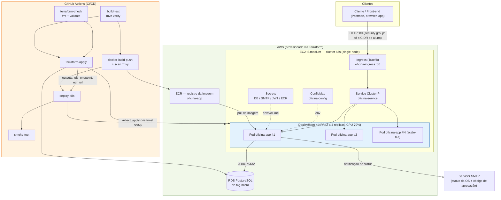

# Oficina Mecânica - Sistema Integrado MVP

> Tech Challenge Fase 1 — FIAP Pós-Graduação SOAT  
> Back-end em Java 21 + Quarkus 3.15 + PostgreSQL

## Sobre o Sistema

Sistema integrado de atendimento e execução de serviços para oficina mecânica, com foco em:

- Gestão de Ordens de Serviço (OS) com máquina de estados
- CRUD de clientes, veículos, peças e serviços
- Acompanhamento público de OS pelo cliente
- Controle de estoque de peças e insumos
- Autenticação JWT para APIs administrativas

## Requisitos

| Ferramenta     | Versão mínima |
|----------------|---------------|
| Java           | 21+           |
| Maven          | 3.9+          |
| Docker         | 24+           |
| Docker Compose | 2.0+          |

## Como Executar

### Opção 1 — Docker Compose (Recomendado)

```bash
# Clone o repositório
git clone <url-repositorio>
cd oficina

# Sobe toda a stack (PostgreSQL + App) em background
docker-compose up --build -d

# Acompanha os logs
docker-compose logs -f app

# Para a stack
docker-compose down
```

A aplicação estará disponível em `http://localhost:8080`

> **Nota:** Na primeira execução, o container gera automaticamente o par de chaves RSA para JWT. O volume
`oficina_jwt_keys` persiste as chaves entre reinicializações.

### Opção 2 — Desenvolvimento Local

```bash
# 1. Gere as chaves JWT (necessário apenas na primeira vez)
chmod +x generate-keys.sh
./generate-keys.sh

# 2. Suba o PostgreSQL via Docker
# Usuário/senha alinhados aos defaults da aplicação (DB_USERNAME/DB_PASSWORD=postgres),
# permitindo rodar 'mvn quarkus:dev' sem definir variáveis de ambiente.
docker run -d \
  --name oficina-postgres \
  -e POSTGRES_DB=oficina_db \
  -e POSTGRES_USER=postgres \
  -e POSTGRES_PASSWORD=postgres \
  -p 5432:5432 \
  postgres:16-alpine

# 3. Execute em modo dev (hot-reload)
mvn quarkus:dev
```

### Opção 3 — Build e execução manual

```bash
# Build sem testes
mvn package -DskipTests

# Executa o JAR
java -jar target/quarkus-app/quarkus-run.jar
```

## Documentação da API (Swagger)

Após subir a aplicação, acesse:

- **Swagger UI:** http://localhost:8080/swagger-ui
- **OpenAPI JSON:** http://localhost:8080/openapi

## Usuários Padrão (apenas dev/MVP)

Em **dev** (via `docker-compose.yml`) os seguintes usuários são criados na primeira execução:

| Usuário  | Senha (dev)  | Papel   | Permissões                                                                              |
|----------|--------------|---------|-----------------------------------------------------------------------------------------|
| admin    | admin123     | ADMIN   | Acesso total, incluindo exclusões, métricas, ajuste de estoque e cancelamento de OS      |
| mecanico | mecanico123  | MECHANIC| Consulta e operação da OS + cadastros (leitura/criação); **sem** exclusão nem métricas   |

> ⚠️ **Em produção, defina obrigatoriamente** as variáveis `APP_SEED_ADMIN_PASSWORD` e
> `APP_SEED_MECHANIC_PASSWORD`. Se não forem definidas, o sistema **gera senhas aleatórias**
> e as registra no log apenas uma vez — comportamento de laboratório, documentado em
> `DataSeeder`. Após criar os usuários, defina `APP_SEED_ENABLED=false`.

## Autenticação

```bash
# 1. Faça login para obter o token JWT
curl -X POST http://localhost:8080/auth/login \
  -H "Content-Type: application/json" \
  -d '{"username": "admin", "password": "admin123"}'

# Resposta:
# {
#   "token": "eyJhbGc...",
#   "username": "admin",
#   "role": "ADMIN",
#   "expiresIn": 28800
# }

# 2. Use o token nas chamadas administrativas
curl http://localhost:8080/admin/clients \
  -H "Authorization: Bearer eyJhbGc..."
```

## Fluxo da Ordem de Serviço

```
RECEIVED → IN_DIAGNOSIS → AWAITING_APPROVAL → IN_EXECUTION → FINISHED → DELIVERED
                                     ↓
                                 CANCELLED
```

| Ação                           | Endpoint                                          | Papel          |
|--------------------------------|---------------------------------------------------|----------------|
| Criar OS                       | `POST /admin/work-orders`                         | ADMIN/MECHANIC |
| Iniciar diagnóstico            | `PATCH /admin/work-orders/{id}/start-diagnosis`   | ADMIN/MECHANIC |
| Enviar orçamento               | `PATCH /admin/work-orders/{id}/send-for-approval` | ADMIN/MECHANIC |
| Cliente aprova (remoto)        | `POST /public/work-orders/{orderNumber}/approve`  | Público (¹)    |
| Cliente rejeita (remoto)       | `POST /public/work-orders/{orderNumber}/reject`   | Público (¹)    |
| Aprovar (registro presencial)  | `PATCH /admin/work-orders/{id}/approve`           | ADMIN/MECHANIC |
| Rejeitar (registro presencial) | `PATCH /admin/work-orders/{id}/reject`            | ADMIN/MECHANIC |
| Concluir execução              | `PATCH /admin/work-orders/{id}/complete`          | ADMIN/MECHANIC |
| Registrar entrega              | `PATCH /admin/work-orders/{id}/deliver`           | ADMIN/MECHANIC |
| Cancelar                       | `PATCH /admin/work-orders/{id}/cancel`            | ADMIN          |

> (¹) **Approve/Reject — dois canais distintos**
> - **Canal público** (`/public/work-orders/{orderNumber}/approve|reject`): destinado ao
    > próprio cliente aprovar/rejeitar remotamente seu orçamento. Exige o número da OS,
    > o CPF/CNPJ e o **código de autorização de uso único** recebido por e-mail.
> - **Canal administrativo** (`/admin/work-orders/{id}/approve|reject`): destinado ao
    > operador registrar uma aprovação/rejeição feita **presencialmente ou por telefone**
    > pelo cliente. Mantém auditoria via JWT do operador (ADMIN/MECHANIC) e não exige o
    > código — é o caminho para clientes sem e-mail cadastrado.

## Listagem de OS (fila de trabalho)

`GET /admin/work-orders` devolve a **fila ativa**:

- ordenada por prioridade de status — **Em Execução > Aguardando Aprovação > Diagnóstico >
  Recebida** — e, dentro do mesmo status, das **mais antigas para as mais recentes**;
- com **exclusão lógica** (nunca física) dos estados terminais: `FINISHED`, `DELIVERED` e
  também `CANCELLED` — uma OS cancelada não tem mais trabalho pendente, então não pertence
  à fila. Todas continuam consultáveis por `GET /admin/work-orders?status=DELIVERED`;
- com o total de registros, ignorando a paginação, no cabeçalho **`X-Total-Count`** (também
  presente em `/admin/clients`, `/admin/vehicles` e `/admin/parts`).

A prioridade é declarada no enum de domínio `WorkOrderStatus` (`listingPriority()` /
`isTerminal()`) e a consulta de persistência é derivada dela — não há uma segunda cópia da
regra escrita à mão no adapter.

## Endpoints Públicos (sem autenticação)

| Método | Endpoint                                    | Descrição                                     |
|--------|---------------------------------------------|-----------------------------------------------|
| GET    | `/public/work-orders/{orderNumber}/status`  | Consultar status da OS                        |
| POST   | `/public/work-orders/{orderNumber}/approve` | Aprovar orçamento (CPF/CNPJ + código do e-mail) |
| POST   | `/public/work-orders/{orderNumber}/reject`  | Rejeitar orçamento (CPF/CNPJ + código do e-mail) |

> **Aprovação/rejeição pública — duas provas independentes**
>
> O número da OS é sequencial (`OS-000001`, `OS-000002`…) e portanto enumerável, e o
> CPF/CNPJ é um dado amplamente conhecido. Só com esses dois, um terceiro conseguiria
> aprovar ou cancelar o orçamento de outra pessoa por força bruta. Por isso `approve` e
> `reject` exigem também um **código de autorização de 256 bits** gerado no envio do
> orçamento, entregue **exclusivamente no e-mail do cliente** e invalidado no primeiro uso.
>
> - CPF/CNPJ divergente → `404`, com a mesma mensagem de OS inexistente (não confirma quais
>   números de OS existem)
> - código ausente → `400`; código inválido → `404`; código já usado → `422`
> - reenviar o orçamento gera um código novo e invalida o anterior
>
> O código **não** aparece em nenhuma resposta da API — nem para o operador autenticado. Em
> execução local, o e-mail é capturado pelo Mailpit em <http://localhost:8025>.
>
> Exemplo:
> ```bash
> curl -X POST http://localhost:8080/public/work-orders/OS-000001/approve \
>   -H "Content-Type: application/json" \
>   -d '{"clientCpfCnpj": "111.444.777-35", "approvalToken": "<código recebido por e-mail>"}'
> ```

## Executando os Testes

```bash
# Roda todos os testes com relatório de cobertura JaCoCo
mvn verify

# Apenas testes unitários
mvn test

# Relatório de cobertura em: target/site/jacoco/index.html
```

## Estrutura do Projeto

```
src/main/java/br/com/oficina/
├── domain/                 # Zero dependência de framework (sem Spring/Quarkus/JPA)
│   ├── model/              # Aggregates e enums. WorkOrder é POJO puro; Client, Vehicle,
│   │                       #   Part e ServiceItem também — cada um com Entity+Mapper próprios
│   ├── valueobject/        # CpfCnpj, LicensePlate, ApprovalToken
│   ├── event/              # WorkOrderStatusChangedEvent
│   └── exception/          # Exceções de domínio
├── application/
│   ├── dto/                # Data Transfer Objects (request/response)
│   ├── ports/in/           # Driver ports (casos de uso)
│   ├── ports/out/          # Driven ports (repositórios, notificação)
│   ├── service/            # Implementação dos casos de uso
│   └── validation/         # Anotações Bean Validation que delegam aos VOs do domínio
├── infrastructure/
│   ├── adapters/out/       # Implementações dos driven ports (persistência, e-mail)
│   ├── persistence/        # *Entity, *Mapper e *PanacheRepository (isolam o JPA)
│   └── security/           # Autenticação JWT, AppUser, seed inicial
└── interfaces/
    ├── rest/               # Recursos JAX-RS (endpoints REST)
    └── exception/          # Mapeamento de exceções para HTTP
```

**Direção das dependências:** `interfaces → application → domain` e
`infrastructure → application → domain`. O domínio não importa nada de fora — verificável
com `grep -r "^import \(jakarta\|io.quarkus\|org.hibernate\)" src/main/java/br/com/oficina/domain/`,
que não retorna nada.

As duas famílias de portas ficam lado a lado em `application.ports`: as de entrada
devolvem DTOs de aplicação, então declará-las no domínio inverteria a dependência. Os
adapters usam os repositórios Panache **por composição** — herdar `PanacheRepository`
direto no adapter transformava ~40 métodos de persistência em API pública dele.

## Banco de Dados

**PostgreSQL** foi escolhido pelos seguintes motivos:

- Suporte nativo a tipos avançados (JSONB, arrays)
- ACID compliance robusto para operações transacionais
- Excelente performance em queries complexas com JOIN
- Suporte a índices parciais e expressões
- Comunidade ativa e ampla adoção enterprise

As migrations são gerenciadas pelo **Flyway** (`src/main/resources/db/migration/`).

## Variáveis de Ambiente

| Variável                    | Padrão              | Descrição                                      |
|-----------------------------|---------------------|------------------------------------------------|
| DB_HOST                     | localhost           | Host do PostgreSQL                             |
| DB_PORT                     | 5432                | Porta do PostgreSQL                            |
| DB_NAME                     | oficina_db          | Nome do banco                                  |
| DB_USERNAME                 | postgres            | Usuário do banco                               |
| DB_PASSWORD                 | postgres            | Senha do banco                                 |
| JWT_ISSUER                  | oficina-api         | Issuer do JWT                                  |
| JWT_EXPIRATION_HOURS        | 8                   | Validade do token JWT (horas)                  |
| JWT_PRIVATE_KEY_LOCATION    | keys/privateKey.pem | Caminho da chave privada RSA                   |
| JWT_PUBLIC_KEY_LOCATION     | keys/publicKey.pem  | Caminho da chave pública RSA                   |
| CORS_ALLOWED_ORIGINS        | localhost:3000,8080 | Lista de origens permitidas (CSV)              |
| APP_SEED_ENABLED            | true                | Se cria usuários iniciais (desabilite após)    |
| APP_SEED_ADMIN_PASSWORD     | _gerada_            | Senha do admin; vazia → senha aleatória        |
| APP_SEED_MECHANIC_PASSWORD  | _gerada_            | Senha do mecânico; vazia → senha aleatória     |
| MAILER_HOST / MAILER_PORT   | localhost / 1025    | SMTP usado para notificar mudança de status    |
| MAILER_FROM                 | nao-responda@…      | Remetente das notificações                     |

## Health Check

```bash
# Liveness
curl http://localhost:8080/q/health/live

# Readiness
curl http://localhost:8080/q/health/ready

# Status completo
curl http://localhost:8080/q/health
```

## Segurança

- Senhas armazenadas com **BCrypt** (custo 12, sem reversibilidade)
- Tokens JWT assinados com **RSA-256** (chave 2048-bit)
- Tokens expiram em **8 horas** (configurável via `JWT_EXPIRATION_HOURS`)
- Endpoints administrativos requerem role `ADMIN` ou `MECHANIC`; exclusões, métricas e
  ajuste direto de estoque/cancelamento de OS são exclusivos de `ADMIN`
- Aprovação pública de orçamento exige **código de uso único** entregue só por e-mail
  (CPF/CNPJ sozinho não autoriza — ver "Endpoints Públicos")
- Comparação de senha em **tempo constante** evita _timing attacks_ que vazariam usuários válidos
- Validação de CPF/CNPJ (com dígitos verificadores) no cadastro de clientes
- Validação de placa de veículo (formato antigo e Mercosul)
- CORS configurável por origem (sem `*` em produção)
- Container Docker executa como **usuário não-root com UID numérico (1001)**, e o
  `securityContext` do Deployment reforça (`runAsNonRoot`, `readOnlyRootFilesystem`,
  `allowPrivilegeEscalation: false`, `capabilities: drop [ALL]`, `seccomp: RuntimeDefault`)
- Em ambiente `prod`, Swagger UI e OpenAPI são **desabilitados automaticamente**
- Senhas iniciais não-hardcoded: se não configuradas, são geradas aleatoriamente e logadas uma única vez
- `correlationId` em respostas 500 facilita troubleshooting sem expor stack trace ao cliente

## Tecnologias

| Tecnologia            | Versão | Finalidade                              |
|-----------------------|--------|-----------------------------------------|
| Java                  | 21 LTS | Linguagem                               |
| Quarkus               | 3.15.7 | Framework (fast startup, GraalVM-ready) |
| Maven                 | 3.9+   | Gerenciador de dependências             |
| PostgreSQL            | 16     | Banco de dados principal                |
| Hibernate ORM Panache | 3.15.7 | ORM com padrão Repository               |
| Flyway                | —      | Migrations de banco de dados            |
| SmallRye JWT          | —      | Autenticação JWT (RSA-256)              |
| SmallRye OpenAPI      | —      | Documentação Swagger                    |
| Hibernate Validator   | —      | Validação de beans                      |
| H2                    | —      | Banco em memória para testes            |
| Micrometer/Prometheus | —      | Métricas da aplicação em `/q/metrics`   |
| JUnit 5               | —      | Testes unitários                        |
| Mockito               | —      | Mocking para testes unitários           |
| REST-Assured          | —      | Testes de integração REST               |
| JaCoCo                | 0.8.13 | Cobertura de código                     |

## Observabilidade

| Recurso            | Endpoint      | Observação                                                    |
|--------------------|---------------|---------------------------------------------------------------|
| Liveness           | `/q/health/live`    | Usado pelo `livenessProbe` e pelo HEALTHCHECK do Docker |
| Readiness          | `/q/health/ready`   | Inclui checagem da conexão com o banco                  |
| Startup            | `/q/health/started` | Cobre a janela de boot (pool + Flyway) no `startupProbe`|
| Métricas Prometheus| `/q/metrics`        | JVM, HTTP server e sistema, via Micrometer              |

Em perfil `prod` o log do console sai em **JSON** (`quarkus.log.console.json`): com várias
réplicas escrevendo no mesmo stdout, texto livre é impraticável de correlacionar.

> O HPA usa o **metrics-server** (embarcado no k3s), que é independente do `/q/metrics`.
> Confirme com `kubectl top pods -n oficina` antes de demonstrar o autoscaling — se a
> métrica aparecer como `<unknown>`, o HPA não escala.

---

## 🔄 Atualizações de Aderência ao Desafio (Fase 1)

Esta seção documenta melhorias aplicadas após a revisão de aderência entre o desafio,
o código e a documentação DDD (Miro).

### Justificativa da escolha do banco de dados (PostgreSQL)

Optou-se por **PostgreSQL** por ser um SGBD relacional open-source, maduro e amplamente
adotado, adequado ao domínio da oficina (dados fortemente relacionais: Cliente → Veículo →
Ordem de Serviço → Peças/Serviços, com integridade referencial e transações ACID). Recursos
relevantes para o MVP: constraints e chaves estrangeiras nativas, tipos numéricos exatos
(`DECIMAL`) para valores monetários (orçamento), índices para consultas de acompanhamento e
estoque, e excelente integração com Quarkus/Hibernate ORM + Flyway. Em ambiente de testes
usa-se **H2 em modo de compatibilidade PostgreSQL**, mantendo o mesmo dialeto sem custo de
infraestrutura.

### Controle de estoque por peça (estoque mínimo)

- A entidade `Part` passou a ter **`minimumStock`** (estoque mínimo por peça) e o método de
  domínio **`isLowStock()`** (estoque atual ≤ mínimo).
- Distinção **peça × insumo** via enum **`PartType { PECA, INSUMO }`** (atende "peças e insumos"
  da Linguagem Ubíqua).
- Repositório: `PartRepository.findLowStock()` agora compara `stockQuantity <= minimumStock`
  (antes era um limite global fixo).
- `MetricsService` usa o mínimo por peça para o indicador de reposição.
- Migration **`V2__add_stock_control_to_parts.sql`** adiciona as colunas `minimum_stock` e
  `part_type` (+ índice de apoio).

### Orçamento explícito no domínio

- `WorkOrder.getBudget()` expõe o orçamento (gerado automaticamente a partir de peças e
  serviços incluídos), reforçando o conceito de "Orçamento" da Linguagem Ubíqua.

### Endpoints novos/ajustados (`/admin/parts`)

| Método   | Caminho                    | Descrição                                                           |
|----------|----------------------------|---------------------------------------------------------------------|
| GET      | `/admin/parts/low-stock`   | Lista peças/insumos com estoque ≤ mínimo (alerta de reposição)      |
| POST/PUT | `/admin/parts` (e `/{id}`) | Campos novos opcionais: `minimumStock`, `partType` (default `PECA`) |

Os DTOs `PartRequestDto`/`PartResponseDto` incluem `minimumStock`, `partType` e `lowStock`.

### Documentação DDD consolidada (`docs/DDD.md`)

A documentação DDD foi consolidada em [`docs/DDD.md`](docs/DDD.md) com diagramas em **Mermaid**
(renderizados como imagem pelo GitHub), refletindo a arquitetura atual — incluindo o **isolamento
do core domain** (`WorkOrder` como POJO puro; persistência via `WorkOrderEntity` + `WorkOrderMapper`).
O documento cobre:

1. **Linguagem Ubíqua + glossário PT↔EN** (Recebida=RECEIVED, Orçamento=Budget/totalCost, Peça=Part, Insumo=Part(
   INSUMO), etc.).
2. **Context Map** — core (OS), supporting (Clientes/Veículos, Catálogo/Estoque), generic (Segurança) e o canal de *
   *Acompanhamento Público** (API do cliente).
3. **Modelo de Domínio (classDiagram)** — aggregates, VOs (`CustomerSnapshot`/`VehicleSnapshot`), `minimumStock`/
   `partType` em `Part`, `getBudget()` em `WorkOrder`.
4. **Máquina de Estados** da OS (7 status).
5. **Event Storming** — Fluxo da OS e Fluxo de Peças/Insumos (comando→evento→política), com estoque mínimo por peça.
6. **Arquitetura em Camadas** — com `PostgreSQL`, `Swagger/OpenAPI` e o isolamento de persistência do domínio.

> Reparos adicionais pós-aprovação foram considerados **fora do escopo deste MVP** (a máquina de
> estados atual permite edição apenas em `RECEIVED`/`IN_DIAGNOSIS`).

---
## Fase 2 — Escalabilidade, Infraestrutura e Automação

### Objetivo da fase

A Fase 1 entregou o MVP funcional (gestão de OS, clientes, veículos e peças). A Fase 2 evolui essa base
para suportar operação real com múltiplas unidades e picos de demanda, sem alterar as regras de negócio:

- **Refatoração arquitetural** — domínio sem nenhuma dependência de framework, ports `in`/`out`
  explícitos na camada de aplicação e adapters por composição, com testes automatizados cobrindo os
  fluxos críticos (detalhe em [`docs/DDD.md`](docs/DDD.md) e [`docs/spec-hexagonal.md`](docs/spec-hexagonal.md)).
- **Conteinerização** consistente entre desenvolvimento local e produção (mesmo `Dockerfile` multi-stage).
- **Orquestração via Kubernetes** com auto-scaling horizontal (HPA) reagindo a carga de CPU.
- **Infraestrutura como código** (Terraform) provisionando cluster e banco de forma reprodutível.
- **Pipeline de CI/CD** automatizando build, testes, build/push de imagem, provisionamento e deploy.

### Arquitetura proposta



**Componentes da aplicação:** container único (`oficina-app`, Quarkus) expondo as APIs administrativas
(`/admin/*`, autenticadas via JWT) e o canal público de acompanhamento (`/public/work-orders/*`, validado
por CPF/CNPJ + código de uso único). Estado é 100% externalizado (PostgreSQL) — os pods são *stateless* e
substituíveis, requisito para o HPA escalar horizontalmente sem afetar sessões em andamento. As chaves de
assinatura do JWT vêm de um Secret montado como volume, para que **todas as réplicas assinem com o mesmo
par** (do contrário, um token emitido por um pod seria rejeitado por outro).

**Infraestrutura provisionada (Terraform, detalhe em [`infra/README.md`](infra/README.md)):**

| Recurso            | Nome               | Observação                                                      |
|--------------------|--------------------|-----------------------------------------------------------------|
| VPC                | `oficina-vpc`      | 1 subnet pública + 2 privadas, sem NAT Gateway                  |
| Cluster Kubernetes | `oficina-k3s`      | k3s single-node em EC2 `t3.medium`, disco criptografado, IMDSv2 |
| Banco de dados     | `oficina-postgres` | RDS PostgreSQL `db.t4g.micro`, single-AZ, `storage_encrypted`   |
| Registro de imagem | `oficina-app`      | ECR privado                                                     |

**Exposição da API:** o Ingress (Traefik, embarcado no k3s) publica a aplicação na porta 80 do node, e o
security group libera essa porta **apenas para o CIDR informado em `allowed_cidr`**. A API do Kubernetes
(6443) nunca é exposta: todo acesso administrativo, inclusive o da pipeline, passa por túnel do
**SSM Session Manager**. A URL final sai em `terraform output application_url`.

### Alta disponibilidade — o que esta entrega faz e o que não faz

O enunciado pede "garantir alta disponibilidade". Vale ser explícito sobre o que foi entregue:

| Dimensão                          | Situação                                                            |
|-----------------------------------|---------------------------------------------------------------------|
| Elasticidade sob pico             | ✅ HPA de 2 a 4 réplicas por CPU, com `behavior` calibrado           |
| Rollout sem downtime              | ✅ `maxUnavailable: 0` + `maxSurge: 1`, probes de readiness/startup  |
| Sobrevivência à queda de um pod   | ✅ 2 réplicas mínimas + PodDisruptionBudget                          |
| Sobrevivência à queda do **node** | ❌ cluster **single-node** — o node é ponto único de falha           |
| Sobrevivência à queda de uma AZ   | ❌ RDS single-AZ, sem réplica de leitura                             |

Isso é uma **decisão consciente de custo**, não um esquecimento: o ambiente roda em conta AWS Academy com
crédito único de US$50 para o curso inteiro. Um EKS gerenciado custa ~US$0,10/h só de control plane, e
multi-AZ no RDS dobra o custo do banco — juntos consumiriam o orçamento em poucos dias de laboratório.

O caminho para HA real, sem reescrever nada: os manifestos em `/k8s` são Kubernetes padrão e sobem
inalterados em EKS/AKS/GKE. Bastaria (1) trocar o módulo de EC2+k3s por um cluster gerenciado multi-AZ com
pelo menos 2 nodes, (2) `multi_az = true` no RDS com `backup_retention_period > 0`, e (3) acrescentar
`topologySpreadConstraints` ao Deployment para distribuir as réplicas entre AZs. A justificativa completa
da escolha está em [`docs/spec-terraform-aws.md`](docs/spec-terraform-aws.md).

### Fluxo de deploy (pipeline `.github/workflows/ci-cd.yml`)

Roda em **todo push e PR** (sem custo, sem credencial AWS):

1. `build-test` — `mvn verify` (build + testes + gate de cobertura JaCoCo). Publica relatórios de testes e
   de cobertura como artefatos da execução.
2. `terraform-check` — `terraform fmt -check` e `terraform validate`, sem tocar na AWS.

Roda **por push de tag `v*` ou disparo manual** (`workflow_dispatch`) — os estágios que custam dinheiro:

3. `docker-build-push` — build da imagem com cache do BuildKit, **scan Trivy** (falha em CRITICAL com
   correção disponível) e só então push para o ECR, com tag pelo SHA do commit + `latest`.
4. `terraform-apply` — `init/plan/apply` provisionando VPC, EC2 (k3s), RDS e ECR. Exporta `rds_endpoint`,
   `ecr_repository_url` e `application_url` como **outputs do job**, consumidos diretamente pelo deploy —
   antes esses valores eram GitHub Secrets atualizados à mão a cada sessão, origem mais comum de deploy
   quebrado, já que a infraestrutura é recriada do zero.
5. `deploy-k8s` — obtém o kubeconfig via SSM, gera os Secrets (DB, SMTP, chaves JWT, credencial do ECR) a
   partir de GitHub Secrets e aplica `namespace`, `configmap`, `deployment`, `service`, `ingress`, `hpa` e
   `networkpolicy`. A imagem é fixada com `kubectl set image`. Se o rollout falhar, faz `rollout undo`
   automático e despeja logs e eventos.
6. `smoke-test` — valida `/q/health/live` e `/q/health/ready` pelo Service e, de dentro do node, o caminho
   completo pelo Ingress. Em falha, reverte o deploy.

> **Por que os estágios de infraestrutura não rodam em todo push na master:** cada `apply` recria EC2 e
> RDS numa conta de crédito limitado. O gatilho por tag (`git tag v1.0.0 && git push --tags`) mantém o CD
> automatizado, com um marco explícito de release, sem transformar cada commit em um deploy pago.

### Execução local

```bash
cd oficina
docker-compose up --build -d
```

Sobe PostgreSQL, **Mailpit** (captura os e-mails em <http://localhost:8025> — é lá que aparece o código de
aprovação do orçamento) e a aplicação em <http://localhost:8080>. Detalhes de variáveis de ambiente e modo
dev na seção [Como Executar](#como-executar); passo a passo completo em [`docs/RUN-LOCAL.md`](docs/RUN-LOCAL.md).

### Deploy em Kubernetes

Pré-requisito: cluster provisionado (seção seguinte) e `KUBECONFIG` apontando para ele. Passo a passo
completo, incluindo geração dos `Secrets`, em [`k8s/README.md`](k8s/README.md):

```bash
kubectl apply -f k8s/namespace.yaml -f k8s/configmap.yaml
# Secrets (ECR, JWT, DB/SMTP) — ver k8s/README.md para os comandos completos
kubectl apply -f k8s/deployment.yaml -f k8s/service.yaml -f k8s/ingress.yaml \
              -f k8s/hpa.yaml -f k8s/networkpolicy.yaml
kubectl get pods,hpa,svc,ingress -n oficina
```

### Provisionamento da infraestrutura (Terraform)

Passo a passo completo (bootstrap do backend remoto, variáveis obrigatórias, custo estimado e destruição ao
final da sessão) em [`infra/README.md`](infra/README.md):

```bash
cd infra
terraform init
terraform plan -out=tfplan
terraform apply tfplan
terraform output application_url
```

> Ambiente roda em conta AWS Academy (créditos limitados por sessão). `terraform destroy` é obrigatório ao
> final de cada sessão — ver [`docs/SESSION-GUIDE.md`](docs/SESSION-GUIDE.md).

### Collection de API

- Swagger/OpenAPI (gerado automaticamente pelo Quarkus/SmallRye): `http://localhost:8080/swagger-ui` —
  especificação OpenAPI em `http://localhost:8080/openapi`. Em perfil `prod` o Swagger fica
  **desabilitado** por hardening; use a collection abaixo contra o ambiente publicado.
- Collection Postman: [`postman/Oficina-Mecanica.postman_collection.json`](postman/Oficina-Mecanica.postman_collection.json).

### Vídeo demonstrativo

[Link do vídeo](https://www.youtube.com/watch?v=ZaVSqljr3ek)
