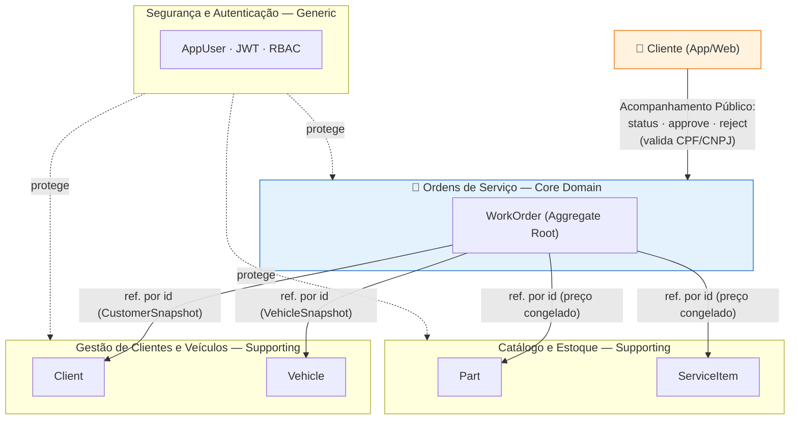
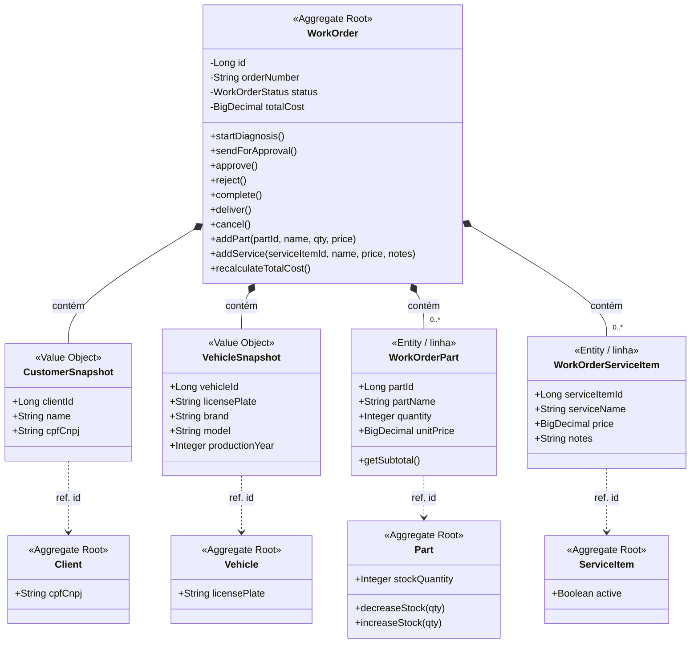
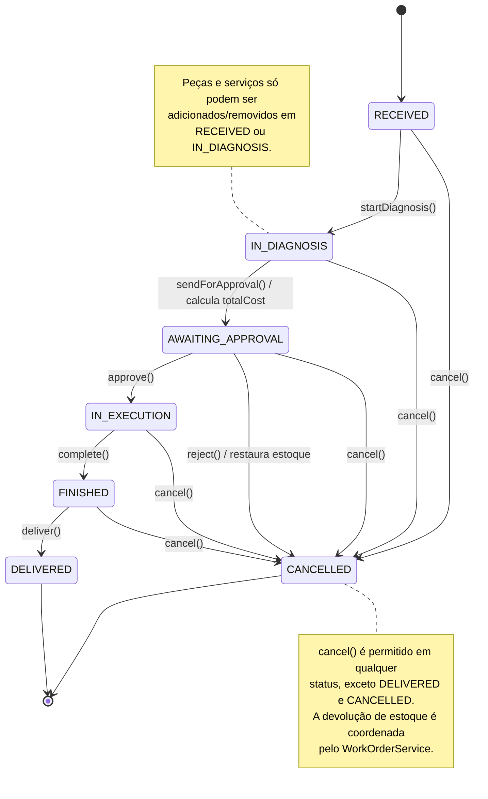
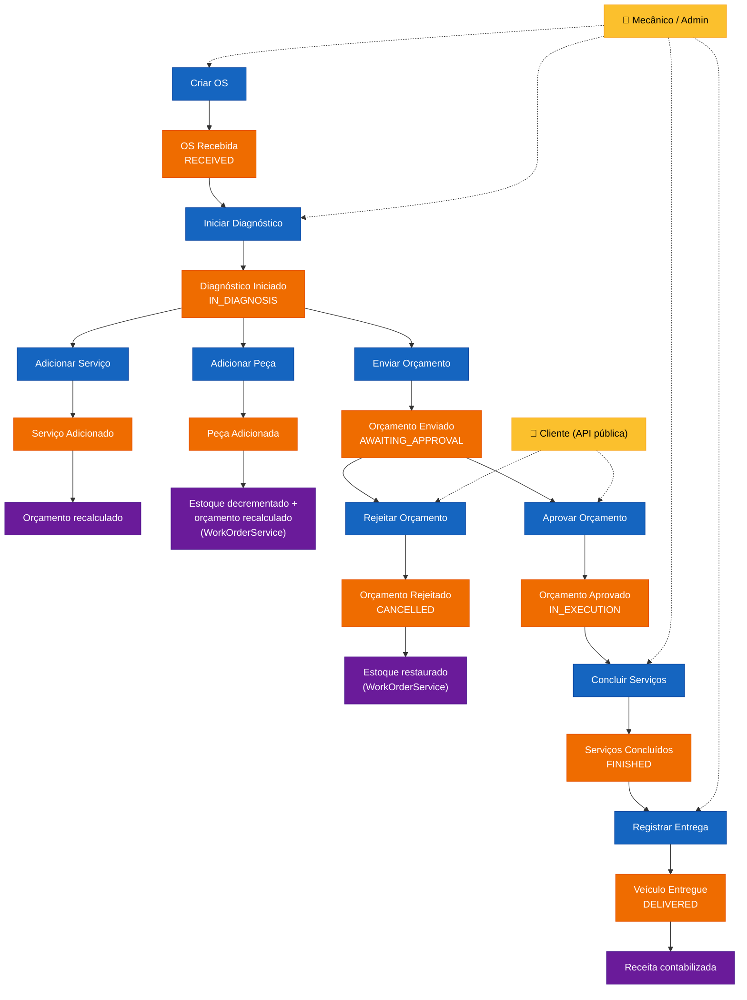
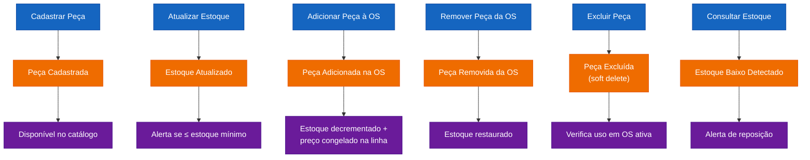
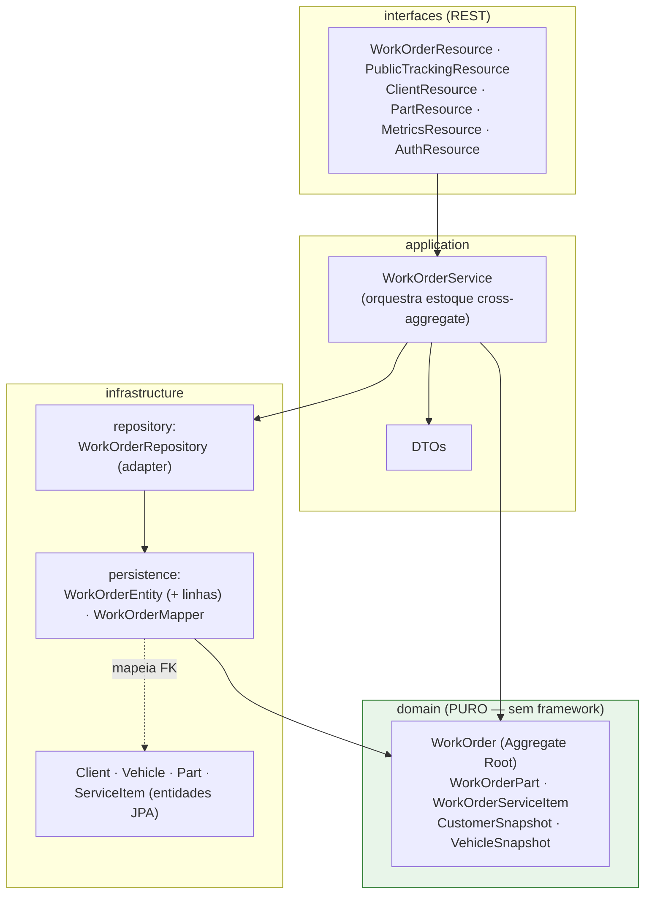

# Documentação DDD — Oficina Mecânica MVP

> Os diagramas abaixo estão em [Mermaid](https://mermaid.js.org/) e são
> renderizados automaticamente como imagem pelo GitHub/GitLab.

## 1. Linguagem Ubíqua (Ubiquitous Language)

A linguagem ubíqua estabelece um vocabulário compartilhado entre especialistas de domínio e desenvolvedores.

| Termo                     | Definição                                                                                                                                                                                                                                                                                                |
|---------------------------|----------------------------------------------------------------------------------------------------------------------------------------------------------------------------------------------------------------------------------------------------------------------------------------------------------|
| **Ordem de Serviço (OS)** | Documento que registra todos os serviços e peças relacionados ao atendimento de um veículo. Possui um ciclo de vida bem definido com status.                                                                                                                                                             |
| **Cliente**               | Pessoa física (CPF) ou jurídica (CNPJ) que solicita serviços da oficina.                                                                                                                                                                                                                                 |
| **Veículo**               | Automóvel identificado por placa, marca, modelo e ano pertencente a um cliente.                                                                                                                                                                                                                          |
| **Diagnóstico**           | Análise técnica realizada pelo mecânico para identificar problemas no veículo.                                                                                                                                                                                                                           |
| **Orçamento**             | Estimativa de custo calculada automaticamente com base nos serviços e peças da OS.                                                                                                                                                                                                                       |
| **Aprovação**             | Autorização do cliente para execução dos serviços após recebimento do orçamento.                                                                                                                                                                                                                         |
| **Peça/Insumo**           | Material consumido na execução do serviço (ex.: óleo, filtro, pastilha de freio).                                                                                                                                                                                                                        |
| **Estoque**               | Quantidade disponível de peças e insumos para uso nas ordens de serviço.                                                                                                                                                                                                                                 |
| **Catálogo de Serviços**  | Conjunto de serviços oferecidos pela oficina com preço base e duração estimada.                                                                                                                                                                                                                          |
| **Mecânico**              | Profissional responsável pelo diagnóstico e execução dos serviços.                                                                                                                                                                                                                                       |
| **Entrega**               | Devolução do veículo ao cliente após conclusão dos serviços.                                                                                                                                                                                                                                             |
| **Status da OS**          | Estado atual da ordem de serviço no seu ciclo de vida.                                                                                                                                                                                                                                                   |
| **Tempo de Execução**     | Duração entre o início da execução e a conclusão dos serviços.                                                                                                                                                                                                                                           |
| **Snapshot**              | Projeção em memória dos dados de outro aggregate (cliente/veículo) ou da linha de item, usada para manter a OS isolada do JPA. Apenas o **preço** (unitário da peça / do serviço) é persistido e congelado na linha; nome, CPF/CNPJ e placa são lidos por *join* na leitura e refletem o cadastro atual. |

### Glossário PT ↔ EN (código)

| Português              | Código (inglês)                 |
|------------------------|---------------------------------|
| Ordem de Serviço (OS)  | `WorkOrder`                     |
| Recebida               | `RECEIVED`                      |
| Em diagnóstico         | `IN_DIAGNOSIS`                  |
| Aguardando aprovação   | `AWAITING_APPROVAL`             |
| Em execução            | `IN_EXECUTION`                  |
| Finalizada             | `FINISHED`                      |
| Entregue               | `DELIVERED`                     |
| Cancelada              | `CANCELLED`                     |
| Cliente                | `Client`                        |
| Veículo                | `Vehicle`                       |
| Peça                   | `Part` (`PartType.PECA`)        |
| Insumo                 | `Part` (`PartType.INSUMO`)      |
| Serviço (catálogo)     | `ServiceItem`                   |
| Linha de peça da OS    | `WorkOrderPart`                 |
| Linha de serviço da OS | `WorkOrderServiceItem`          |
| Orçamento              | `getBudget()` / `totalCost`     |
| Estoque                | `stockQuantity`                 |
| Estoque mínimo         | `minimumStock` / `isLowStock()` |

---

## 2. Context Map / Bounded Contexts

O **Core Domain** (Ordens de Serviço) referencia os demais contextos **por
identidade** — guarda apenas o id + um snapshot dos dados necessários, nunca a
entidade do outro aggregate. Esse é o limite de consistência do sistema.

- **Core Domain — Ordens de Serviço:** ciclo de vida completo da OS, orçamento e aprovação.
- **Supporting — Clientes e Veículos:** CRUD de clientes (CPF/CNPJ) e veículos.
- **Supporting — Catálogo e Estoque:** catálogo de serviços e controle de estoque de peças.
- **Generic — Segurança:** autenticação JWT e controle de acesso por papel.
- **Acompanhamento Público (canal, não um bounded context):** interface REST aberta (`PublicTrackingResource`) para o
  cliente consultar e aprovar/rejeitar a própria OS, expondo uma visão restrita do Core Domain (valida CPF/CNPJ).

---

## 3. Modelo de Domínio — Aggregates, Entities e Value Objects

O aggregate `WorkOrder` é um **POJO puro** (sem JPA). Ele não segura as entidades
`Client`/`Vehicle`/`Part`/`ServiceItem`: referencia cada uma **por id** e expõe
snapshots para exibição. Apenas o **preço** (unitário da peça / do serviço) é
persistido e congelado na linha; os nomes/CPF/placa dos snapshots são
reconstruídos por *join* na leitura — refletem o cadastro atual, preservando o
comportamento anterior à refatoração.

**Domain Services / comportamento de domínio**

- `WorkOrder.startDiagnosis() / sendForApproval() / approve() / reject() / complete() / deliver() / cancel()` —
  transições de estado válidas.
- `WorkOrder.sendForApproval()` — recalcula `totalCost` antes da transição.
- `WorkOrder.recalculateTotalCost()` — orçamento = Σ subtotais de peças + Σ preços de serviços.
- `Part.decreaseStock(qty) / increaseStock(qty)` — invariante de estoque (`>= 0`).
- **Estoque cross-aggregate:** a reserva (ao adicionar peça) e a devolução (ao
  remover/rejeitar/cancelar) **não** ficam no `WorkOrder` — são coordenadas pelo
  `WorkOrderService`, pois envolvem dois aggregates (OS e Part) na mesma transação.

---

## 4. Diagrama de Estado da OS

> **Nota sobre o status `CANCELLED`**
> O Tech Challenge lista 6 status do *fluxo feliz* (`RECEIVED`, `IN_DIAGNOSIS`,
> `AWAITING_APPROVAL`, `IN_EXECUTION`, `FINISHED`, `DELIVERED`). Adotamos um
> sétimo, `CANCELLED`, para modelar explicitamente a rejeição do orçamento e o
> cancelamento administrativo. Sem ele, a alternativa seria reaproveitar
> `FINISHED`/`DELIVERED` (distorce métricas) ou apagar a OS (perde
> rastreabilidade). `CANCELLED` preserva o histórico, segrega métricas e mantém a
> invariante de que toda transição é auditável. A inclusão é **complementar**.

---

## 5. Event Storming — Fluxo 1: Criação e Acompanhamento da OS

🟦 Comando · 🟧 Evento de domínio · 🟪 Política/Reação · 🟨 Ator

---

## 6. Event Storming — Fluxo 2: Gestão de Peças e Insumos

---

## 7. Arquitetura e Isolamento do Domínio

Arquitetura em camadas com o **core domain isolado de JPA**. O `WorkOrder` é um
POJO; a persistência vive na infraestrutura (`WorkOrderEntity` + `WorkOrderMapper`)
e o `WorkOrderRepository` é um adapter que traduz entidade ↔ domínio.

> Os *supporting domains* (`Client`, `Vehicle`, `Part`, `ServiceItem`) permanecem
> como entidades JPA — decisão proporcional: isola-se o core, onde está a
> complexidade de negócio, sem pagar o custo de mapeamento nos CRUDs simples.

---

## 8. Regras de Negócio (Domain Invariants)

1. **Invariante de Estoque:** `part.stockQuantity >= 0` sempre. `decreaseStock()`
   lança exceção se o estoque for insuficiente. A reserva/devolução entre OS e
   Part é coordenada pelo `WorkOrderService` (cross-aggregate, mesma transação).
2. **Invariante de Estado:** transições inválidas lançam `InvalidStatusTransitionException`.
   Somente as transições do diagrama de estado são aceitas.
3. **CPF/CNPJ Único:** não é possível cadastrar dois clientes com o mesmo CPF/CNPJ.
4. **Placa Única:** não é possível cadastrar dois veículos com a mesma placa.
5. **Associação Veículo-Cliente:** um veículo só entra numa OS se pertencer ao cliente identificado pelo CPF/CNPJ.
6. **Edição de OS:** peças e serviços só podem ser adicionados/removidos em status `RECEIVED` ou `IN_DIAGNOSIS`.
7. **Orçamento Automático:** o `totalCost` é recalculado a cada inclusão/remoção e na transição para
   `AWAITING_APPROVAL`.
8. **Preço Congelado:** o preço unitário de peças e o preço de serviços são gravados na linha no momento da inclusão (
   não mudam se o catálogo for atualizado depois).
9. **Serviço/Peça Inativo:** itens `active = false` não podem ser adicionados a novas OS.
10. **Cancelamento:** uma OS `DELIVERED` não pode ser cancelada.
11. **Referência por Identidade:** o aggregate `WorkOrder` referencia os demais aggregates por id (+ snapshot), nunca
    por referência direta à entidade de persistência.
