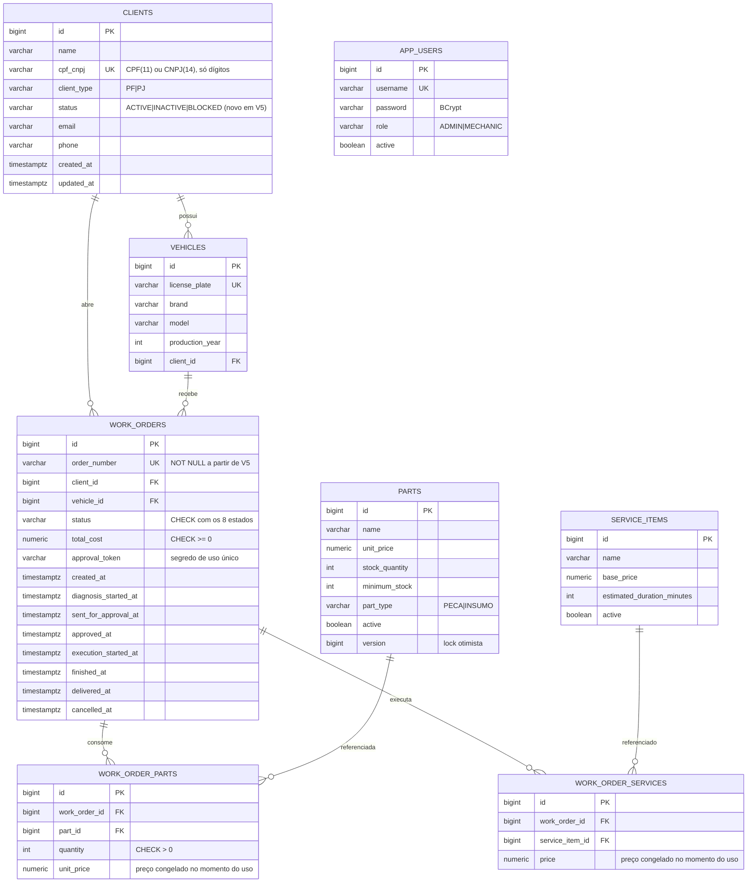

# E1 — Modelagem do banco: justificativa formal, consistência e performance

> Atende R9 e a parte de "justificativa formal para a escolha do banco e ajustes no modelo relacional,
> com diagramas ER" de R8. Pré-requisito de [02](02-auth-cpf-lambda.md): o Lambda precisa consultar o
> **status** do cliente, coluna que hoje não existe.

## 1. Dependências

Nenhuma técnica — é a primeira etapa de código. Deve preceder E5 (Lambda) e ser aplicada junto de E4
(aplicação), porque as migrations Flyway sobem com o pod.

## 2. Justificativa formal da escolha do banco

O PDF exige justificativa formal. O texto abaixo é o conteúdo do RFC correspondente
(`rfc/0002-escolha-do-banco-de-dados.md`, spec 09).

**Natureza do domínio.** O núcleo é a Ordem de Serviço: uma máquina de estados
(`RECEIVED → IN_DIAGNOSIS → AWAITING_APPROVAL → APPROVED → IN_PROGRESS → FINISHED → DELIVERED`, com
`CANCELLED` transversal) que agrega itens de serviço e peças, debita estoque e calcula valor total.
Três características decidem o modelo de persistência:

1. **Invariantes multi-tabela em uma transação.** Aprovar um orçamento debita `parts.stock_quantity`,
   insere em `work_order_parts` e muda `work_orders.status`. Ou tudo acontece, ou nada — não existe
   leitura correta de "estoque debitado com a OS não aprovada". Isso é consistência forte, não
   eventual.
2. **Concorrência sobre o mesmo agregado.** Dois mecânicos consumindo a mesma peça é *lost update*
   clássico; a solução já implementada (`parts.version`, lock otimista) depende de transação ACID.
3. **Consultas relacionais por natureza.** Os dashboards exigidos por R7 (volume diário de OS, tempo
   médio por status) são agregações com junção entre `work_orders`, `clients` e `vehicles`. É
   exatamente o que SQL faz melhor.

**Alternativas avaliadas e por que foram rejeitadas.**

| Opção | Por que não |
|---|---|
| DynamoDB (chave-valor/documento) | Transações limitadas a 100 itens e sem junção; os dashboards exigiriam desnormalização e tabelas secundárias mantidas pela aplicação. Trocaria uma consulta SQL por código de consistência escrito à mão — mais caro de manter e de testar |
| MongoDB / DocumentDB | O agregado OS até caberia num documento, mas `parts` e `service_items` são catálogos compartilhados entre OSs; o documento único levaria a duplicação e a atualizações em cascata. DocumentDB tem piso de instância (~US$50/mês), incompatível com o orçamento |
| Aurora Serverless v2 | Escala bem, mas o piso de 0,5 ACU cobra ~US$0,06/h mesmo ocioso (≈ US$43/mês) e **não é parado pelo "End Lab"** |
| MySQL gerenciado | Viável, mas sem vantagem sobre PostgreSQL aqui e perderia recursos já usados (`GENERATED BY DEFAULT AS IDENTITY`, índices parciais, advisory lock que o Flyway usa para serializar migrations entre réplicas) |
| PostgreSQL em container no cluster | Mais barato, mas o PDF exige **banco gerenciado**; e o dado sobreviveria a menos falhas que num RDS |

**Escolha: Amazon RDS PostgreSQL 16, `db.t4g.micro`.** Gerenciado (atende o requisito literal),
ACID, custo de US$0,016/h, criptografia em repouso habilitada, `auto_minor_version_upgrade` ligado.
Trade-offs de laboratório assumidos explicitamente e já documentados no código: `multi_az = false`,
`backup_retention_period = 0`, `deletion_protection = false`.

## 3. Ajustes no modelo relacional (migration `V5`)

Cada item abaixo tem uma razão de consistência, de performance ou de requisito da fase — nenhum é
cosmético.

### 3.1 Requisito da fase

- **`clients.status VARCHAR(10) NOT NULL DEFAULT 'ACTIVE'`** com
  `CHECK (status IN ('ACTIVE','INACTIVE','BLOCKED'))`.
  R3 exige que o Lambda consulte "a existência **e o status** do cliente". Hoje `clients` não tem
  status algum. `INACTIVE` = cadastro desativado; `BLOCKED` = impedido de autenticar (inadimplência,
  fraude) — o Lambda nega token para ambos, com mensagem genérica.
- **Índice de autenticação:** `CREATE INDEX idx_clients_cpf_active ON clients (cpf_cnpj) WHERE status = 'ACTIVE'`.
  Índice parcial: a consulta do Lambda é sempre `cpf_cnpj = ? AND status = 'ACTIVE'`, e o índice
  parcial é menor e mais quente em cache que o índice completo.

### 3.2 Consistência

- **`TIMESTAMP` → `TIMESTAMPTZ`** em todas as colunas de data/hora (`clients`, `vehicles`, `parts`,
  `service_items`, `work_orders`, `app_users`). Motivo direto do enunciado: a oficina expandiu para
  **múltiplas unidades**. `TIMESTAMP` sem fuso grava o horário local do servidor e torna impossível
  comparar duas unidades ou calcular corretamente o "tempo médio por status" do dashboard (R7) quando
  o pod roda em UTC e o usuário lê em `America/Sao_Paulo`. A conversão é `USING coluna AT TIME ZONE 'UTC'`.
- **`work_orders.order_number` → `NOT NULL`** após backfill. Hoje é `UNIQUE` mas nulo, e `NULL` escapa
  do `UNIQUE` — dá para ter N ordens sem número, o que quebra a rastreabilidade que o número existe
  para garantir.
- **`CHECK` de domínio**, hoje garantidos só na aplicação (e portanto ausentes para qualquer outro
  cliente do banco — inclusive o Lambda e consultas manuais):
  - `work_orders.total_cost >= 0`
  - `work_order_parts.quantity > 0` e `unit_price >= 0`
  - `work_order_services.price >= 0`
  - `parts.stock_quantity >= 0`, `parts.minimum_stock >= 0`, `parts.unit_price >= 0`
  - `service_items.base_price >= 0`, `estimated_duration_minutes > 0`
  - `vehicles.production_year BETWEEN 1900 AND 2100`
  - `work_orders.status IN (...)` — a lista dos 8 estados; hoje é `VARCHAR(25)` livre.
- **`clients.email`/`phone`**: manter opcionais, mas normalizar `email` para minúsculo com
  `CHECK (email = lower(email))`. O canal de aprovação por e-mail depende disso para não duplicar
  cliente por diferença de caixa.

### 3.3 Performance

- **Remover índices duplicados.** `clients.cpf_cnpj` e `vehicles.license_plate` já são `UNIQUE`, o que
  no PostgreSQL cria um índice B-tree automático. `idx_clients_cpf_cnpj` e `idx_vehicles_plate` são
  cópias — ocupam espaço, encarecem todo `INSERT`/`UPDATE` e nunca são escolhidos preferencialmente.
  `DROP INDEX` nos dois.
- **Criar índices de chave estrangeira ausentes:** `work_order_parts(part_id)` e
  `work_order_services(service_item_id)`. Sem eles, todo `DELETE`/`UPDATE` em `parts` ou
  `service_items` faz *sequential scan* nas tabelas filhas para validar a FK.
- **Índice do dashboard de volume diário:** `work_orders(created_at DESC)` e o composto
  `work_orders(status, created_at DESC)`. As duas consultas de R7 ("volume diário" e "tempo médio por
  status") passam por aqui; sem índice, viram *seq scan* na tabela que mais cresce.
- **Índice de OS por cliente ativo:** o endpoint `GET /api/work-orders/me` (spec 04) filtra por
  `client_id` e ordena por `created_at` — `work_orders(client_id, created_at DESC)` substitui o
  `idx_work_orders_client` atual (que cobre só a coluna).

### 3.4 Segurança — usuário de leitura para o Lambda

O Lambda consulta `clients` diretamente. Conectar com o usuário mestre do RDS daria a uma função
exposta na internet poder de `DROP TABLE`. Migration cria papel dedicado:

```sql
CREATE ROLE oficina_auth_ro LOGIN PASSWORD '${lambda_ro_password}';
GRANT CONNECT ON DATABASE oficina_db TO oficina_auth_ro;
GRANT USAGE  ON SCHEMA public        TO oficina_auth_ro;
GRANT SELECT (id, name, cpf_cnpj, client_type, status) ON clients TO oficina_auth_ro;
```

`GRANT SELECT` por coluna: o Lambda não precisa de `email` nem `phone`, e não deve poder lê-los.
A senha entra por **placeholder do Flyway** (`quarkus.flyway.placeholders.lambda-ro-password`),
alimentado pelo Secret do Kubernetes — nunca literal na migration. Uma migration idempotente
(`DO $$ ... IF NOT EXISTS ... $$`) evita falha na segunda execução.

> **Fronteira de responsabilidade.** O repositório `oficina-infra-database` provisiona a *instância*;
> o repositório da aplicação é dono do *schema* (Flyway). A criação do papel do Lambda fica na
> aplicação porque é DDL de schema, não de instância. Isso vira ADR (spec 09) para não virar discussão
> depois.

## 4. Modelo alvo (ER)



**Relacionamentos e por que são assim** (texto que vai para o RFC do banco):

- `CLIENTS 1—N VEHICLES`: um veículo pertence a exatamente um cliente. Transferência de propriedade é
  atualização de `client_id`, não novo veículo — a placa é a identidade natural.
- `WORK_ORDERS` referencia **cliente e veículo separadamente**, embora o veículo já aponte para um
  cliente. Não é redundância: a OS registra quem *contratou* o serviço, que pode diferir do
  proprietário atual do veículo depois de uma venda. Sem essa coluna, o histórico da OS mudaria de dono
  retroativamente ao transferir o carro.
- `WORK_ORDER_PARTS` e `WORK_ORDER_SERVICES` guardam `unit_price`/`price` próprios: o preço do catálogo
  muda, o valor cobrado numa OS fechada não pode mudar junto. É *snapshot* deliberado, não
  desnormalização acidental.
- `APP_USERS` não se relaciona com `CLIENTS`: são identidades diferentes (funcionário × cliente).
  O cliente autentica por CPF via Lambda e nunca recebe linha em `app_users` — decisão de fronteira
  registrada no ADR de autenticação.

## 5. Contrato de entrega

Arquivos:

- `src/main/resources/db/migration/V5__phase3_consistency_and_performance.sql` — todos os itens de §3.
- `src/main/resources/db/migration/V6__auth_readonly_role.sql` — papel do Lambda, com placeholder.
- `docs/erd.md` — o diagrama Mermaid acima, versionado e renderizado pelo GitHub.
- Ajuste em `application.properties`: `quarkus.flyway.placeholders.lambda-ro-password=${LAMBDA_RO_PASSWORD:}`.
- Ajuste no `Client` de domínio e no `ClientEntity`/`ClientMapper`: novo Value Object `ClientStatus`
  (enum) com a regra `canAuthenticate()` — regra de negócio no domínio, não em `if` espalhado.

## 6. Pool de conexões — ajuste obrigatório junto do V5

`db.t4g.micro` tem 1 GiB de RAM; `max_connections` no RDS é
`LEAST({DBInstanceClassMemory/9531392}, 5000)` ≈ **112**. A configuração atual é
`quarkus.datasource.jdbc.max-size=20` por pod. Com o HPA em 4 réplicas: 80 conexões, mais o Lambda,
mais qualquer sessão administrativa — encosta no teto exatamente durante a demonstração de escala.

Ação: `max-size=8`, `min-size=2`, `acquisition-timeout=5s`. 4 × 8 = 32 conexões, com folga de sobra.
Para uma API que passa a maior parte do tempo em I/O curto, 8 conexões por pod sustentam bem mais
throughput do que o `t3.medium` consegue gerar. **Sem RDS Proxy** — custa US$0,015/h por vCPU do banco
e resolveria um problema que não temos nesta escala.

## 7. Critério de aceite

- `mvn verify` verde, com o gate JaCoCo mantido em 80% nos pacotes críticos.
- `V5`/`V6` aplicam do zero (banco vazio) **e** sobre um banco na V4 (`flyway:info` mostra 6 versões).
- Testes novos: `ClientStatusTest` (regras de `canAuthenticate`), teste de repositório provando que
  cliente `BLOCKED` não é retornado pela consulta de autenticação.
- `EXPLAIN (ANALYZE)` das duas consultas de dashboard usa *Index Scan*, não *Seq Scan*, com ao menos
  1.000 OSs semeadas.
- `psql` conectado como `oficina_auth_ro` consegue `SELECT id, name, cpf_cnpj, client_type, status FROM clients`
  e falha em `SELECT email FROM clients`, em `INSERT` e em `DROP`.
- Nenhuma senha literal em arquivo versionado (`grep -r` no diretório de migrations).

## 8. Rollback

Migrations Flyway não têm `undo` na edição community. Reversão real = restaurar o banco. Como o
ambiente é efêmero e recriado por sessão, a estratégia é: **não aplicar V5/V6 em produção sem antes
rodá-las numa sessão de homologação com o dump de dados da demo**. Se falharem no start do pod, o
`startupProbe` falha, o rollout não completa e o `rollout undo` da pipeline devolve a imagem anterior —
mas o schema já terá mudado, então a imagem anterior precisa continuar compatível. Por isso todas as
mudanças de V5 são **aditivas ou de constraint**, nenhuma remove coluna usada pela versão anterior.

## 9. Fora de escopo

- Particionamento de `work_orders`, materialized views para dashboard, réplica de leitura: volume do
  laboratório não chega perto de justificar.
- Auditoria temporal (histórico de transições em tabela própria). As colunas `*_at` já respondem "tempo
  médio por status" para o dashboard exigido; uma tabela `work_order_status_history` seria o passo
  seguinte se houvesse requisito de auditoria — fica registrada como evolução futura no RFC.
- Multi-AZ, backup automatizado e `deletion_protection`: decisões de custo já assumidas na Fase 2.
