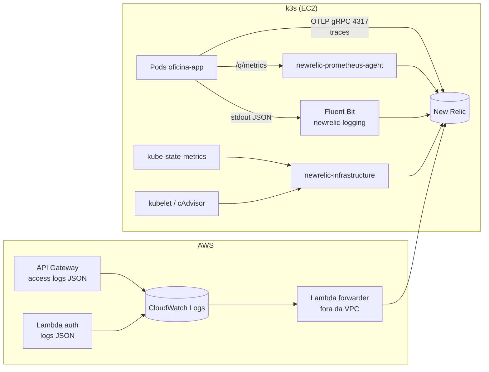

# E7 — Observabilidade fim a fim

> Atende R7 integralmente. Toca os quatro repositórios: agentes no cluster (`oficina-infra-k8s`),
> instrumentação da aplicação (`oficina-app`), logs do Lambda e do gateway (`oficina-auth-lambda`).

## 1. Dependências

- [04](04-app-rbac-cliente.md): métricas de negócio e `X-Correlation-Id` precisam existir para que os
  dashboards tenham o que mostrar.
- [03](03-api-gateway.md): access logs do gateway.
- Cluster de pé ([06](06-infra-k8s-terraform.md)).

## 2. Escolha da ferramenta

| | New Relic | Datadog |
|---|---|---|
| Free tier | **100 GB/mês perpétuos**, 1 usuário full, usuários básicos ilimitados | 5 hosts, **só infraestrutura**, retenção de 1 dia |
| APM / tracing no free tier | incluso | **não** — só no trial de 14 dias |
| Logs no free tier | inclusos (dentro dos 100 GB) | **não** |
| Alertas e dashboards | inclusos | limitados |
| Integração AWS sem criar IAM role | sim (Lambda forwarder + OTLP) | a integração recomendada exige `iam:CreateRole` — **bloqueado no Academy** |
| Custo estimado nesta fase | **US$0,00** | US$0 por 14 dias, depois indisponível |

**Escolhido: New Relic.** O free tier cobre os três sinais (métricas, logs, traces) de forma
permanente, o que importa num projeto que vai ser retomado ao longo do curso e demonstrado em vídeo
possivelmente depois de 14 dias. O PDF deixa a escolha livre entre as duas.

**Ponto de arquitetura, não de fornecedor:** a aplicação exporta por **OTLP (OpenTelemetry)**, não pelo
agente proprietário. Trocar de fornecedor vira mudança de endpoint e header, não reinstrumentação.
Isso vira ADR.

## 3. Arquitetura de coleta



**Por que três caminhos e não um só:**

- **Traces** só existem na aplicação e precisam de contexto de propagação → OTLP direto do pod
  (`quarkus-opentelemetry`).
- **Métricas** (JVM, HTTP, negócio) já estão em `/q/metrics` e o Deployment **já tem** as anotações
  `prometheus.io/scrape`. O `newrelic-prometheus-agent` coleta sem tocar na aplicação. Usar OTLP também
  para métricas exigiria habilitar o exportador de métricas do Quarkus, ainda marcado como experimental
  em 3.15 — risco desnecessário quando o caminho estável já está pronto.
- **Logs** do pod são stdout; Fluent Bit é o coletor natural e preserva o JSON estruturado.
- **Lambda em VPC sem NAT não tem internet** ([02](02-auth-cpf-lambda.md) §4): a única saída é
  CloudWatch → forwarder fora da VPC.

## 4. O que instalar no cluster

Helm chart `newrelic/nri-bundle`, com o mínimo:

```yaml
global:
  licenseKey: <secret>
  cluster: oficina-prod          # ou oficina-hml
  lowDataMode: true              # reduz cardinalidade e volume — protege o teto de 100 GB
newrelic-infrastructure: { enabled: true }
kube-state-metrics:      { enabled: true }
newrelic-prometheus-agent: { enabled: true }
newrelic-logging:        { enabled: true }
nri-kube-events:         { enabled: true }
newrelic-pixie: { enabled: false }   # eBPF, alto consumo, não cabe no node
pixie-chart:    { enabled: false }
```

**Orçamento de memória no node único (`t3.medium`, 4 GiB) — verificar antes de confiar:**

| Componente | Reserva estimada |
|---|---|
| k3s + CoreDNS + Traefik + metrics-server | ~700 MiB |
| `nri-bundle` (infra + KSM + prometheus-agent + fluent-bit + kube-events) | ~450–550 MiB |
| Aplicação, 4 réplicas × 384 MiB de request | 1.536 MiB |
| **Total** | **~2,8 GiB de 4 GiB** |

Cabe, com pouca folga. Ação obrigatória logo após instalar: `kubectl top nodes` e `kubectl top pods -A`.
Se o quarto pod ficar `Pending` durante o teste de HPA, as opções em ordem de preferência são
(a) `maxReplicas: 3`, (b) `requests.memory: 320Mi`, (c) `t3.large` (+US$0,17 por sessão de 4h). Definir
`requests`/`limits` explícitos em todos os componentes do `nri-bundle` — sem eles, o scheduler não tem
como proteger a aplicação.

## 5. Instrumentação da aplicação

- Extensão `quarkus-opentelemetry`; `quarkus.otel.exporter.otlp.traces.endpoint=https://otlp.nr-data.net:4317`
  e header `api-key=<license key>`.
- `quarkus.otel.resource.attributes=service.name=oficina-app,service.namespace=oficina,deployment.environment=<env>`
  — sem isso, os serviços de `hml` e `prod` aparecem misturados no mesmo gráfico.
- Amostragem: `quarkus.otel.traces.sampler=parentbased_traceidratio` com razão **1.0 em homologação** e
  **0.2 em produção**. 100% de traces numa demo com teste de carga é o caminho mais rápido para
  consumir o free tier de 100 GB.
- Log JSON já existe em `prod`; adicionar campos fixos `service.name` e `env` e garantir MDC
  (`correlationId`, `traceId`, `spanId`, `clientId`).
- **Nunca logar**: CPF completo, token, senha, e-mail de cliente. Adicionar um teste que faz a
  requisição de login e afirma que a senha não aparece na saída capturada.

## 6. Os cinco itens de monitoramento exigidos

| Exigência do PDF | Fonte | Onde aparece |
|---|---|---|
| Latência das APIs | APM (OTLP) + `$context.responseLatency` do gateway | Dashboard "Operação", p50/p95/p99 |
| Consumo de recursos do Kubernetes (CPU, memória) | `newrelic-infrastructure` + kube-state-metrics | Dashboard "Operação" |
| Healthchecks e uptime | New Relic Synthetics (*ping monitor*) contra `GET <api-gateway>/health`, a cada 5 min | Dashboard "Operação" + alerta |
| Alertas para falhas no processamento de ordens de serviço | `oficina_work_order_transition_errors_total` + log `event="workorder.error"` | Política de alerta (§8) |
| Logs estruturados (JSON) com correlação | Fluent Bit + MDC | Aba Logs, filtro por `correlationId` |

## 7. Dashboards exigidos

Um dashboard chamado **"Oficina — Negócio"** com os três itens do PDF, e um **"Oficina — Operação"**
com o resto. NRQL de referência (a instrumentar contra a métrica real na implementação):

```sql
-- Volume diário de ordens de serviço
SELECT sum(oficina_work_orders_created_total)
FROM Metric SINCE 14 days ago TIMESERIES 1 day FACET origin

-- Tempo médio de execução por status (Diagnóstico, Execução, Finalização)
SELECT average(oficina_work_order_status_duration_seconds)
FROM Metric WHERE status IN ('IN_DIAGNOSIS','IN_PROGRESS','FINISHED')
SINCE 7 days ago TIMESERIES FACET status

-- Erros e falhas nas integrações
SELECT count(*) FROM Metric
WHERE metricName IN ('oficina_integration_failures_total','oficina_work_order_transition_errors_total')
SINCE 24 hours ago TIMESERIES FACET integration, reason
```

Dashboards versionados como **JSON no repositório** (`observability/dashboards/*.json`) e aplicados
pela pipeline via `newrelic-cli` ou provider Terraform `newrelic`. Dashboard criado só pela interface
se perde no primeiro acidente e não entra em revisão de código.

## 8. Alertas

| Política | Condição | Janela | Severidade |
|---|---|---|---|
| Latência da API | p95 de `duration` do APM > 1,5 s | 5 min | crítica |
| Falha no processamento de OS | `oficina_work_order_transition_errors_total` > 0 | 5 min | crítica |
| Disponibilidade | monitor Synthetics falhando | 2 verificações consecutivas | crítica |
| Saúde do cluster | pod em `CrashLoopBackOff` ou `Pending` > 5 min | 5 min | alta |
| Saturação | CPU do container > 85% por 10 min **ou** memória > 90% do limite | 10 min | alta |
| Autenticação | `oficina_auth_denied_total` acima de 50 em 5 min (sinal de enumeração de CPF) | 5 min | média |

Canal de notificação: e-mail (gratuito). Webhook para Slack/Discord se houver, mas não é requisito.

## 9. Custo

| Item | Custo |
|---|---|
| New Relic (ingestão estimada: <5 GB/mês com `lowDataMode` e amostragem 20%) | US$0,00 |
| CloudWatch Logs (gateway + 2 Lambdas, retenção 7 dias) | < US$0,05/mês |
| Recursos de cluster consumidos pelos agentes | já contabilizados na EC2 |
| **Total adicional** | **≈ US$0,05** |

Guarda-corpo do free tier: alerta de consumo em 70 GB/mês configurado na própria conta New Relic; se a
ingestão disparar, a causa quase certa é amostragem de trace em 100% ou log em DEBUG em produção.

## 10. Critério de aceite

- Uma requisição feita pelo API Gateway aparece no New Relic como **um trace único** atravessando
  gateway → aplicação, e o log correspondente é encontrável pelo mesmo `correlationId`.
- `kubectl top nodes` após instalar os agentes mostra folga suficiente para o HPA chegar ao teto
  configurado — e o teste de carga confirma o scale-out sem pod `Pending`.
- Os dois dashboards existem, são carregados a partir do JSON versionado e mostram dados reais.
- As seis políticas de alerta existem e ao menos duas são disparadas de propósito na validação
  (derrubar um pod; forçar uma transição inválida de OS).
- Logs do Lambda de autenticação aparecem no New Relic via forwarder, com `correlationId` presente.
- `grep` nos logs não encontra CPF completo nem token.

## 11. Fora de escopo

- Profiling contínuo, RUM (front está fora de escopo), Pixie/eBPF.
- SLO/error budget formalizado — a lista de alertas cobre o requisito; SLO é evolução futura no ADR.
- Prometheus + Grafana auto-hospedados: dobrariam o consumo de memória do node único para entregar o
  mesmo resultado que o free tier do New Relic entrega sem custo de infraestrutura.
