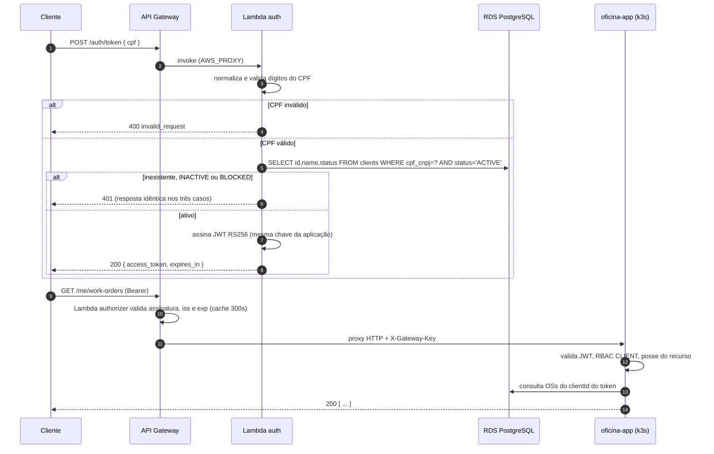

# E8 — Documentação arquitetural (ADRs, RFCs e diagramas)

> Atende R8. É requisito obrigatório do PDF e artefato de repositório — **não** se confunde com o
> documento PDF de entrega nem com o vídeo, que estão fora do escopo deste plano.

## 1. Dependências

Escrita ao longo das etapas, consolidada ao final. Cada ADR é redigido **quando a decisão é tomada**,
não retroativamente — ADR escrito depois vira justificativa fabricada, e o avaliador nota.

## 2. Onde cada documento vive

Documentação de decisão que atravessa repositórios ficaria duplicada ou órfã se espalhada. Por isso:

| Documento | Repositório |
|---|---|
| ADRs e RFCs (todos) | **`oficina-app`**, em `docs/adr/` e `docs/rfc/` — é o repositório do domínio, o que dá contexto às decisões |
| Diagrama de componentes (visão geral) | `oficina-app/docs/arquitetura.md`, com link nos outros três READMEs |
| Diagramas de sequência | `oficina-app/docs/arquitetura.md` |
| Diagrama ER + justificativa do banco | `oficina-app/docs/erd.md` + `docs/rfc/0002-*` |
| Diagrama específico de cada repositório | README do próprio repositório |

Ferramenta: **Mermaid em Markdown**. Renderiza nativamente no GitHub, versiona como texto (diff
revisável em PR) e custa zero. Alternativas rejeitadas: draw.io (binário, diff ilegível), Structurizr
(bom para C4, mas exige ferramenta e curva para um diagrama de componentes só).

## 3. ADRs a escrever

Formato MADR enxuto: Contexto · Decisão · Consequências (positivas e negativas) · Alternativas
consideradas · Status. Numeração sequencial, imutável — ADR superado é marcado `Superseded by NNNN`,
nunca editado no lugar.

| # | Título | Fonte |
|---|---|---|
| 0001 | Arquitetura Hexagonal como estratégia de isolamento do domínio | Fase 2, formalizar |
| 0002 | k3s em EC2 única em vez de EKS gerenciado | [00](00-visao-geral.md) §3 |
| 0003 | AWS API Gateway HTTP API como gateway de borda | [03](03-api-gateway.md) §2 |
| 0004 | Autenticação de cliente por CPF, sem senha, com JWT de curta duração | [02](02-auth-cpf-lambda.md) |
| 0005 | Lambda dentro da VPC com acesso somente-leitura ao banco | [02](02-auth-cpf-lambda.md) §4 |
| 0006 | Emissor único de JWT: mesmo par de chaves para aplicação e Lambda | [02](02-auth-cpf-lambda.md) §2 |
| 0007 | Autorização em duas camadas (Lambda authorizer + RBAC na aplicação) | [03](03-api-gateway.md) §4 |
| 0008 | Comunicação síncrona REST; sem mensageria nesta fase | [00](00-visao-geral.md) §3 |
| 0009 | HPA por CPU apenas, sem métrica de memória | Fase 2 (`hpa.yaml`), formalizar |
| 0010 | Observabilidade por OTLP com New Relic como backend intercambiável | [05](05-observabilidade.md) §2 |
| 0011 | Contrato entre repositórios por SSM Parameter Store | [06](06-infra-k8s-terraform.md) §3 |
| 0012 | Segredos em variável de ambiente do Lambda em vez de Secrets Manager | [02](02-auth-cpf-lambda.md) §4 |
| 0013 | Duplicação deliberada do algoritmo de CPF entre repositórios | [02](02-auth-cpf-lambda.md) §5 |
| 0014 | Migrations de schema pertencem à aplicação, não ao repositório de infraestrutura | [01](01-modelagem-banco.md) §3.4 |
| 0015 | Homologação como stack separada por workspace, subindo sob demanda | [06](06-infra-k8s-terraform.md) §4 |
| 0016 | Java 21 + SnapStart como runtime da Function Serverless | [02](02-auth-cpf-lambda.md) §3 |
| 0017 | Repositórios públicos sob organização GitHub gratuita | [08](08-repositorios-cicd.md) §3 |

O PDF cita explicitamente "escolha do padrão de comunicação" e "uso de HPA" como exemplos de ADR —
0008 e 0009 cobrem os dois pelo nome.

Os ADRs 0015 a 0017 registram decisões fechadas em 2026-09-09 cujas alternativas foram avaliadas e
recusadas com motivo — namespace compartilhado, runtime Node/Python e repositórios privados. Cada um
deve trazer a alternativa recusada com o argumento, não apenas a escolha: é o que separa um ADR de um
comunicado.

## 4. RFCs a escrever

RFC ≠ ADR: o RFC discute o problema, o espaço de soluções e a recomendação, com espaço para
contestação; o ADR registra a decisão fechada. Os três que o PDF pede pelo nome:

| # | Título | Conteúdo |
|---|---|---|
| 0001 | Escolha da nuvem | AWS × Azure × GCP; restrições do Academy (IAM bloqueado, orçamento único de US$50, "End Lab" só para EC2); continuidade da Fase 2 |
| 0002 | Escolha do banco de dados e ajustes no modelo relacional | Todo o conteúdo de [01](01-modelagem-banco.md) §2 a §4: natureza transacional do domínio, comparação com NoSQL, ER comentado, índices, decisões de consistência |
| 0003 | Estratégia de autenticação | CPF sem senha × usuário/senha × OAuth2/OIDC (Cognito); riscos do CPF como credencial e mitigações (throttling, TTL curto, 401 indistinguível, papel de menor privilégio); caminho de evolução para OIDC |

## 5. Diagramas obrigatórios

### 5.1 Componentes (visão de nuvem, APIs, banco e monitoramento)

Um único diagrama mostrando: cliente/front → API Gateway → (Lambda de auth | k3s/Traefik → pods) →
RDS; SSM como contrato entre stacks; New Relic recebendo dos três caminhos de coleta; ECR alimentando
o cluster; CloudWatch como intermediário do Lambda. Deve deixar visível **o que atravessa a fronteira
da VPC** — é o que explica as decisões 0005 e 0012.

### 5.2 Sequência — autenticação por CPF



### 5.3 Sequência — abertura de ordem de serviço

Deve mostrar: cliente autenticado → `POST /me/work-orders` → validação de posse do veículo → criação
em `RECEIVED` → emissão da métrica de negócio → notificação por e-mail → e o caminho de erro
(transição inválida gerando o counter que dispara o alerta de R7).

### 5.4 ER

O de [01](01-modelagem-banco.md) §4, com o texto explicando cada relacionamento — o PDF pede
"explicação dos relacionamentos", não só o desenho.

## 6. Template de README (os quatro repositórios)

```markdown
# <nome>
## Propósito            — o que este repositório entrega e o que deliberadamente não entrega
## Arquitetura          — diagrama Mermaid específico deste repositório
## Tecnologias          — com versões
## Pré-requisitos       — contas, credenciais, ferramentas, e o que precisa estar aplicado antes
## Execução local
## Deploy               — branches, ambientes, como disparar, como reverter
## APIs                 — link do Swagger / coleção Postman  (quando aplicável)
## Ambiente ativo       — URL do deploy                        (quando aplicável)
## Custo                — tabela por recurso e por hora
## Encerramento         — como destruir a stack e conferir órfãos
## Documentação         — links para ADRs, RFCs e diagramas em oficina-app
```

## 7. Critério de aceite

- 17 ADRs e 3 RFCs escritos, numerados, com alternativas consideradas preenchidas de verdade (não
  "N/A").
- Os quatro diagramas renderizam no GitHub sem erro de sintaxe Mermaid.
- Os quatro READMEs seguem o template e nenhum tem seção vazia ou "TODO".
- Todo link entre repositórios funciona (verificar após o split, quando as URLs mudam).
- A justificativa do banco existe em RFC e é referenciada no README de `oficina-infra-database`.

## 8. Fora de escopo

- Documento PDF de entrega no Portal do Aluno e vídeo de demonstração — **responsabilidade do usuário**.
- Documentação de operação estilo runbook de incidente: [10](10-runbook-sessao-custos.md) cobre o
  necessário para esta fase.
- C4 nos quatro níveis: o PDF pede diagrama de componentes; contexto e container entram como seções do
  mesmo documento, sem ferramenta dedicada.
